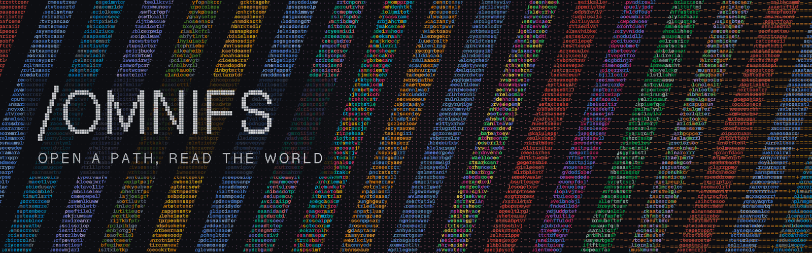

<div align="center">
<p align="center">
  
</p>

<h1 align="center"><b>omnifs</b></h1>
<h4 align="center">open a path, read the world.</h4>
<p align="center"><a href="#quickstart">quickstart</a> | <a href="https://omnifs.dev">homepage</a> | <a href="https://omnifs.dev/start">docs</a> | <a href="#things-to-try">things to try</a> | <a href="#providers">providers</a> | <a href="#how-it-works">how it works</a></p>
</div>

omnifs projects external systems into local filesystem paths. GitHub, DNS, arXiv, Docker, Linear, and SQLite become directories and files you can `cd`, `ls`, `cat`, `grep`, `find`, `jq`, and script against.

The goal is simple: if a tool can read files, it can read the outside world without learning another SDK, auth flow, pagination model, or response schema.

> Alpha status: omnifs is real and usable, but the read surface is still early. The filesystem is exposed through FUSE, and omnifs runs in a Docker container in supported environments for compatibility, rootless execution, and simpler setup across Linux, macOS, and Windows. NFSv4 and FSKit support are planned, and we will remove the Docker requirement when native mounts are ready.

<p align="center">
  
</p>

## Quickstart

omnifs is written in Rust. We build prebuilt binaries for all platforms and ship them through the npm registry. During alpha, you need Node.js, npm, and a Docker-compatible container engine such as Docker, OrbStack, or Podman.

```bash
npm install -g @0xff-ai/omnifs
omnifs setup
omnifs up
omnifs shell
```

`omnifs setup` is interactive. It pulls the Docker image and walks you through provider selection and auth.

`omnifs shell` opens a shell against the running container. Inside the container, the filesystem is mounted at `/omnifs`, with convenience symlinks for every mount at the root, such as `/github`, `/dns`, and `/arxiv`.

---

For a direct, scriptable path, initialize providers one at a time with `omnifs init <provider>`. Each command writes a mount config under `~/.omnifs/config/mounts/`; `omnifs up` then materializes those mounts, credentials, and capability grants into the runtime container.

```bash
omnifs init github
omnifs init dns
omnifs status
omnifs up
omnifs shell
```

---

Useful commands:

```bash
omnifs status      # runtime, mount, and auth state
omnifs logs -f     # follow container and daemon logs
omnifs inspect     # live TUI for FUSE, provider, cache, and callout activity
omnifs down        # stop the container and clean up the session
```

## Things to try

Once you are in `omnifs shell`, use normal shell tools.

```bash
# GitHub
cd /github/ollama/ollama
ls
cat repo.json
cat issues/open/12959/title
cat pulls/all/9585/diff
# repository trees are cloned on demand
cd repo && ls

# DNS
cat /dns/cloudflare.com/A
cat /dns/@google/google.com/AAAA
cat /dns/openai.com/TXT
cat /dns/reverse/1.1.1.1

# arXiv -- "Attention is all you need"
ls /arxiv/papers/1706.03762
cat /arxiv/papers/1706.03762/@latest/paper.json | jq .title

# Docker
cat /docker/system/version.json | jq .
cat /docker/containers.json | jq .
ls /docker/containers/running

# Linear -- requires a Linear API key
ls /linear/teams
cat /linear/teams/ENG/issues/open/ENG-123/title

# SQLite -- download an example db and explore the data
wget -O /tmp/chinook.sqlite https://github.com/lerocha/chinook-database/raw/refs/heads/master/ChinookDatabase/DataSources/Chinook_Sqlite.sqlite
omnifs init db      # provide path: /tmp/chinook.sqlite
ls /db/tables
cat /db/tables/Album/schema.sql
cat /db/tables/Album/sample.json | jq .
```

<details>
<summary>SSH agent troubleshooting</summary>

Check the host before opening repo tree paths:

```bash
echo "$SSH_AUTH_SOCK"
ssh-add -L
ssh -T git@github.com
```

</details>

## Why paths

APIs are good boundaries for applications. They are a bad default interface for every script, terminal session, CI job, editor, and agent that only needs to read state.

omnifs makes the path the interface:

```text
/github/ollama/ollama/issues/open/12959/title
/docker/containers/running/{name}/state
/arxiv/papers/1706.03762/@latest/paper.json
/dns/cloudflare.com/TXT
```

That gives existing tools a common substrate. `grep -r`, `find`, `jq`, `tar`, `diff`, `head`, `tail`, and editors can all operate without provider-specific clients. Agents get the same benefit: open a path and read bytes.

The current surface is read-only. Write-back is designed around explicit staged transactions, but projected issue, PR, container, and DNS files are not directly writable today.

## Providers

| Provider | Mount | What it projects |
| --- | --- | --- |
| GitHub | `/github` | Users, orgs, repos, issues, pull requests, Actions runs, diffs, and repo trees cloned on demand |
| DNS | `/dns` | DNS-over-HTTPS records, resolver-scoped queries, raw answers, and reverse lookups |
| arXiv | `/arxiv` | Paper version families, PDFs, source archives, metadata, and category paper listings |
| Docker | `/docker` | Docker daemon system state, container listings, per-container inspect output, state, and summaries |
| Linear | `/linear` | Teams and issues, with title, state, priority, assignee, and description files |
| SQLite | `/db` | Read-only SQLite metadata, table schemas, indexes, row counts, and samples |

### GitHub

| Path | Content |
| --- | --- |
| `/github/{owner}` | Repositories for a user or organization |
| `/github/{owner}/{repo}` | Repository surface |
| `/github/{owner}/{repo}/repo/` | Source tree, cloned on demand via SSH |
| `/github/{owner}/{repo}/issues/{open,all}/` | Issue listings |
| `/github/{owner}/{repo}/issues/{filter}/{n}/title` | Issue title |
| `/github/{owner}/{repo}/issues/{filter}/{n}/body` | Issue body |
| `/github/{owner}/{repo}/pulls/{filter}/{n}/diff` | Pull request diff |
| `/github/{owner}/{repo}/actions/runs/{id}/status` | Actions run status |
| `/github/{owner}/{repo}/actions/runs/{id}/log` | Actions run log |

### DNS

| Path | Content |
| --- | --- |
| `/dns/{domain}/A` | A records |
| `/dns/{domain}/AAAA` | AAAA records |
| `/dns/{domain}/MX` | MX records |
| `/dns/{domain}/TXT` | TXT records |
| `/dns/{domain}/all` | Common record types |
| `/dns/{domain}/raw` | Dig-style output |
| `/dns/@{resolver}/{domain}/{record}` | Query through a named or IP resolver |
| `/dns/reverse/{ip}` | Reverse lookup |
| `/dns/resolvers` | Configured resolvers |

### arXiv

| Path | Content |
| --- | --- |
| `/arxiv/papers/{id}/` | Paper version family |
| `/arxiv/papers/{id}/@latest/paper.pdf` | Latest version PDF |
| `/arxiv/papers/{id}/@latest/source.tar.gz` | Latest version source bundle |
| `/arxiv/papers/{id}/@latest/paper.atom` | Raw upstream Atom feed |
| `/arxiv/papers/{id}/@latest/paper.json` | Rendered metadata |
| `/arxiv/papers/{id}/v{n}/paper.pdf` | Version-pinned PDF |
| `/arxiv/categories/{cat}/papers/` | Recent papers in a category |
| `/arxiv/categories/{cat}/papers/{id}/@latest/...` | Category alias for the same paper version family |

### Docker, Linear, and SQLite

| Path | Content |
| --- | --- |
| `/docker/system/version.json` | Docker daemon version |
| `/docker/containers.json` | Container listing |
| `/docker/containers/{by-name,by-id,running,stopped}/` | Container indexes |
| `/docker/containers/running/{name}/state` | Live container state |
| `/docker/containers/running/{name}/inspect.json` | Docker inspect JSON |
| `/linear/teams/` | Linear teams by key |
| `/linear/teams/{KEY}/issues/{open,all}/` | Team issue listings |
| `/linear/teams/{KEY}/issues/{filter}/{KEY-N}/description.md` | Issue description |
| `/db/meta/info.json` | SQLite database metadata |
| `/db/tables/{table}/schema.sql` | Table schema |
| `/db/tables/{table}/sample.json` | Sample rows |

## How it works

omnifs runs a Linux FUSE filesystem in a runtime container. The host CLI owns setup, credentials, container lifecycle, and the user-facing commands.

```text
                                                                  +----------------+
+-------------+          +-----------------------------+          | github.wasm    | -> GitHub
| shell, app, |   FUSE   |        omnifs host          | callouts | dns.wasm       | -> DoH
| CI, agent   | <------> | /github /dns /arxiv ...     | <------> | docker.wasm    | -> Docker socket
|             |  files   | cache, auth, git, network   |          | linear.wasm    | -> Linear
+-------------+          +-----------------------------+          +----------------+
```

Providers are WebAssembly components implementing the [`omnifs:provider` WIT interface](crates/omnifs-wit/wit/provider.wit). Providers are self-contained: they declare required capabilities and offer an introspection surface via `omnifs.provider.json`, embedded in the Wasm bytecode. A provider's main job is to answer filesystem operations via entrypoint methods `lookup_child`, `list_children`, and `read_file`.

Providers do not hold tokens, open sockets, or run Git themselves. They return callout requests such as HTTP fetches, blob downloads, archive opens, or repo tree handoffs. The host executes those requests, attaches credentials at the boundary, enforces declared capabilities, and owns caching.

The cache is host-owned plain byte storage. Providers can return canonical upstream bytes and derived filesystem entries together, so one upstream payload can populate multiple files and child entries. Invalidations come from explicit provider effects and runtime events.

## Development workflows

Use `omnifs dev` when working from this repository. It builds the dev image, captures `gh auth token`, fetches the Chinook SQLite fixture, synthesizes dev mounts from the built-in provider manifests, and starts the container.

```bash
git clone https://github.com/0xff-ai/omnifs
cd omnifs
cargo install --path crates/omnifs-cli --force
omnifs dev -y
omnifs shell
```

Core checks:

```bash
cargo fmt
cargo nextest run
just providers-check
just providers-build
```

For runtime behavior, validate through the container:

```bash
omnifs dev -y
docker exec omnifs /bin/zsh -lc 'omnifs status'
docker exec omnifs /bin/zsh -lc 'OMNIFS_DEMO_MODE=smoke /tmp/demo.sh'
docker exec omnifs /bin/zsh -lc 'tail -n 80 /tmp/omnifs.log'
```

## Roadmap

### ✅ Working today

- A Linux FUSE runtime you reach from macOS and Windows too, through the container and `omnifs shell`.
- A host CLI on npm that handles setup, auth, lifecycle, logs, status, and inspection.
- Sandboxed Wasm providers that can only reach the network, Git, sockets, and files the host hands them.
- Host-held credentials, layered caching, and `omnifs inspect` for a live view of what the runtime is doing.
- Six live providers: GitHub, DNS, arXiv, Docker, Linear, and SQLite.

### 🚧 In progress

- Making the provider SDK nicer to write against, especially for object-shaped providers.
- Letting providers build paths from their registered routes instead of hand-formatting strings.
- Caching polish: clearer traces, bounded disk usage, and identities that survive a remount.
- Better behavior under stuck reads and aggressive directory walkers (shells, prompt tools, crawlers).
- Smoother setup, auth, status, and `doctor` output, plus a hardened container test suite.
- Provider reference docs generated straight from each provider's manifest and routes.

### 🔭 Planned

- Write support: stage your intent first, then apply it upstream.
- Many more providers, including object stores, Kubernetes, Postgres, Redis, Slack, Discord, Google Drive, Gmail, Notion, Stripe, Cloudflare, Vercel, and Telegram.
- A real provider ecosystem: standalone packaging, a community catalog, authoring docs, and sidecars for providers that need native dependencies.
- Mount surfaces beyond Linux FUSE for environments where FUSE isn't the right fit, plus passthrough for host-backed subtrees.
- Easier install and slimmer packaging: multi-arch runtime images, Homebrew or shell installers, and a cleaner split between the CLI and the runtime binary.
- Going further than warm cache reads: offline snapshots, background indexing, semantic search, and DNS prefetch.
- Trust and safety: signed provider manifests, tighter sandboxing for host-run tools, and metered filesystem access.

## License

MIT OR Apache-2.0
