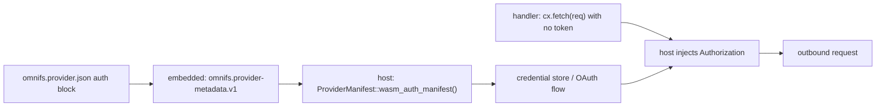

A provider declares its authentication scheme in `omnifs.provider.json`. That manifest is embedded into the compiled WASM, and the host derives a runtime auth manifest from it. The crucial property: **a provider never receives raw credentials.** The host injects them into outbound callouts. Your handler code calls `cx.fetch(..)` with no token, and the host adds the right `Authorization` header before the request leaves the sandbox.

## Where the manifest lives

`omnifs.provider.json` sits at the provider crate root next to `Cargo.toml`. Its top level identifies the provider and lists mounts; the `auth` block declares the scheme.

```json
{
  "schema": "omnifs.provider/v1",
  "id": "github",
  "name": "GitHub",
  "description": "Browse GitHub repositories, issues, and pull requests as a filesystem.",
  "mounts": [
    { "mount": "github", "description": "GitHub repositories and metadata." }
  ],
  "auth": {
    "scheme": "static-token",
    "static-token": {
      "scheme": "Bearer",
      "env": "GITHUB_TOKEN"
    }
  }
}
```

This manifest is embedded into the WASM as the `omnifs.provider-metadata.v1` custom section. The host and CLI read it through `ProviderManifest::wasm_auth_manifest()` to build the runtime `AuthManifest`, so the provider binary is self-describing — there is no separate registration step.

## Auth schemes

### `none`

No credentials. The DNS and arXiv providers use this.

```json
"auth": { "scheme": "none" }
```

### `static-token`

A long-lived token presented on every request with a fixed scheme. `scheme` is the HTTP auth scheme (for example `Bearer`); `env` names the environment variable or secret the host reads the token from.

```json
"auth": {
  "scheme": "static-token",
  "static-token": { "scheme": "Bearer", "env": "GITHUB_TOKEN" }
}
```

The host resolves the token and injects `Authorization: Bearer <token>` into each outbound `fetch`/`fetch_blob` callout. Your handler writes the request as if it were unauthenticated:

```rust
fn fetch_repo(cx: &Cx, owner: &str, repo: &str) -> Result<RepoMeta> {
    let req = Request::get(format!("https://api.github.com/repos/{owner}/{repo}"));
    // No Authorization header here — the host injects it from the manifest.
    cx.fetch(req)?.json()
}
```

### `oauth`

An OAuth flow. Declare the endpoints and scopes; the host runs the device/loopback/manual flow, stores the result in the credential store, and injects the access token into callouts.

```json
"auth": {
  "scheme": "oauth",
  "oauth": {
    "authorization-endpoint": "https://linear.app/oauth/authorize",
    "token-endpoint": "https://api.linear.app/oauth/token",
    "scopes": ["read"]
  }
}
```

## What the provider can and cannot see

The provider never sees the token, the refresh token, or any secret. It can inspect **non-secret** auth context through `cx.auth()`:

```rust
let auth = cx.auth();
if !auth.is_authenticated() {
    return Err(ProviderError::permission_denied("mount is not authenticated"));
}
if let Some(account) = auth.account() {
    // e.g. label the authenticated user without ever holding their token
}
```

`Auth` exposes only `account()` (a label, if the host has one) and `is_authenticated()`. There is no method that returns the raw credential, by design.



:::danger
Do not attempt to read tokens from the environment, files, or config inside a provider, and do not add a token field to your `#[config]` struct. Credentials are host-managed and injected at the callout boundary. A provider that holds a secret is a sandbox-escape risk and breaks the auth contract.
:::

:::note
Static mounts may still reference external secrets via `token_env` or `token_file` at the mount/auth config level — that is host configuration, not provider code, and it never adds keychain indirection inside mount JSON.
:::
