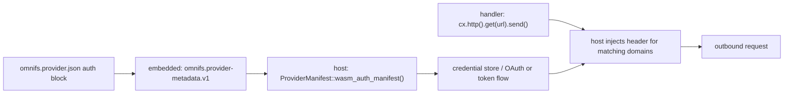

A provider declares its authentication in `omnifs.provider.json`. That manifest is embedded into the compiled WASM, and the host derives a runtime auth manifest from it. The crucial property: **a provider never receives raw credentials.** The host injects them into outbound callouts. Your handler code issues `cx.http().get(url).send()` with no token, and the host adds the configured auth header before the request leaves the sandbox.

## Where the manifest lives

`omnifs.provider.json` sits at the provider crate root next to `Cargo.toml`. Its top level identifies the provider and declares `capabilities`; the `auth` block declares how credentials are obtained and injected. The whole manifest is embedded into the WASM as the `omnifs.provider-metadata.v1` custom section, and the host and CLI read it back through `ProviderManifest::wasm_auth_manifest()` to build the runtime `AuthManifest`. The provider binary is self-describing — there is no separate registration step.

## No auth

Providers that talk only to public endpoints omit the `auth` block entirely. The DNS and arXiv providers do this; they declare `domain` capabilities but no `auth`.

## The auth block

The `auth` block has three parts: `inject` (where and how the token is attached to requests), `default` (which scheme to use unless overridden), and `schemes` (the named credential methods).

```json
"auth": {
  "inject": {
    "domains": ["api.github.com"],
    "header": "Authorization",
    "prefix": "Bearer "
  },
  "default": "device",
  "schemes": {
    "pat": {
      "type": "staticToken",
      "description": "GitHub personal access token",
      "creationUrl": "https://github.com/settings/tokens/new?scopes=read:user",
      "validation": {
        "method": "GET",
        "url": "https://api.github.com/user",
        "expectStatus": 200,
        "extract": { "identity": "/login" }
      }
    },
    "device": {
      "type": "oauth",
      "displayName": "GitHub OAuth device flow",
      "clientId": "Ov23licogxMDzS47s9sF",
      "scopes": [],
      "flow": {
        "kind": "deviceCode",
        "authorizationEndpoint": "https://github.com/login/oauth/authorize",
        "deviceAuthorizationEndpoint": "https://github.com/login/device/code",
        "tokenEndpoint": "https://github.com/login/oauth/access_token"
      }
    }
  }
}
```

### `inject`

`domains` lists the hosts the token may be attached to — the host only injects credentials into callouts whose URL matches. `header` and `prefix` form the header the host writes, for example `Authorization: Bearer <token>`. A provider that uses a raw token with no prefix (like Linear) sets `"prefix": ""`.

### `schemes`

Each scheme has a `type`:

- **`staticToken`** — a long-lived token (PAT or API key). `creationUrl` points the user at where to mint one; `validation` describes a request the host runs to verify the token and `extract` identity/workspace fields from the response (via JSON pointers).
- **`oauth`** — an OAuth flow. `flow.kind` is `deviceCode` (device flow) or `pkceLoopback` (loopback flow); the endpoints and scopes are declared inline. The host runs the flow, stores the result in the credential store, and injects the access token per `inject`.

### `default`

Names the scheme used when the user does not pick one. GitHub defaults to `device` (OAuth), Linear to `oauth`.

## What the provider can and cannot see

The provider never sees the token, the refresh token, or any secret. Handlers simply make requests; the host injects auth for matching domains:

```rust
impl GithubHttpExt for Cx<State> {
    fn github_get(&self, path: impl AsRef<str>) -> Request<'_, State> {
        // No Authorization header here — the host injects it per the manifest.
        self.http()
            .get(format!("{API_BASE}{}", path.as_ref()))
            .header("X-GitHub-Api-Version", "2022-11-28")
    }

    async fn github_json<T: DeserializeOwned>(&self, path: impl AsRef<str>) -> Result<T> {
        let resp = self.github_get(path).send().await?.error_for_status()?;
        parse_model(resp.body())
    }
}
```



## Capabilities and reach

The `capabilities` array declares what the provider is allowed to reach: `domain` entries whitelist outbound hosts, `gitRepo` declares clone URL patterns (for `#[treeref]` git handoff), `memoryMb` bounds the heap, and `preopenedPath` exposes a host file/dir to the sandbox. The host grants only what the manifest declares.

```json
"capabilities": [
  { "kind": "domain", "value": "api.github.com", "why": "Fetch GitHub API resources." },
  { "kind": "gitRepo", "value": "git@github.com:*", "why": "Clone repository contents over SSH." },
  { "kind": "memoryMb", "value": 256, "why": "Room for larger payloads and tree projections." }
]
```

:::danger
Do not read tokens from the environment, files, or config inside a provider, and do not add a token field to your `#[config]` struct. Credentials are host-managed and injected at the callout boundary. A provider that holds a secret is a sandbox-escape risk and breaks the auth contract.
:::

:::note
The runtime types behind the `auth` block (`AuthManifest`, `AuthScheme`, `StaticTokenScheme`, `OauthScheme`, `OAuthFlow`, `DeviceCodeConfig`, `PkceLoopbackConfig`) are re-exported in the SDK prelude so host and CLI share one source of truth. Provider code rarely touches them directly.
:::


## Design reference

The source of truth behind this page is [Host auth](https://github.com/0xff-ai/omnifs/blob/main/docs/design/host-auth.md), and [OAuth](https://github.com/0xff-ai/omnifs/blob/main/docs/oauth.md). See the full [design-doc index](/contributing/design-docs/) for everything these pages are based on.
