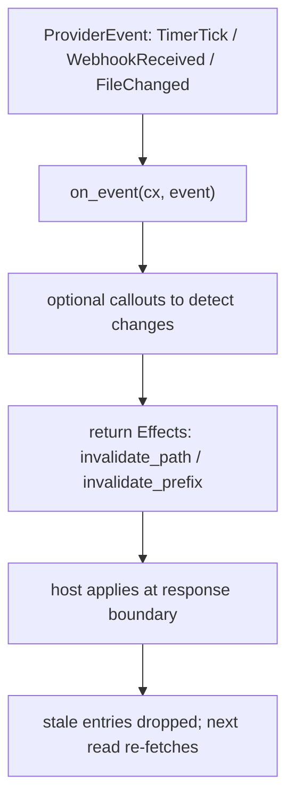

omnifs caches every provider result — listings, lookups, and file content — in capacity-bounded caches with no TTLs. Entries leave the cache only by capacity eviction or by **explicit invalidation** that your provider signals. Providers must not implement their own caches or time-based expiration; rely on the host's invalidation signals.

## Invalidation lives in Effects

Invalidation is expressed through `Effects`: `invalidate_path(path)` drops one exact provider-relative path; `invalidate_prefix(prefix)` drops every cached entry whose path starts with the prefix. The host applies effects at the response boundary, after it accepts your terminal answer.

### On a browse terminal

Any `Listing`, `FileContent`, or `Lookup` entry can carry an `Effects` batch via `.with_effects(..)`. When producing a result also makes other cached paths stale, stage the invalidations alongside it:

```rust
#[file("/{owner}/{repo}/refresh")]
async fn refresh(cx: Cx<State>, owner: String, repo: String) -> Result<FileContent> {
    let mut effects = Effects::new();
    effects
        .invalidate_path(format!("{owner}/{repo}/meta.json"))
        .invalidate_prefix(format!("{owner}/{repo}/issues"));
    Ok(FileContent::new("refreshed\n").with_effects(effects))
}
```

`invalidate_path` clears exactly that entry; `invalidate_prefix` clears a whole subtree (a directory listing plus all its children) in one effect.

### On an event (`on_event`)

The host can deliver `ProviderEvent`s: a watched file changed, a webhook arrived, a timer ticked, or auth refreshed. The provider entrypoint may define an `on_event` handler that returns the `Effects` to apply. This is the path for reacting to outside-world changes rather than user reads.

```rust
#[omnifs_sdk::provider(state = State, config = Config, mounts(/* ... */))]
impl GithubProvider {
    fn init(_config: Config) -> Result<Init<State>> {
        Ok(Init::new(State::new()))
    }

    async fn on_event(cx: Cx<State>, event: ProviderEvent) -> Result<Effects> {
        match event {
            ProviderEvent::TimerTick(_) => timer_tick(cx).await,
            _ => Ok(Effects::new()),
        }
    }
}
```

The `timer_tick` poller fetches what it needs (via callouts on `cx`) and returns the paths to drop:

```rust
pub(crate) async fn timer_tick(cx: Cx<State>) -> Result<Effects> {
    let mut effects = Effects::new();
    // Poll upstream; for repos with changes, invalidate their cached event listings.
    effects.invalidate_prefix("some-owner/some-repo/events");
    Ok(effects)
}
```

`on_event` is async, so it can issue callouts before deciding what to invalidate. If you do not define `on_event`, the macro generates a no-op. To find which paths are worth polling, `cx.active_paths(mount_id, parse)` returns the currently-open paths the host reported in a `TimerTick` context.



## Choosing path vs prefix

- A single file's content went stale → `invalidate_path("owner/repo/meta.json")`.
- A directory's membership changed, or many descendants are stale → `invalidate_prefix("owner/repo/issues")`.
- Be precise. Over-broad prefixes force needless re-fetches; missing invalidations serve stale bytes. Invalidate exactly the paths whose backing data you know changed.

## Paths are provider-relative and normalized

Invalidation paths are relative to the mount root. The SDK trims surrounding slashes, but you must not construct `.`/`..` traversal segments.

:::caution
Do not add a provider-side LRU, a time-based cache, or a "refetch every N seconds" loop. That duplicates the host cache, fights its eviction, and produces inconsistent results. Project freely and let the host cache; invalidate explicitly when you know something changed.
:::

:::note
Stability also feeds caching decisions: `Immutable` content is held until invalidated, `Mutable` may be re-fetched, `Volatile` is never snapshot-cached. Set the right `Stability` on your projections (see [Projections](./projections/)), then use invalidation effects for what stability alone cannot express.
:::
