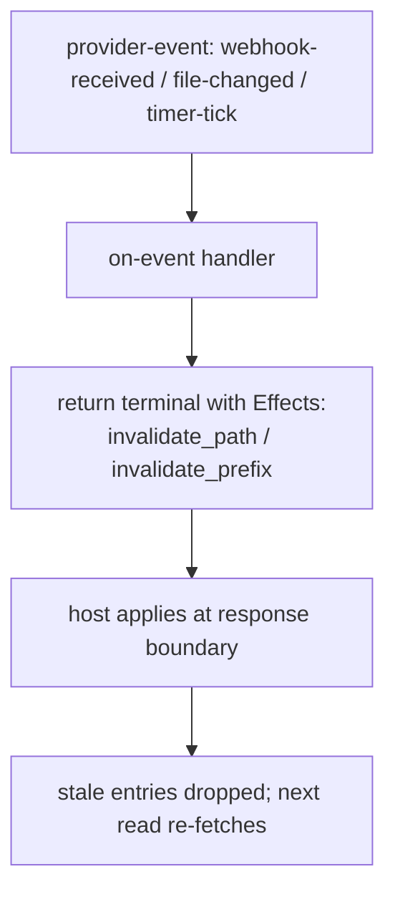

omnifs caches every provider result — listings, lookups, and file content — in capacity-bounded caches with no TTLs. Entries leave the cache only by capacity eviction or by **explicit invalidation** that your provider signals. Providers must not implement their own caches or time-based expiration; rely on the host's invalidation signals.

## Two ways to signal invalidation

Invalidation is expressed as effects: `invalidate-path` (one exact path) and `invalidate-prefix` (everything under a prefix). Effects are applied by the host at the response boundary, after it accepts your terminal answer.

### On a terminal, via `Effects`

Any terminal you return can carry an `Effects` batch. When a handler knows that producing this result also makes other cached paths stale, stage invalidations alongside it:

```rust
#[file("{owner}/{repo}/refresh")]
fn refresh(owner: &str, repo: &str, cx: &Cx) -> Result<FileContent> {
    // Re-fetch and, because state changed, drop the cached projections.
    let mut effects = Effects::new();
    effects
        .invalidate_path(format!("{owner}/{repo}/meta.json"))
        .invalidate_prefix(format!("{owner}/{repo}/issues"));
    Ok(FileContent::new("refreshed\n").with_effects(effects))
}
```

`invalidate_path` drops the cache entry for exactly that provider-relative path. `invalidate_prefix` drops every entry whose path starts with the prefix — use it to clear a whole subtree (a directory listing plus all its children) in one effect.

### On an event, via `on-event`

The host can deliver `provider-event`s: a watched file changed, a webhook arrived, a timer ticked, or auth refreshed. The event handler returns a terminal whose effects describe what to invalidate; the host applies them before surfacing the result. This is the path for reacting to outside-world changes rather than user reads.



## Choosing path vs prefix

- A single file's content went stale → `invalidate_path("owner/repo/meta.json")`.
- A directory's membership changed, or many descendants are stale → `invalidate_prefix("owner/repo/issues")`.
- Be precise. Over-broad prefixes force needless re-fetches; missing invalidations serve stale bytes. Invalidate exactly the paths whose backing data you know changed.

## Paths are provider-relative and normalized

Invalidation paths are relative to the mount root and must be normalized — no leading/trailing slashes, no `.` or `..` segments. The SDK trims surrounding slashes for you, but you are responsible for not constructing `..` traversals.

:::caution
Do not add a provider-side LRU, a time-based cache, or a "refetch every N seconds" loop. That duplicates the host cache, fights its eviction, and produces inconsistent results. Project freely and let the host cache; invalidate explicitly when you know something changed.
:::

:::note
Stability also feeds the host's caching decisions: `Immutable` content is held until invalidated, `Mutable` may be re-fetched, and `Volatile` is never snapshot-cached. Set the right `Stability` on your projections (see [Projections](./projections/)) so the host caches each file appropriately, then use invalidation effects for the cases stability alone cannot express.
:::
