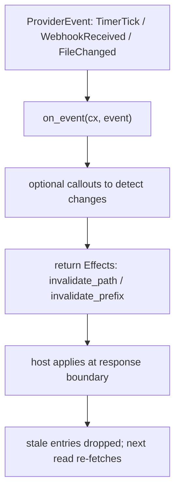

omnifs caches every provider result — listings, lookups, and file content — in capacity-bounded caches with no TTLs. Entries leave the cache only by capacity eviction or by **explicit invalidation** that your provider signals. Providers must not implement their own caches or time-based expiration; rely on the host's invalidation signals.

## Invalidation lives in Effects

Invalidation is expressed through the `Effects` type:

- `effects.invalidate_path(path)` drops one exact provider-relative path.
- `effects.invalidate_prefix(prefix)` drops every cached entry whose path starts with the prefix.

The host applies effects at the response boundary, after it accepts your return. The primary place a provider produces an invalidation `Effects` batch is the `on_event` handler — the path for reacting to outside-world changes rather than user reads.

## Reacting to events (`on_event`)

The host can deliver `ProviderEvent`s: a watched file changed, a webhook arrived, a timer ticked, or auth refreshed. Define an `on_event` method on the `#[provider]` impl; it is `async` and returns `Result<Effects>`. If you do not define it, the macro generates a no-op.

```rust
#[provider(
    metadata = "omnifs.provider.json",
    mounts(crate::root::RootHandlers, crate::repo::RepoHandlers /* ... */)
)]
impl GithubProvider {
    fn init(_config: Config) -> (State, ProviderInfo, RequestedCapabilities) {
        (
            State { event_etags: hashbrown::HashMap::new() },
            ProviderInfo { name: "github-provider".into(), version: "0.1.0".into(), description: "GitHub API provider".into() },
            RequestedCapabilities::with_git(60),   // request a 60s poll interval
        )
    }

    async fn on_event(cx: Cx<State>, event: ProviderEvent) -> Result<Effects> {
        match event {
            ProviderEvent::TimerTick(_) => timer_tick(cx).await,
            _ => Ok(Effects::new()),
        }
    }
}
```

`on_event` takes `Cx<State>` by value (it can mutate state via `cx.state_mut(..)`) and may issue callouts before deciding what to invalidate. A `timer_tick` poller asks the host which paths are currently open, fetches their upstream state, and returns the prefixes to drop:

```rust
pub(crate) async fn timer_tick(cx: Cx<State>) -> Result<Effects> {
    let mut effects = Effects::new();

    // Only poll repos the user actually has open.
    let mut repo_ids = cx.active_paths(RepoPath::MOUNT_ID, RepoId::parse);
    repo_ids.sort();
    repo_ids.dedup();
    if repo_ids.is_empty() {
        return Ok(effects);
    }

    // Conditional fetches (If-None-Match) in one parallel batch.
    let fetches = repo_ids.into_iter().map(|repo_id| {
        let cx = cx.clone();
        let etag = cx.state(|s| s.event_etags.get(&repo_id).cloned());
        async move {
            let mut req = cx.github_json_request(format!("/repos/{repo_id}/events?per_page=30"));
            if let Some(etag) = etag { req = req.header("If-None-Match", etag); }
            (repo_id, req.send().await)
        }
    });

    for (repo_id, response) in join_all(fetches).await {
        let Ok(resp) = response else { continue };
        if resp.status().as_u16() == 304 { continue; }   // unchanged
        // ...inspect the event list and invalidate the affected subtrees...
        effects.invalidate_prefix(format!("{repo_id}/issues"));
        effects.invalidate_prefix(format!("{repo_id}/pulls"));
    }
    Ok(effects)
}
```

`cx.active_paths(mount_id, parse)` returns the currently-open paths the host reported in the `TimerTick` context, parsed through your closure — so the poller only does work for paths the user cares about.



## Choosing path vs prefix

- A single file's content went stale → `invalidate_path("owner/repo/meta.json")`.
- A directory's membership changed, or many descendants are stale → `invalidate_prefix("owner/repo/issues")`.
- Be precise. Over-broad prefixes force needless re-fetches; missing invalidations serve stale bytes. Invalidate exactly the paths whose backing data you know changed.

## Paths are provider-relative and normalized

Invalidation paths are relative to the mount root. Do not construct `.`/`..` traversal segments.

:::caution
Do not add a provider-side LRU, a time-based cache, or a refetch loop. That duplicates the host cache, fights its eviction, and produces inconsistent results. Project freely and let the host cache; invalidate explicitly when an event tells you something changed.
:::

:::note
Stability also feeds caching decisions: `Immutable` content is held until invalidated, `Mutable` may be re-fetched, `Volatile` is never snapshot-cached. Set the right `Stability` on your projections (see [Projections](./projections/)), then use `on_event` invalidation for what stability alone cannot express. Version tokens (an ETag or commit sha on a `FileProj`) let the host skip refetching unchanged content even after an invalidation prompt.
:::


## Design reference

The source of truth behind this page is the [Cache architecture](https://github.com/0xff-ai/omnifs/blob/main/docs/design/cache-architecture.md) design document. See the full [design-doc index](/contributing/design-docs/) for everything these pages are based on.
