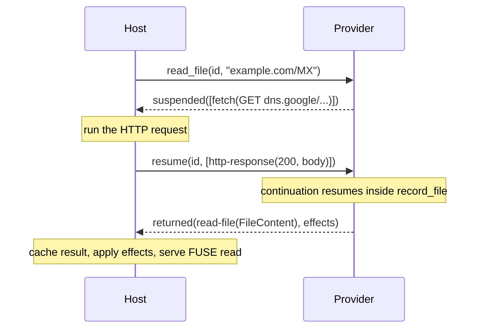

A provider does no I/O itself. When a handler needs the network, a git clone, or an archive, it issues a **callout**: a request for the host to do the work. The handler suspends; the host runs the callout and resumes the handler with the result. This is the suspend/resume protocol, and it is strictly request/response — there are no fire-and-forget callouts, and a completed return never carries trailing callouts.

## The handler-facing API

You rarely touch the raw protocol. The SDK's async runtime makes callouts look like ordinary `.await`s on `cx`:

```rust
#[file("/{domain}/{record_type}")]
async fn record_file(cx: &Cx<State>, domain: DomainName, record_type: String)
    -> Result<FileContent> {
    let url = format!("https://dns.google/resolve?name={domain}&type={record_type}");
    let resp = cx.http().get(url).send().await?;   // <- suspends here
    let resp = resp.error_for_status()?;            // 4xx/5xx -> ProviderError
    Ok(FileContent::bytes(resp.body().to_vec()))
}
```

`cx.http().get(url).send().await` yields an `http::Response<Vec<u8>>`, but under the hood the handler suspended after issuing a `fetch` callout, the host performed the HTTP request, and the SDK resumed the handler with the response. The continuation is keyed by the correlation id the host supplied with the original browse call.

## The callout builders on `Cx`

| Builder | Callout | Result |
| --- | --- | --- |
| `cx.http().get(url).send()` / `.post(url)` | `fetch(http-request)` | `http::Response<Vec<u8>>` (bytes cross the WIT) |
| `cx.http().get(url).into_blob().with_cache_key(k).send()` | `fetch-blob` | `BlobRef` (bytes stay host-side) |
| `cx.git().open_repo(cache_key, clone_url)` | `git-open-repo` | `GitRepoInfo` (`.tree`, `.repo`) |
| `cx.archives().open(blob).format(..).send()` | `open-archive` | `TreeRef` |
| `cx.blob(id).read()` / `.read_range(off, len)` | `read-blob` | `Vec<u8>` (a bounded range) |

The HTTP builder is chainable: `.header(name, value)`, `.body(bytes)`, and `.json(&value)` (sets the body and `Content-Type`). Invalid headers and serialization failures are recorded as a sticky error surfaced at `.send().await`. Use `ResponseExt::error_for_status()` for default 4xx/5xx mapping, or inspect the response directly for custom handling — the SDK already maps `429` with `retry-after` to a retryable `ProviderError::rate_limited`, and providers commonly add their own check (GitHub maps `x-ratelimit-remaining: 0` and abuse-detection bodies to rate-limited).

Use `into_blob()` for large bodies you will serve verbatim or mount as a tree — the body lands in the host's disk-backed blob cache and only a handle plus metadata crosses the boundary. `into_blob()` requires a cache key; reusing the same key from the same provider deduplicates the fetch.

```rust
// Large file: keep bytes host-side, serve later as a blob.
let blob = cx.http().get(pdf_url).into_blob().with_cache_key(format!("pdf-{id}")).send().await?;
Ok(FileContent::blob_with_attrs(
    FileAttrs::new(Size::Exact(blob.size), Stability::Immutable),
    blob.id(),
))

// Cloneable tree: hand off to a bind mount from a #[treeref] handler.
let repo = cx.git().open_repo(cache_key, clone_url).await?;
Ok(TreeRef::new(repo.tree))
```

## Multiple callouts

Sequential awaits become sequential suspend/resume cycles:

```rust
let repo = cx.github_json::<RepoMeta>(format!("/repos/{owner}/{repo}")).await?;       // cycle 1
let issues = cx.github_json::<Vec<Issue>>(format!("/repos/{owner}/{repo}/issues")).await?; // cycle 2
```

For independent requests, `join_all([..])` batches several callout futures into a **single** yield/resume round trip so the host runs them in parallel — this is how the DNS provider's `all` record fetches every type at once:

```rust
use omnifs_sdk::prelude::join_all;

let mut requests = Vec::new();
for record_type in SupportedRecordType::common() {
    let url = cx.state(|s| doh::query_url(&s.resolvers, None, &domain, *record_type))?;
    requests.push(cx.dns_message_get(url).send());
}
let responses = join_all(requests).await;
```

Each child future must belong to the same `Cx` and yield exactly one callout per suspension.

## The protocol underneath

Each browse export returns a `provider-step`: either `returned(provider-return)` — a terminal answer plus host effects — or `suspended(list<callout>)` — a non-empty batch the host must run. The host runs the batch and calls `resume(id, results)` with one `callout-result` per callout, in order. The stored continuation picks up where it left off and runs to the next suspension or to a return.



## Errors and cancellation

A callout can fail; the host delivers a `callout-error` (network, timeout, rate-limited, …) which surfaces in your handler as the `Err` arm of the awaited `Result`. Propagate it with `?` or map it to a more specific `ProviderError`. The host may also `cancel(id)` an in-flight operation (for example, the user interrupted the read); the SDK drops the continuation.

:::caution
`init` / `initialize()` is terminal-only — it has no correlation id and cannot suspend. Never issue a callout during init. Do all I/O inside browse handlers, where suspend/resume is available.
:::

:::note
Callouts are strictly request/response. If something is conceptually one-way, it does not belong as a callout. The WIT also reserves streaming and websocket callouts (`stream-*`, `ws-*`); the SDK surfaces the `http`, `git`, `archives`, and `blob` builders today.
:::
