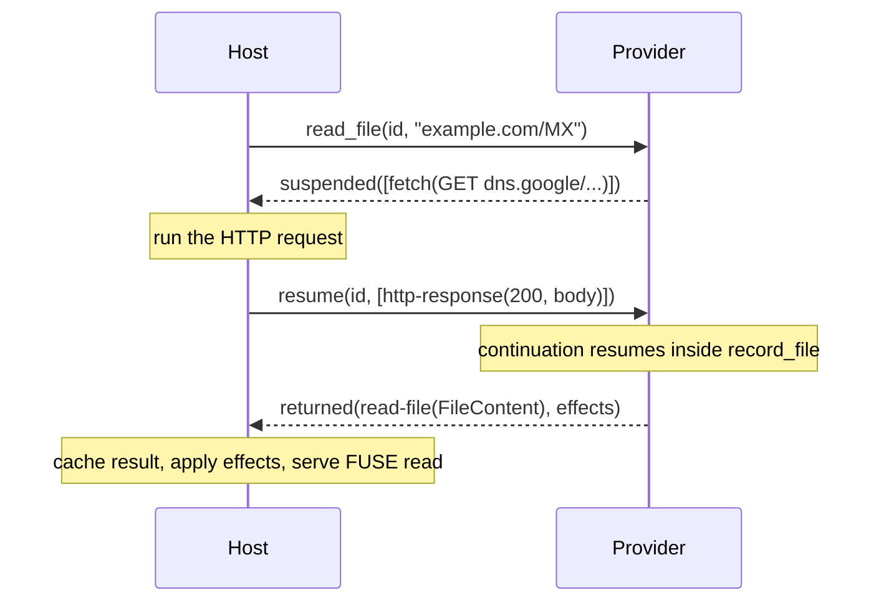

A provider does no I/O itself. When a handler needs the network, a git clone, or an archive, it emits a **callout**: a request for the host to do the work. The host runs the callout, then resumes the handler with the result. This is the suspend/resume protocol, and it is strictly request/response — there are no fire-and-forget callouts, and a completed return never carries trailing callouts.

## The handler-facing API

You rarely touch the raw protocol. The SDK's async runtime makes callouts look like ordinary synchronous method calls on `Cx`:

```rust
#[file("{domain}/{record_type}")]
fn record_file(domain: &str, record_type: &str, cx: &Cx) -> Result<FileContent> {
    let url = format!("https://dns.google/resolve?name={domain}&type={record_type}");
    let response = cx.fetch(Request::get(url))?;   // <- suspends here
    if !response.is_success() {
        return Err(ProviderError::internal(format!("query failed: {}", response.status())));
    }
    Ok(FileContent::new(response.body().to_vec()))
}
```

`cx.fetch(..)` returns a `Response`, but under the hood the handler suspended after issuing a `fetch` callout, the host performed the HTTP request, and the handler resumed with the response filled in. The continuation is keyed by a correlation id the host supplied with the original browse call.

## The callout methods on `Cx`

| Method | Callout | Result |
| --- | --- | --- |
| `cx.fetch(Request)` | `fetch(http-request)` | `Response` (bytes cross the WIT) |
| `cx.fetch_blob(Request, cache_key)` | `fetch-blob` | `Blob` handle (bytes stay host-side) |
| `cx.open_archive(blob, format, strip_prefix)` | `open-archive` | a `tree` handle |
| `cx.git_open(clone_url, cache_key)` | `git-open-repo` | a `tree` handle |
| `cx.read_blob(blob, offset, len)` | `read-blob` | `Vec<u8>` (a bounded range) |

Use `fetch_blob` for large bodies you will serve verbatim or mount as a tree — the body lands in the host's disk-backed blob cache and only a handle plus metadata crosses the boundary. Use `fetch` for payloads you must parse in the provider. Reusing the same `cache_key` from the same provider deduplicates the fetch.

```rust
// Large file: keep bytes host-side, serve later as a blob.
let blob = cx.fetch_blob(Request::get(pdf_url), format!("pdf-{id}"))?;
Ok(FileContent::blob(blob.id()))

// Cloneable tree: hand off to a bind mount.
let tree = cx.git_open(clone_url, cache_key)?;
Ok(List::subtree(path, tree))
```

## Multiple callouts in one handler

A handler may issue several callouts; each one suspends and resumes independently. Sequential calls become sequential suspend/resume cycles:

```rust
let repo = cx.fetch(Request::get(repo_url))?.json::<RepoMeta>()?;   // cycle 1
let issues = cx.fetch(Request::get(issues_url))?.json::<Vec<Issue>>()?; // cycle 2
```

If two requests are independent, prefer fetching once and projecting everything (see [Project everything](./project-everything/)) over many round trips.

## The protocol underneath

Each browse export returns a `provider-step`: either `returned(provider-return)` — a terminal answer plus host effects — or `suspended(list<callout>)` — a non-empty batch the host must run. The host runs the batch and calls `resume(id, results)` with one `callout-result` per callout, in order. The provider's stored continuation picks up where it left off and runs to the next suspension or to a return.



## Errors and cancellation

A callout can fail; the host delivers a `callout-error` (network, timeout, rate-limited, and so on) which surfaces in your handler as a `Result::Err`. Propagate it with `?` or map it to a more specific `ProviderError`. The host may also `cancel(id)` an in-flight operation (for example, the user interrupted the read); the SDK drops the continuation.

:::caution
`initialize()` is terminal-only — it has no correlation id and cannot suspend. Never issue a callout during config parsing. Do all I/O inside browse handlers, where suspend/resume is available.
:::

:::note
Callouts are strictly request/response. If something is conceptually one-way, it does not belong as a callout. The WIT also reserves streaming and websocket callouts (`stream-*`, `ws-*`); the SDK surfaces the synchronous `fetch`/`git_open`/`fetch_blob`/`open_archive`/`read_blob` set today.
:::
