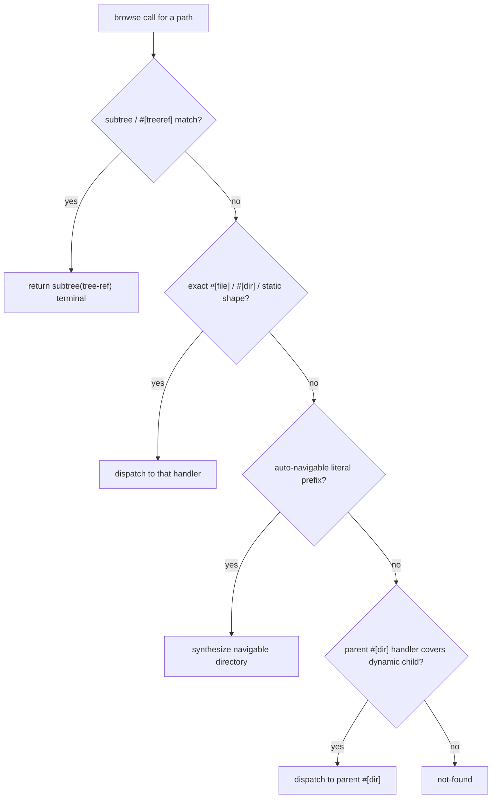

Handlers are free functions inside a `#[omnifs_sdk::handlers] impl` block. Each carries a path-pattern attribute. The SDK builds a route table from those patterns and dispatches each browse call to the most specific matching handler.

## Path patterns and captures

A pattern is a slash-separated template. A literal segment matches itself; a `{name}` segment captures one path component and is passed to the handler as a `&str` parameter of the same name. Every handler may take a trailing `cx: &Cx` parameter to reach config and callouts.

```rust
#[dir("{owner}/{repo}")]
fn repo_dir(owner: &str, repo: &str, cx: &Cx) -> Result<List> { /* ... */ }
```

`owner` and `repo` are bound from the path; their order in the signature follows their order in the pattern.

## The attributes

### `#[dir("...")]`

A directory family. Returns `Result<List>` — the listing of children at that path. Use it for any path the user `cd`s into or `ls`es.

```rust
#[dir("{category}")]
fn category_dir(category: &str, cx: &Cx) -> Result<List> {
    let feed = query(cx, category)?;
    let entries = feed.items.iter().map(|i| Entry::dir(&i.id));
    Ok(List::entries(Listing::partial(entries)))
}
```

### `#[file("...")]`

An exact file family. Returns `Result<FileContent>` — the bytes for a `read_file`.

```rust
#[file("{domain}/{record_type}")]
fn record_file(domain: &str, record_type: &str, cx: &Cx) -> Result<FileContent> {
    let answer = resolve(cx, domain, record_type)?;
    Ok(FileContent::new(answer))
}
```

### `#[treeref("...")]`

A subtree handoff: the matched path is a real directory tree that the host should materialize from a clone or archive, not project entry-by-entry. The handler obtains a `tree` handle (from `cx.git_open(..)` or `cx.open_archive(..)`) and returns `List::subtree(path, tree)`. The host bind-mounts the resolved tree at that path.

```rust
#[treeref("{owner}/{repo}/tree")]
fn repo_tree(owner: &str, repo: &str, cx: &Cx) -> Result<List> {
    let tree = cx.git_open(
        format!("git@github.com:{owner}/{repo}.git"),
        format!("github-{owner}-{repo}"),
    )?;
    Ok(List::subtree(format!("{owner}/{repo}/tree"), tree))
}
```

### `#[bind("...")]`

Mounts a typed subtree at this path family. The handler parses the prefix captures, constructs a value of a `#[omnifs_sdk::subtree] impl` type, and returns it. The host dispatches the remaining path suffix through that type's own inner handlers. See [Subtrees](./subtrees/).

```rust
#[bind("{database}")]
fn database(database: &str, cx: &Cx) -> Result<Database> {
    let path = cx.config::<DbConfig>()?.databases.get(database)
        .cloned()
        .ok_or_else(|| ProviderError::not_found("no such database"))?;
    Ok(Database { name: database.into(), path })
}
```

### `#[mutate("...")]`

A mutation handler family.

:::caution
Mutations are not implemented yet. Do not make projected files writable as an implicit mutation mechanism. If you are adding mutation support, follow the draft-namespace + control-directory design described in the project guidance, not direct writes.
:::

## Auto-navigable prefixes

You do **not** write stub `#[dir]` handlers for intermediate navigation nodes. Any literal-segment prefix of a registered route is automatically a navigable directory. If your only routes are `#[dir("{owner}/{repo}")]` and `#[file("{owner}/{repo}/meta.json")]`, the path `{owner}` is still listable and `cd`-able even though no handler is bound to it. Adding empty pass-through handlers for these is wrong.

## Per-segment validators and match candidacy

Route parse functions participate in match candidacy. A pattern segment may reject a value (for example, a `{paper_id}` that must look like an arXiv id). When a segment rejects, dispatch **falls through to the next-most-specific candidate route**, not straight to `ENOENT`. This is how a literal route like `tree` can coexist with a dynamic sibling `{filename}`: the literal wins for `tree`, the capture handles everything else.

## How a path routes



The precedence, in words: subtree handlers first, then exact / static / auto-navigable shape, then the parent `#[dir]` handler for dynamic children, then not-found. A rejected per-segment validator removes a candidate but does not short-circuit the search.

:::note
`docs/design/path-dispatch-and-listing.md` in the repo is the source of truth for routing precedence and listing exhaustiveness. The summary here matches it; read that file before changing dispatch logic itself.
:::

## Listing exhaustiveness

`list_children` returns a `List` whose underlying `Listing` is either `complete` (the host treats absence as authoritative negative) or `partial` (the host may still resolve unlisted children via `lookup_child`). Use `Listing::complete` when you have enumerated every child, and `Listing::partial` when the directory has dynamic members you cannot list ahead of time (for example, every possible domain under a DNS root). An auto-navigable directory is non-exhaustive whenever a sibling route at the next depth has a capture or rest segment.
