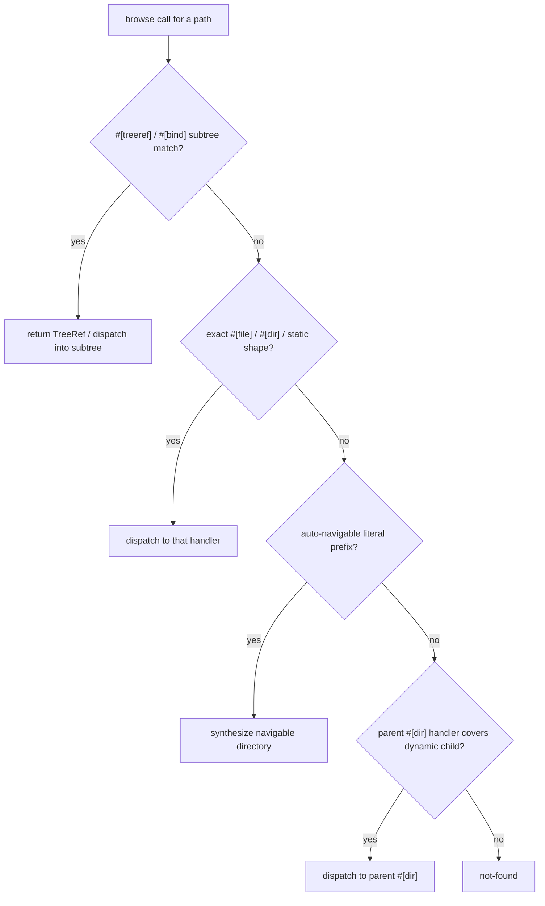

Handlers are functions inside a `#[omnifs_sdk::handlers] impl SomeHandlers` block. Each carries a path-pattern attribute. The SDK builds a route table from those patterns and dispatches each browse call to the most specific matching handler.

## Handler shape

A handler optionally takes a context first, then one parameter per captured path segment, and returns a `Result<T>` whose `T` depends on the attribute. The context type depends on the handler kind:

- `#[dir]` handlers take `cx: &DirCx<State>` (carries the request intent: lookup, list, or read-file).
- `#[file]` handlers take `cx: &Cx<State>`.
- handlers inside a `#[subtree]` block take `cx: &BindCtx<'_, State, B>`.

The context is optional — omit it when a handler needs neither config nor callouts. The state type is inferred from the context, so `#[handlers]` takes no arguments. Handlers may be `fn` or `async fn`.

```rust
pub struct IssueHandlers;

#[handlers]
impl IssueHandlers {
    #[dir("/{owner}/{repo}/issues/{filter}")]
    async fn issue_list(
        cx: &DirCx<State>,
        owner: OwnerName,
        repo: RepoName,
        filter: StateFilter,
    ) -> Result<Projection> {
        // ...
    }
}
```

The handler-struct name is just a grouping the entrypoint references in `mounts(...)`; routes are registered by pattern.

## Path patterns and captures

A pattern is a slash-prefixed template. A literal segment matches itself; a `{name}` segment captures one path component and is passed to the handler as a parameter of the same name. Capture parameters are **typed**: use `String` or `u64` for a free segment, or a custom type that validates the segment by implementing `FromStr` (with `type Err = ()`). A type that rejects a value removes that route from candidacy (see below).

```rust
#[file("/{domain}/{record_type}")]
async fn record_file(cx: &Cx<State>, domain: DomainName, record_type: String)
    -> Result<FileContent> { /* ... */ }
```

Parameter order in the signature follows segment order in the pattern. A literal route segment can also embed a sigil, e.g. `#[dir("/@{resolver}")]` matches `@cloudflare`.

## The attributes

### `#[dir("...")]` → `Result<Projection>`

A directory family. You build a `Projection` mutably and return it. A dir handler answers list, lookup, *and* read-file for that subtree — the `DirCx`'s `intent()` tells you which the host asked for if you need to specialize.

```rust
#[dir("/tables")]
fn list(cx: &DirCx<State>) -> Result<Projection> {
    let names = cx.state(|s| s.backend.borrow().list_tables())
        .map_err(|e| ProviderError::internal(format!("list tables: {e}")))?;
    let mut p = Projection::new();
    for name in names {
        p.dir(name);
    }
    p.page(PageStatus::Exhaustive);   // exhaustive listing
    Ok(p)
}
```

`p.page(PageStatus::Exhaustive)` marks the listing authoritative (the host treats absence as a negative). `p.page(PageStatus::More(Cursor::Opaque("...")))` marks it non-exhaustive — for an open namespace whose members are resolved on demand (a DNS root, a paged feed). If you omit `page`, the listing defaults to non-exhaustive.

### `#[file("...")]` → `Result<FileContent>`

An exact file family. Returns the bytes for a `read_file`.

```rust
#[file("/{domain}/{record_type}")]
async fn record_file(cx: &Cx<State>, domain: DomainName, record_type: String)
    -> Result<FileContent> {
    let bytes = read_record_bytes(cx, None, &domain, &record_type).await?;
    Ok(FileContent::bytes(bytes))
}
```

### `#[treeref("...")]` → `Result<TreeRef>`

A subtree handoff: the matched path is a real directory tree the host should materialize from a clone or archive rather than projecting file-by-file. The handler obtains a tree handle from a callout (`cx.git().open_repo(..)` or `cx.archives().open(..)`) and returns a `TreeRef`. The host bind-mounts the resolved tree there. See [Subtrees](./subtrees/).

```rust
#[treeref("/{owner}/{repo}/repo")]
async fn repo_tree(cx: &Cx<State>, owner: OwnerName, repo: RepoName) -> Result<TreeRef> {
    let repo_id = RepoId::new(&owner, &repo);
    let repo = cx.git()
        .open_repo(format!("github.com/{repo_id}"), format!("git@github.com:{repo_id}.git"))
        .await?;
    Ok(TreeRef::new(repo.tree))
}
```

### `#[bind("...")]` → `Result<SubtreeType>`

Mounts a typed subtree at this path family. The handler parses and validates the prefix captures, then returns a value of a `#[omnifs_sdk::subtree] impl` type. The host dispatches the remaining suffix through that type's own handlers. See [Subtrees](./subtrees/).

```rust
#[bind("/tables/{name}")]
fn table(_cx: &Cx<State>, name: TableName) -> Result<TableSubtree> {
    Ok(TableSubtree { name: name.into_inner() })
}
```

### `#[mutate("...")]`

A mutation handler family.

:::caution
Mutations are not implemented yet. Do not make projected files writable as an implicit mutation mechanism. If you are adding mutation support, follow the draft-namespace + control-directory design in the project guidance, not direct writes.
:::

## Auto-navigable prefixes

You do **not** write stub `#[dir]` handlers for intermediate navigation nodes. Any literal-segment prefix of a registered route is automatically a navigable directory. The GitHub provider, for example, declares no `/` handler at all — there is no "list all owners" API, and the SDK derives the implicit prefix dir from `/{owner}` below it:

```rust
#[handlers]
impl RootHandlers {
    // No `/` handler: the SDK derives an implicit prefix dir from `/{owner}`.
    #[dir("/{owner}")]
    async fn repos(cx: &DirCx<State>, owner: OwnerName) -> Result<Projection> { /* ... */ }
}
```

Adding empty pass-through handlers for intermediate nodes is wrong. (A root `#[dir("/")]` returning a non-exhaustive empty `Projection` is the one common exception, used to present a valid but open root.)

## Per-segment validators and match candidacy

Typed capture parsers participate in match candidacy. A capture whose `FromStr` rejects the segment removes that route from the candidate set; dispatch then **falls through to the next-most-specific candidate**, not straight to `ENOENT`. This is how a literal route like `/{owner}/{repo}/repo` coexists with a dynamic sibling capture: the literal wins for `repo`, the capture handles everything else, and a malformed capture falls through rather than masking a valid route.

```rust
#[derive(Clone, Debug)]
pub struct TableName(String);

impl std::str::FromStr for TableName {
    type Err = ();
    fn from_str(s: &str) -> std::result::Result<Self, ()> {
        if s.is_empty() || s.contains(['\0', '/', '\\']) { return Err(()); }
        Ok(Self(s.to_string()))
    }
}
```

## How a path routes



The precedence, in words: subtree/treeref handlers first, then exact / static / auto-navigable shape, then the parent `#[dir]` handler for dynamic children, then not-found. A rejected per-segment validator removes a candidate but does not short-circuit the search.

:::note
`docs/design/path-dispatch-and-listing.md` in the repo is the source of truth for routing precedence and listing exhaustiveness. The summary here matches it; read that file before changing dispatch logic itself.
:::


## Design reference

The source of truth behind this page is the [Path dispatch & listing](https://github.com/0xff-ai/omnifs/blob/main/docs/design/path-dispatch-and-listing.md) design document. See the full [design-doc index](/contributing/design-docs/) for everything these pages are based on.
