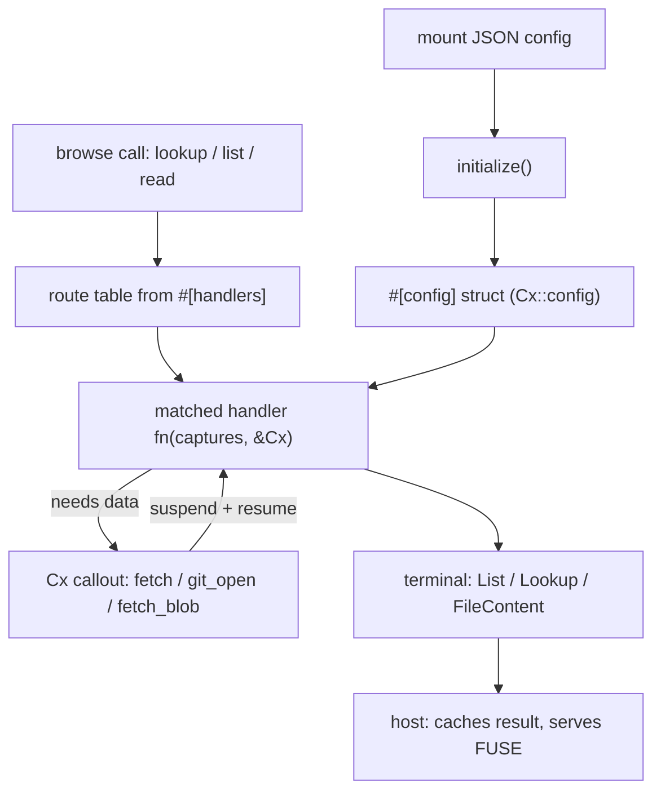

An omnifs provider is a self-contained WebAssembly component that teaches the host how to project some external service into the filesystem. The host owns the FUSE mount, the inode table, all caching, and every network or git operation. Your provider only answers questions about paths: what lives at a directory, what an entry is, and what bytes a file holds.

## What a provider is

A provider is a `wasm32-wasip2` component implementing the `omnifs:provider` WIT interface. The host loads it, calls `initialize()` once with the mount's config, then drives it through a small browse surface:

- `lookup_child(parent_path, name)` — resolve one child entry
- `list_children(path)` — list a directory
- `read_file(path)` — read exact file content

You never write those functions directly. You write **free-function path handlers** annotated with attributes like `#[dir]` and `#[file]`, collected from a `#[omnifs_sdk::handlers] impl` block. The SDK builds a route table from your handlers and dispatches each browse call to the most specific match.

## Anatomy of a provider crate

A minimal provider crate has three parts:

```
providers/dns/
  Cargo.toml             # cdylib, depends on omnifs-sdk
  omnifs.provider.json   # id, mounts, auth manifest (embedded into the WASM)
  src/lib.rs             # config + provider entrypoint + handlers
```

Inside `lib.rs` you declare three things:

```rust
use omnifs_sdk::prelude::*;

// 1. Config: deserialized from the mount's JSON config object.
#[omnifs_sdk::config]
#[derive(Default)]
struct DnsConfig {
    resolver: Option<String>,
}

// 2. Provider entrypoint: declares the mounts this provider serves.
struct DnsProvider;

#[omnifs_sdk::provider(mounts(dns))]
impl DnsProvider {}

// 3. Handlers: free functions that answer path queries.
#[omnifs_sdk::handlers]
impl DnsProvider {
    #[dir("{domain}")]
    fn domain_dir(domain: &str) -> Result<List> {
        let entries = ["A", "AAAA", "MX"].iter().map(|rt| {
            Entry::file(*rt, FileProj::deferred_full(Size::NonZero, Stability::Mutable, None))
        });
        Ok(List::entries(Listing::complete(entries)))
    }

    #[file("{domain}/{record_type}")]
    fn record_file(domain: &str, record_type: &str, cx: &Cx) -> Result<FileContent> {
        let url = format!("https://dns.google/resolve?name={domain}&type={record_type}");
        let response = cx.fetch(Request::get(url))?;
        Ok(FileContent::new(response.body().to_vec()))
    }
}
```

## How it fits together

A handler receives the captured path segments plus an optional `&Cx` execution context. When it needs data from the outside world, it calls a method on `Cx` such as `cx.fetch(..)`. Those calls look synchronous but are implemented as **callouts**: the handler suspends, the host runs the request, and the handler resumes with the result. The provider itself never opens a socket, clones a repo, or touches a credential.



## Map of this section

- **[Project setup](./project-setup/)** — the crate, `Cargo.toml`, `wit_bindgen::generate!`, and declaring mounts.
- **[Handlers](./handlers/)** — `#[dir]`, `#[file]`, `#[treeref]`, `#[bind]`, `#[mutate]`, and how a path routes to a handler.
- **[Subtrees](./subtrees/)** — typed `#[subtree]` dispatch versus `#[treeref]` clone handoff.
- **[Config](./config/)** — `#[config]` structs and the JSON config object.
- **[Projections](./projections/)** — declaring projected files: size, bytes, read mode, stability.
- **[Project everything](./project-everything/)** — returning every byte you already fetched so the host avoids refetches.
- **[Auth manifest](./auth-manifest/)** — `omnifs.provider.json` auth and host-injected credentials.
- **[Callouts](./callouts/)** — the suspend/resume protocol in depth.
- **[Cache invalidation](./cache-invalidation/)** — signalling the host to drop cached entries.
- **[Testing](./testing/)** — building, clippy, and `--target wasm32-wasip2` checks.
- **[WIT reference](./wit-reference/)** — the raw `omnifs:provider` interface.

:::note
The host owns all caching and all I/O. A provider is a pure function from paths to projections plus a list of callouts it wants the host to run. Keep that mental model and the rest of this section follows.
:::
