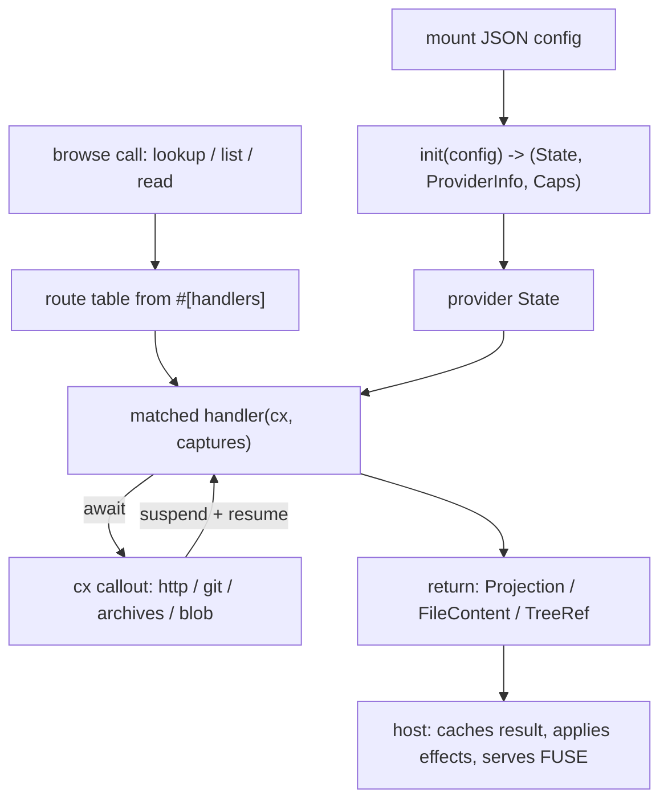

An omnifs provider is a self-contained WebAssembly component that teaches the host how to project some external service into the filesystem. The host owns the FUSE mount, the inode table, all caching, and every network or git operation. Your provider only answers questions about paths: what lives at a directory, what an entry is, and what bytes a file holds.

## What a provider is

A provider is a `wasm32-wasip2` component implementing the `omnifs:provider` WIT interface. The host loads it, calls `init` once to build your provider state, then drives it through a small browse surface:

- `lookup_child(parent_path, name)` — resolve one child entry
- `list_children(path)` — list a directory
- `read_file(path)` — read exact file content

You do not implement those WIT functions directly. You write **path handlers** annotated with attributes like `#[dir]` and `#[file]`, grouped in `#[omnifs_sdk::handlers] impl` blocks. The SDK macros build a route table from your handlers and dispatch each browse call to the most specific match. A single dir handler returning a `Projection` answers lookup, list, and read at once.

## Anatomy of a provider crate

A provider crate has a manifest, a `Cargo.toml`, and a `src/` tree conventionally split per path family:

```
providers/dns/
  Cargo.toml             # cdylib, depends on omnifs-sdk
  omnifs.provider.json   # id, mount, capabilities, auth (embedded into the WASM)
  src/
    lib.rs               # State + Config + module declarations
    provider.rs          # #[omnifs_sdk::provider(...)] entrypoint + init
    root.rs              # #[handlers] impl RootHandlers { #[dir("/")] ... }
    query.rs             # record lookup logic + handlers
```

The provider declares three kinds of things:

```rust
// 1. State + Config (lib.rs). Config is deserialized from the mount JSON.
#[omnifs_sdk::config]
struct Config {
    #[serde(default = "default_resolver_name")]
    default_resolver: String,
}

#[derive(Clone)]
struct State {
    resolvers: ResolverConfig,
}

// 2. Entrypoint (provider.rs): names the manifest and handler modules.
#[provider(
    metadata = "omnifs.provider.json",
    mounts(crate::root::RootHandlers, crate::query::QueryHandlers)
)]
impl DnsProvider {
    fn init(config: Config) -> Result<(State, ProviderInfo, RequestedCapabilities)> {
        let resolvers = ResolverConfig::from_config(config.default_resolver, config.resolvers)?;
        Ok((
            State { resolvers },
            ProviderInfo {
                name: "dns-provider".into(),
                version: "0.1.0".into(),
                description: "DNS record browsing via DNS-over-HTTPS".into(),
            },
            RequestedCapabilities::empty(),
        ))
    }
}

// 3. Handlers (root.rs): functions answering path queries.
pub struct RootHandlers;

#[handlers]
impl RootHandlers {
    #[dir("/{domain}")]
    fn domain_dir(_domain: DomainName) -> Result<Projection> {
        let mut p = Projection::new();
        for name in record_names() {
            p.deferred_file(name);
        }
        p.page(PageStatus::Exhaustive);
        Ok(p)
    }

    #[file("/{domain}/{record_type}")]
    async fn record_file(cx: &Cx<State>, domain: DomainName, record_type: String)
        -> Result<FileContent> {
        let bytes = read_record_bytes(cx, None, &domain, &record_type).await?;
        Ok(FileContent::bytes(bytes))
    }
}
```

## How it fits together

A handler optionally takes a context first (`cx: &DirCx<State>` for dir handlers, `cx: &Cx<State>` for file handlers, `cx: &BindCtx<'_, State, B>` inside a subtree), then one typed parameter per captured path segment. When it needs data from the outside world, it `.await`s a method on `cx` such as `cx.http().get(url).send()`. Those awaits look ordinary but are **callouts**: the handler suspends, the host runs the request, and the SDK resumes the handler with the result. The provider never opens a socket, clones a repo, or touches a credential itself.



## Map of this section

- **[Project setup](./project-setup/)** — the crate, `Cargo.toml`, mount declaration, and the `wasm32-wasip2` build.
- **[Handlers](./handlers/)** — `#[dir]`, `#[file]`, `#[treeref]`, `#[bind]`, `#[mutate]`, and how a path routes to a handler.
- **[Subtrees](./subtrees/)** — typed `#[subtree]` dispatch via `#[bind]` versus `#[treeref]` clone handoff.
- **[Config](./config/)** — `#[config]` structs and the JSON config object.
- **[Projections](./projections/)** — declaring projected files: size, bytes, read mode, stability.
- **[Project everything](./project-everything/)** — returning every byte you already fetched so the host avoids refetches.
- **[Auth manifest](./auth-manifest/)** — `omnifs.provider.json` auth and host-injected credentials.
- **[Callouts](./callouts/)** — the suspend/resume protocol in depth.
- **[Cache invalidation](./cache-invalidation/)** — signalling the host to drop cached entries.
- **[Testing](./testing/)** — building, clippy, and `--target wasm32-wasip2` checks.
- **[WIT reference](./wit-reference/)** — the raw `omnifs:provider` interface.

:::note
The host owns all caching and all I/O. A provider is effectively a pure function from paths to projections plus a list of callouts it wants the host to run. Keep that mental model and the rest of this section follows.
:::
