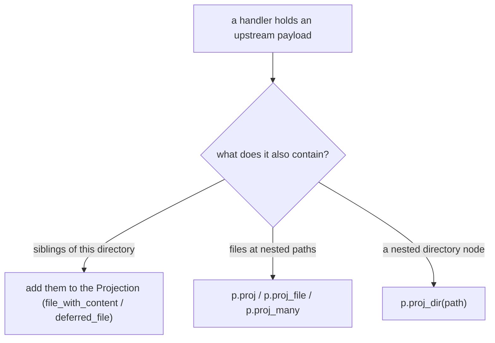

The single most important performance rule for a provider: **if a handler has an upstream payload in hand, project everything that payload can produce.** A user who lists a directory and then reads three files in it should cause one upstream fetch, not four. Returning only the requested field and forcing later refetches is wrong.

The host caches whatever you project, so the channels below turn N reads into one fetch.

## Siblings: just add them to the Projection

Because a `#[dir]` handler answers list, lookup, *and* read-file for its subtree from one `Projection`, the simplest way to project everything is to put every child's content into that `Projection`. Inline the small files you already hold; defer the large ones:

```rust
#[dir("/{category}/{paper_id}")]
async fn paper_dir(cx: &DirCx<State>, category: String, paper_id: String) -> Result<Projection> {
    let entry = api::fetch_entry(cx, &paper_id).await?;   // one fetch returns the whole paper
    let mut p = Projection::new();
    // The payload carries all of these — inline them so a later read/stat
    // of any sibling is served from cache with no second fetch.
    p.file_with_content("metadata.json", entry.metadata_json_bytes(None));
    p.file_with_content("links.json", entry.links_json_bytes(None));
    p.deferred_file("paper.pdf");                          // large -> deferred
    p.page(PageStatus::Exhaustive);
    Ok(p)
}
```

With `PageStatus::Exhaustive`, the host treats this listing as authoritative: a `stat` of `metadata.json` and a `cat links.json` both hit the cache, and a lookup of a non-existent sibling answers `not-found` locally without re-invoking your provider.

## Adjacent and nested content via `proj` / `proj_file`

When a handler produces a single terminal (a `#[file]` read, or a deeper `#[dir]`) but the payload it fetched also carries the bytes of **other paths**, stage those paths as projection effects. `Projection` exposes them:

- `p.proj(path, content)` — install inline bytes at a provider-relative path.
- `p.proj_file(path, file_proj)` — install a full `FileProj` (deferred or inline) at a path.
- `p.proj_many([(path, content), ...])` — a batch of inline files.
- `p.proj_dir(path)` — install a directory node.

These land on the terminal's effect batch; the host caches them when it accepts the return.

```rust
#[dir("/{owner}/{repo}")]
async fn repo_dir(cx: &DirCx<State>, owner: OwnerName, repo: RepoName) -> Result<Projection> {
    let meta = cx.github_json::<RepoMeta>(format!("/repos/{owner}/{repo}")).await?;
    let meta_bytes = serde_json::to_vec_pretty(&meta)
        .map_err(|e| ProviderError::internal(format!("serialize: {e}")))?;

    let mut p = Projection::new();
    // The metadata payload already contains meta.json's bytes — cache them
    // at the nested path so a later read avoids a round trip.
    p.proj(format!("{owner}/{repo}/meta.json"), meta_bytes.clone());
    p.file_with_content("meta.json", meta_bytes);
    p.dir("repo");
    p.page(PageStatus::Exhaustive);
    Ok(p)
}
```

A `#[file]` handler can do the same when its read payload carries adjacent files:

```rust
#[file("/abstract.txt")]
async fn abstract_txt(cx: &BindCtx<'_, State, PaperSubtree>) -> Result<FileContent> {
    let entry = cx.bindings().load_entry(cx).await?;  // one fetch returns the whole paper
    // FileContent itself carries only the read bytes; project the adjacent
    // file through a Projection-staged effect when you have the payload in a
    // dir handler. For a pure #[file] read, prefer projecting siblings from
    // the parent #[dir] so they are cached before the read happens.
    Ok(FileContent::bytes(entry.abstract_text.into_bytes()))
}
```

:::tip
The cleanest pattern is to do all the projecting in the `#[dir]` handler for the parent directory — inline every small sibling and project nested files there. By the time the user reads any leaf, its bytes are already cached, and your `#[file]` handlers become rarely-hit fallbacks.
:::

## Marking listings exhaustive

When you have enumerated every child of a directory, call `p.page(PageStatus::Exhaustive)`. The host then serves a later `readdir` from cache and answers negative lookups locally. Use `PageStatus::More(Cursor::Opaque("..."))` only when the directory is genuinely open-ended (a paged feed, an unbounded namespace) so the host knows to keep asking.

## Choosing the channel



## Why this matters

External services return rich payloads: one GitHub repo call carries name, description, default branch, and counts; one arXiv entry carries title, abstract, authors, and PDF link. If you discard everything but the one field the current path asked for, every sibling read becomes another upstream call — slower for the user and harder on rate limits. Project the full payload and let the host cache it.

:::note
Effect paths passed to `proj`/`proj_file`/`proj_dir` are provider-relative and must be normalized: no empty, `.`, or `..` segments. Invalid paths are recorded as projection errors rather than silently dropped.
:::
