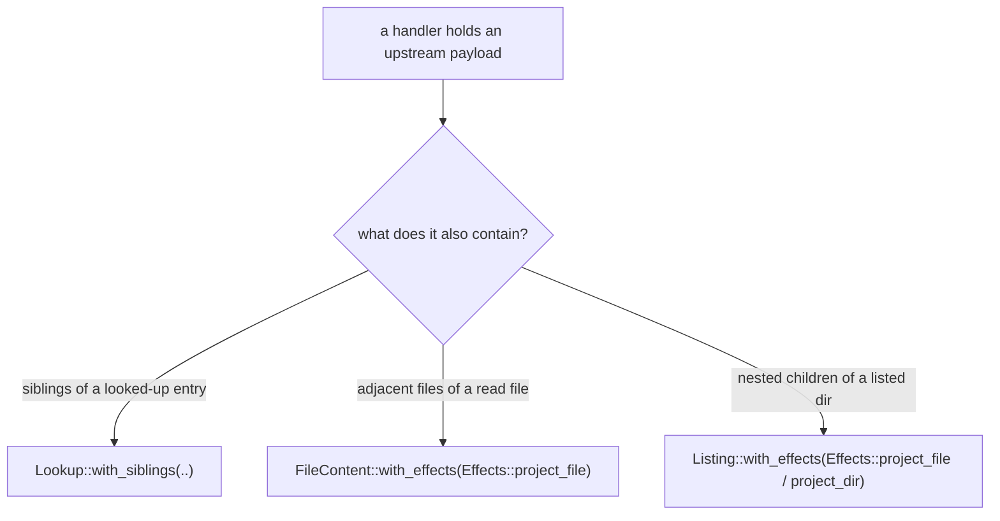

The single most important performance rule for a provider: **if a handler has an upstream payload in hand, project everything that payload can produce.** A user who lists a directory and then reads three files in it should cause one upstream fetch, not four. Returning only the requested field and forcing later refetches is wrong.

The host caches whatever you project, so the channels below turn N reads into one fetch. Which channel you use depends on how the extra content relates to the looked-up target.

## Effects: the projection-staging channel

`Listing`, `FileContent`, and the entry shape of `Lookup` all accept an `Effects` batch via `.with_effects(effects)`. `Effects` is how you install extra projections into the host cache alongside your terminal answer:

- `effects.project_file(path, file_proj)` — install a file projection (inline bytes or deferred shape) at a provider-relative path.
- `effects.project_dir(path)` / `effects.project_dir_exhaustive(path)` — install a directory node; the exhaustive form marks the listing authoritative so a later `readdir` serves from cache.
- `effects.invalidate_path(path)` / `effects.invalidate_prefix(prefix)` — drop cached entries (see [Cache invalidation](./cache-invalidation/)).

`project_file` validates the projection (including the Volatile-requires-Ranged rule) and returns a `Result`, so propagate with `?`.

## Adjacent file content from a read

When a `read_file` payload also contains the bytes of **adjacent files** in the same directory, stage them as `project_file` effects so the host caches them too:

```rust
#[file("/abstract.txt")]
async fn abstract_txt(&self, cx: Cx<State>) -> Result<FileContent> {
    let entry = api::fetch_entry(&cx, &self.id).await?;   // one fetch returns the whole paper

    let mut effects = Effects::new();
    // The same payload carries meta.json's bytes — project them now.
    let meta = serde_json::to_vec_pretty(&entry.as_meta())
        .map_err(|e| ProviderError::internal(format!("serialize meta: {e}")))?;
    effects.project_file("meta.json", FileProj::inline(meta, Stability::Immutable, None))?;

    Ok(FileContent::new(entry.summary).with_effects(effects))
}
```

A subsequent `read` or `stat` of `meta.json` is then served from cache with no second fetch.

## Nested children from a listing

When a `list_children` payload carries the contents of **nested children**, stage them as effects on the `Listing`:

```rust
#[dir("/{owner}/{repo}")]
async fn repo_dir(cx: Cx<State>, owner: String, repo: String) -> Result<Listing> {
    let meta = cx.api_get_json::<RepoMeta>(&format!("/repos/{owner}/{repo}")).await?;
    let meta_bytes = serde_json::to_vec_pretty(&meta)
        .map_err(|e| ProviderError::internal(format!("serialize: {e}")))?;

    let mut effects = Effects::new();
    // The metadata payload already contains meta.json's bytes — cache them.
    effects.project_file(
        format!("{owner}/{repo}/meta.json"),
        FileProj::inline(meta_bytes.clone(), Stability::Mutable, None),
    )?;

    let listing = Listing::partial(vec![
        Entry::file("meta.json", FileProj::inline(meta_bytes, Stability::Mutable, None)),
        Entry::dir("repo"),
    ]);
    Ok(listing.with_effects(effects))
}
```

When you have listed every child of a directory you project, use `project_dir_exhaustive` so the host marks that listing authoritative and serves a later `readdir` from cache without re-invoking `list_children`.

## Siblings from a lookup

When a `lookup_child` resolves one entry but the same payload also describes its **siblings**, attach them with `Lookup::with_siblings`. The host caches the sibling set alongside the target so a later stat or read avoids a round trip:

```rust
let target = Entry::file("body.md", FileProj::inline(issue.body.into_bytes(), Stability::Mutable, None));
let siblings = vec![
    Entry::file("title.txt", FileProj::inline(issue.title.into_bytes(), Stability::Mutable, None)),
    Entry::file("meta.json", FileProj::inline(meta_bytes, Stability::Mutable, None)),
];
Ok(Lookup::entry(target).with_siblings(siblings))
```

By default a lookup with siblings is exhaustive; call `.exhaustive(false)` if there are siblings you did not enumerate.

## Choosing the channel



## Why this matters

External services return rich payloads: one GitHub repo call carries name, description, default branch, and counts; one arXiv entry carries title, abstract, authors, and PDF link. If you discard everything but the one field the current path asked for, every sibling read becomes another upstream call — slower for the user and harder on rate limits. Project the full payload and let the host cache it.

:::tip
Effect paths are provider-relative and must be normalized: no empty, `.`, or `..` segments. The SDK trims surrounding slashes but rejects traversal segments.
:::
