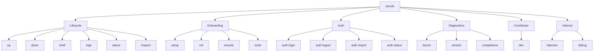

`omnifs` is the single command-line interface to omnifs, a virtual filesystem
for everything. The native host binary manages a Linux runtime container,
credentials, and mount configs; the projected filesystem lives inside the
container and is browsed over FUSE.

```bash
omnifs <command> [flags]
```

Every command is a flat top-level verb. There are no nested command trees on the
daily-driver path; daemon-internal and debug verbs are hidden from `--help`.

## Global flags

| Flag | Purpose |
|------|---------|
| `-v` | Increase tracing verbosity to INFO. |
| `-vv` | DEBUG level, with span open/close events. |
| `-h`, `--help` | Print help for the binary or any subcommand. |
| `-V`, `--version` | Print the CLI version (see also [`omnifs version`](/cli/diagnostics/)). |

Tracing is silent by default. `-v`/`-vv` raise the level, but `RUST_LOG`
overrides them whenever it is set. All tracing, warnings, and errors go to
stderr; command output stays on stdout so pipes work.

### Image selection

The runtime image is resolved per command. Most lifecycle verbs accept
`--image <ref>`; the resolution order is:

1. `--image` flag
2. `OMNIFS_IMAGE` environment variable
3. the version-matched default, `ghcr.io/0xff-ai/omnifs:<cli-version>`

:::note
The CLI version, the npm package version, and the default runtime image tag all
share the same unprefixed semver. `omnifs version --detail` prints the exact
image ref in use.
:::

## Directory layout

The CLI resolves every directory it uses from one source. The default is uniform
across macOS and Linux:

```
~/.omnifs/
├── config/                 # user-owned configuration
│   └── mounts/<name>.json  # one file per configured mount
├── data/                   # persistent state
│   └── credentials.json    # file-store credential fallback
└── cache/                  # disposable cache
```

Resolution per directory is: explicit CLI flag, then a per-purpose environment
variable, then `OMNIFS_HOME` (which fans out into all subdirectories), then the
`~/.omnifs/{config,data,cache}` default.

| Environment variable | Overrides |
|----------------------|-----------|
| `OMNIFS_HOME` | The whole `~/.omnifs` tree. |
| `OMNIFS_CONFIG_DIR` | The `config` directory. |
| `OMNIFS_CACHE_DIR` | The `cache` directory. |
| `OMNIFS_MOUNTS_DIR` | The mount-configs directory. |
| `OMNIFS_PROVIDERS_DIR` | The provider WASM directory used for host-side metadata. |
| `OMNIFS_IMAGE` | The runtime image ref. |
| `OMNIFS_CONTAINER_NAME` | The container name (default `omnifs`). |

:::tip
The whole layout lives under one directory, so it is easy to back up or delete.
Users who prefer platform-native conventions (XDG on Linux, the Library tree on
macOS) opt in through the per-purpose environment variables.
:::

A global `config.toml` under the config directory can supply defaults for the
image, container name, and mount/provider paths. Precedence is flag > env > file
> built-in default. A missing file is not an error; a malformed file is.

## Commands

### Lifecycle

| Command | Purpose |
|---------|---------|
| [`up`](/cli/lifecycle/) | Materialize credentials and configs, then start the container. |
| [`down`](/cli/lifecycle/) | Stop and remove the container, clean up the session. |
| [`shell`](/cli/lifecycle/) | Open an interactive shell inside the running container. |
| [`logs`](/cli/lifecycle/) | Tail the runtime log; `-f` follows. |
| [`status`](/cli/lifecycle/) | Print mount, provider, and auth state. |
| [`inspect`](/cli/lifecycle/) | Live FUSE/provider/callout event stream. |

### Onboarding and config

| Command | Purpose |
|---------|---------|
| [`setup`](/cli/onboarding-config/) | Guided onboarding walkthrough. |
| [`init`](/cli/onboarding-config/) | Interactive setup for one provider mount. |
| [`mounts`](/cli/onboarding-config/) | List or remove configured mounts. |
| [`reset`](/cli/onboarding-config/) | Nuke configs, credentials, and the container. |

### Auth

| Command | Purpose |
|---------|---------|
| [`auth login`](/cli/auth/) | Log in to a provider via OAuth. |
| [`auth logout`](/cli/auth/) | Remove stored credentials for a provider. |
| [`auth import`](/cli/auth/) | Import an existing token. |
| [`auth status`](/cli/auth/) | Show stored credential status. |

### Diagnostics

| Command | Purpose |
|---------|---------|
| [`doctor`](/cli/diagnostics/) | Probe the environment and auth state. |
| [`version`](/cli/diagnostics/) | Print version; `--detail` adds runtime info. |
| [`completions`](/cli/diagnostics/) | Generate shell completion scripts. |

### Contributor

| Command | Purpose |
|---------|---------|
| [`dev`](/cli/dev/) | Build and launch the local dev sandbox (source checkout required). |

### Internal

| Command | Purpose |
|---------|---------|
| `daemon` | Container entrypoint verbs. Hidden; run `omnifs up` instead. |
| `debug` | Diagnostic surfaces (`mount-tree`, `auth-manifest`). Hidden from `--help`. |

## Command groups



## Typical first run

```bash
omnifs setup          # detect env, pick providers, authenticate, launch
omnifs shell          # browse the mounted filesystem
```

Or wire up a single provider directly:

```bash
omnifs init github    # configure a GitHub mount + auth
omnifs up             # materialize credentials and start the container
omnifs status         # confirm the mount is live
```
