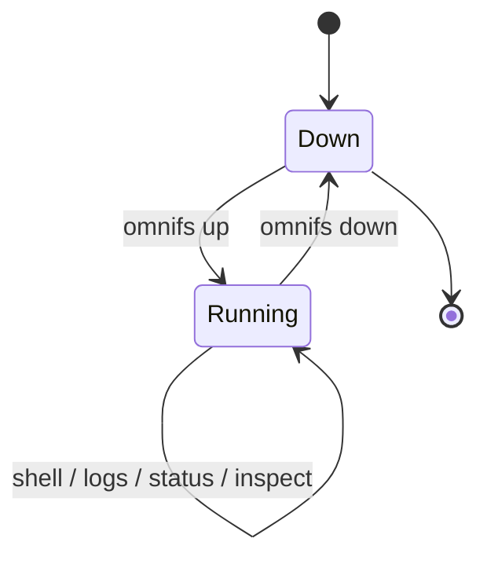

These verbs drive the omnifs runtime container: bringing it up, tearing it down,
and observing it while it runs. The projected filesystem lives inside the
container; the host CLI talks to it through Docker.

## Container lifecycle



A container is either absent (`Down`) or `Running`. `up` is the only verb that
creates it; `down` is the only verb that removes it. `shell`, `logs`, `status`,
and `inspect` observe a running container without changing its state.

## `omnifs up`

```bash
omnifs up [flags]
```

Brings up the container. In order, it:

1. discovers mount configs in the mounts directory (errors if none exist),
2. prepares a per-session directory keyed by container name,
3. materializes credentials from the host credential store and rewrites mount
   configs to point at the session secrets,
4. bind-mounts the rewritten configs into the container,
5. starts the container and waits for the FUSE mount to come up,
6. verifies status before reporting success.

If no mount configs are found, `up` tells you to run `omnifs setup` or
`omnifs init <provider>` first.

| Flag | Purpose |
|------|---------|
| `--mounts-dir <DIR>` | Mount-configs directory. Defaults to `OMNIFS_MOUNTS_DIR`, then the config mounts dir. |
| `--providers-dir <DIR>` | Provider WASM directory for host-side metadata. Defaults to `OMNIFS_PROVIDERS_DIR`. |
| `--image <REF>` | Container image to run. Defaults to `OMNIFS_IMAGE`, then the version-matched image. |
| `--container-name <NAME>` | Container name. Defaults to `OMNIFS_CONTAINER_NAME`, then `omnifs`. |

```bash
omnifs up
# ✓ Materialized 2 mount(s)
# ✓ /omnifs is mounted inside `omnifs`
```

:::note
Credentials are copied into a per-session directory at launch, not baked into the
image. `omnifs down` syncs any OAuth tokens the daemon refreshed back to the host
store before cleaning the session up.
:::

## `omnifs down`

```bash
omnifs down [flags]
```

Stops and removes the container, then cleans up the per-session directory. Before
removing the session it syncs back any OAuth credentials the daemon refreshed
while running, so a later `up` keeps the fresh tokens.

| Flag | Purpose |
|------|---------|
| `--container-name <NAME>` | Container name. Defaults to `OMNIFS_CONTAINER_NAME`, then `omnifs`. |
| `--keep-session` | Keep the per-session directory after teardown (debugging). |

```bash
omnifs down
# ✓ Container `omnifs` removed
```

## `omnifs shell`

```bash
omnifs shell [-- <command>...]
```

Opens an interactive shell inside the running container, the primary way to
browse the projected filesystem. With no argument it runs `/bin/zsh`; trailing
arguments run a one-off command instead. A TTY is attached only when stdin is a
terminal.

| Flag | Purpose |
|------|---------|
| `--container-name <NAME>` | Container name. Defaults to `OMNIFS_CONTAINER_NAME`, then `omnifs`. |

```bash
omnifs shell                     # interactive zsh
omnifs shell -- ls -lrt /github  # one-off command
```

## `omnifs logs`

```bash
omnifs logs [-f]
```

Shows the runtime log. By default it prints buffered stdout/stderr from the
container entrypoint. With `-f` it follows the daemon's file log
(`/tmp/omnifs.log`) live.

| Flag | Purpose |
|------|---------|
| `-f`, `--follow` | Follow the runtime log file as it grows. |
| `--container-name <NAME>` | Container name. Defaults to `OMNIFS_CONTAINER_NAME`, then `omnifs`. |

```bash
omnifs logs -f
```

## `omnifs status`

```bash
omnifs status [flags]
```

The readiness view: runtime, mounts, cache, and per-mount auth state. Run from
the host, it execs `omnifs status` inside the container so it reports live
runtime detail; run inside the container, it reads the local runtime directly.

| Flag | Purpose |
|------|---------|
| `--detail` | Reveal provider runtime detail. |
| `--json` | Emit a machine-readable `StatusJson` payload. |
| `--container-name <NAME>` | Container name. Defaults to `OMNIFS_CONTAINER_NAME`, then `omnifs`. |
| `--mount-point <PATH>` | Override the mount point being inspected. |
| `--config-dir <DIR>` | Override the config directory. |
| `--cache-dir <DIR>` | Override the cache directory. |

```bash
omnifs status
omnifs status --detail
omnifs status --json | jq '.providers'
```

:::note
The `--json` payload always includes a `providers` field. `omnifs up` parses this
payload to gate readiness rather than grepping stdout.
:::

## `omnifs inspect`

```bash
omnifs inspect [flags]
```

Attaches to the live inspector stream — FUSE, provider, and callout events as
JSONL — and renders them in a terminal canvas. Use it to watch the runtime react
as you traverse the filesystem.

| Flag | Purpose |
|------|---------|
| `--plain` | Print raw JSONL instead of the canvas. |
| `--replay <FILE>` | Replay a captured JSONL file instead of attaching live. |
| `--record <FILE>` | While live-attaching, also append the stream to this host path. |
| `--container-name <NAME>` | Container name. Defaults to `OMNIFS_CONTAINER_NAME`, then `omnifs`. |

```bash
omnifs inspect                       # live TUI
omnifs inspect --plain               # raw JSONL to stdout
omnifs inspect --record run.jsonl    # live + capture to file
omnifs inspect --replay run.jsonl    # replay a capture
```

:::tip
The inspector reconnects automatically, so you can start `omnifs inspect` before
`omnifs up` (or `omnifs dev`) finishes binding the inspector socket.
:::
