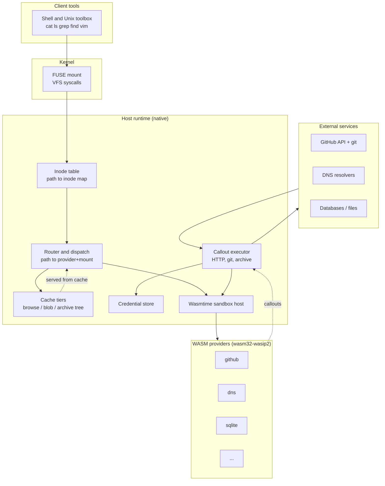
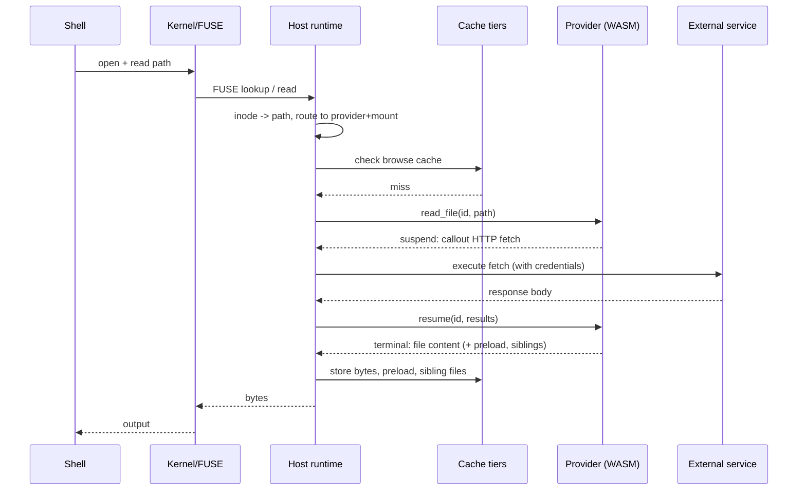

omnifs turns external services into ordinary files. You `cat`, `ls`, `grep`, and `find` paths under a mount, and the bytes come from GitHub, a database, DNS, an archive, or any other source a provider knows how to reach. Nothing about that experience is special-cased into the shell. It works because of a layered design where each layer has one job and a narrow contract with its neighbours.

This page is the map. It shows the four layers, names the major components inside the host runtime, and traces one read from a shell command all the way to an external service and back. Every concept introduced here has its own deep page; follow the links as you go.

## The four layers

**Client tools** are unmodified. The design invariant is that omnifs paths behave like real files for the standard Linux toolbox, so a regression in `cat`, `grep`, `stat`, `tar`, `diff`, or an editor is a bug, not an accepted trade-off.

**The kernel FUSE layer** translates `open`, `read`, `getattr`, `lookup`, and `readdir` syscalls into FUSE requests. The runtime FUSE mount is Linux-only. The host CLI runs on macOS and Linux but always drives a Linux container.

**The host runtime** is the native engine. It owns the inode table, the router, every cache, the callout executor, the credential store, and the Wasmtime sandbox that runs providers. All filesystem mechanics and all caching live here.

**WASM providers** are `wasm32-wasip2` components implementing the `omnifs:provider` WIT interface. A provider describes domain facts — what children a path has, what a file's bytes and attributes are, what it needs fetched — and nothing about FUSE or caching.

**External services** are reached only through host-executed callouts. Providers have no ambient network, git, or filesystem access.

## What lives in the host

The host runtime is the only component that talks to both the kernel and the providers. Its major parts:

- **Inode table** — maps the kernel's inode numbers to protocol paths and back. FUSE speaks in inodes; the rest of the host speaks in [protocol paths](/concepts/path-space/).
- **Router and dispatch** — resolves a path to a provider, a mount, and a suffix, then chooses which registered handler answers. Precedence rules, validators, and the lookup-versus-readdir authority split live here. See [path dispatch](/concepts/path-dispatch/).
- **Cache tiers** — the browse cache (lookups, attributes, listings, durable file bytes), the blob cache (fetched HTTP bodies on disk), and the archive tree cache (materialized subtrees). The host owns all of them. See [caching](/concepts/caching/).
- **Callout executor** — runs the request/response callouts a provider asks for: HTTP fetch, git open, archive extraction. See [the callout runtime](/concepts/callout-runtime/).
- **Credential store** — supplies auth material to callouts without exposing it to provider code. See [auth and credentials](/concepts/auth-credentials/).
- **Wasmtime sandbox host** — instantiates each provider component, denies ambient capabilities, and brokers the suspend/resume protocol. See [the WASM sandbox](/concepts/wasm-sandbox/).

## A read, end to end

Suppose you run `cat /github/octocat/hello/issues/42`. Here is the flow when nothing is cached.

The provider never made the HTTP request itself. It *suspended* with a callout describing what it needed; the host executed that request, attaching credentials, and called `resume` with the result. The provider then returned a terminal carrying the file's bytes plus any sibling files and preload content it already had in hand. The host cached everything before answering the kernel, so the next stat or read of a sibling avoids a round trip.

A cached read short-circuits at the cache tier: the router finds the entry and answers the kernel directly, never entering the sandbox.

## The host browse surface

Providers expose exactly three browse operations to the host:

- `lookup_child(id, parent_path, name)` — resolve one child entry.
- `list_children(id, path)` — list a directory.
- `read_file(id, path)` — read exact file content.

This is deliberately small. Everything richer — subtree handoff for git clones, cache preloading, sibling-file delivery, invalidation — folds into these three plus the suspend/resume callout protocol. See [the provider model](/concepts/provider-model/).

## Design stance

Three principles run through every layer:

1. **The host owns mechanics; providers own facts.** FUSE, NFS, caching, eviction, and credential handling stay in the host. Providers describe what a path is.
2. **Providers describe, the host executes.** A provider cannot reach the network on its own. It declares callouts and the host runs them, which is what makes the sandbox boundary real.
3. **One path space, one cache authority.** A single absolute path namespace crosses the WIT boundary and keys every cache. There is no second path encoding and no provider-local cache.

Each of the pages in this Concepts track expands one slice of this picture. Start with the [path space](/concepts/path-space/) and the [provider model](/concepts/provider-model/), then follow the [callout runtime](/concepts/callout-runtime/) and [caching](/concepts/caching/) for the moving parts of a request.
