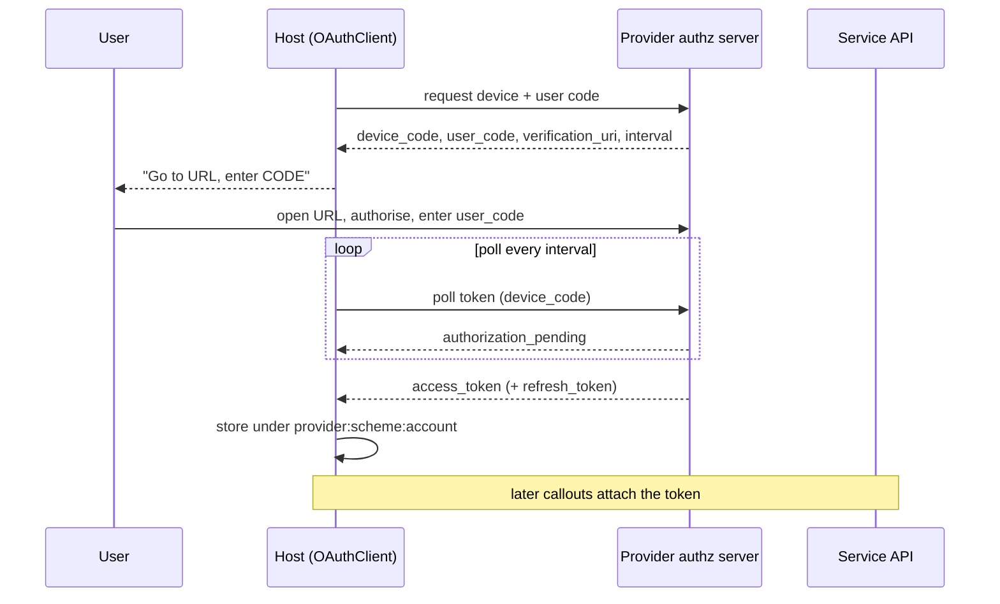
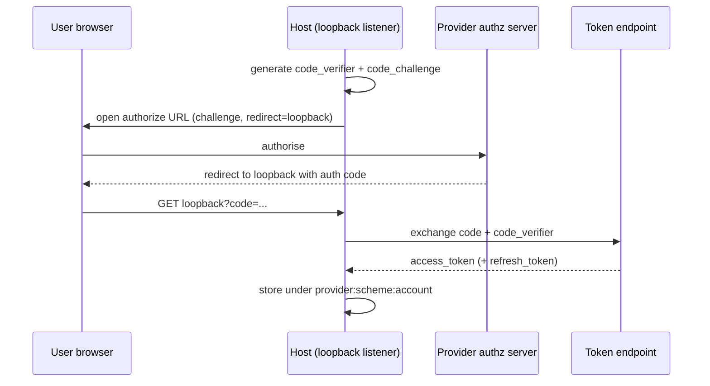

Most providers reach services that require authentication. omnifs keeps auth material entirely in the host: a provider declares *what* auth it needs through a manifest, and the host supplies the credential when it executes a [callout](/concepts/callout-runtime/). Provider code never sees a token. This is what makes the [sandbox](/concepts/wasm-sandbox/) boundary meaningful for auth as well as I/O.

## Auth manifests

A provider's auth requirements live in `omnifs.provider.json` and are embedded into the WASM component as `omnifs.provider-metadata.v1`. The host and CLI derive a runtime auth manifest from the component through `ProviderManifest::wasm_auth_manifest()`. The manifest is shipped *with* the provider — it is part of the artifact, not separate config the user has to write.

A mount's JSON config then chooses an auth scheme. Two shapes are supported:

- **`static-token`** with a `scheme` — an externally supplied secret, sourced from `token_env` or `token_file`. Static mounts do not use keychain indirection.
- **`oauth`** — a host-managed OAuth credential acquired through an interactive flow.

```text
omnifs.provider.json  ──embedded──▶  omnifs.provider-metadata.v1  (in WASM)
                                              │
                          ProviderManifest::wasm_auth_manifest()
                                              │
                                              ▼
                                    runtime AuthManifest
```

## Host-managed credentials

For host-managed (OAuth) credentials, the effective mount config must carry:

- **`provider_id`** — always present on the effective config (see [mount lifecycle](/concepts/mount-lifecycle/)).
- **`auth.scheme`** — the scheme name.
- **`auth.account`** — optional account selector.

These three compose the credential identity. Static mounts may instead point at an external secret via `token_env` or `token_file`; do not add keychain indirection to mount JSON.

## The credential store

The host picks one credential backend at startup:

- **Keychain** — the OS secret store, used on desktop hosts.
- **File fallback** — `~/.omnifs/data/credentials.json`, used in containers and headless environments where no desktop secret service exists.

The file store is intentionally a local fallback and session-transfer store. It gives omnifs a known path, enumerable keys, atomic writes, and private Unix permissions without depending on a desktop secret service.

The only public wire form for a credential is its **storage key**, produced by `CredentialKey::storage_key()`:

```text
provider:scheme:account

github:pat:default        # GitHub personal access token, default account
linear:oauth:work         # Linear OAuth credential, "work" account
```

Session secret filenames use this same key. The credential value itself is private; callers obtain it only through `access_token()`, never by reading the field.

## The contributor sandbox path

For `omnifs dev`, the host captures `gh auth token` on the host machine and exposes it as a read-only mounted secret file at `/run/secrets/github_token` inside the container. This is a sandbox convenience, distinct from the normal user path below.

## The normal user path

For end users, `omnifs init` plus `omnifs up` drive OAuth where needed. Acquired credentials live in the host credential store (keychain, or the file fallback). The `omnifs-auth` crate is the OAuth protocol client — it implements `OAuthClient`, the device flow, the loopback flow, and the manual flow. It is *not* mount auth config, credential storage, or manifest parsing; those are separate concerns.

## OAuth device-code flow

The device-code flow suits environments without a usable browser redirect, such as a remote shell. The host requests a device code, shows the user a URL and code to enter, and polls until the user authorises.



This is the shape GitHub uses for omnifs's contributor and CLI flows: the user authorises in a browser while the host polls for completion, then the resulting token is stored under its storage key.

## OAuth PKCE loopback flow

The PKCE (Proof Key for Code Exchange) loopback flow suits desktop hosts with a browser. The host starts a local loopback listener, sends the user to the authorisation URL with a code challenge, receives the authorisation code on the loopback redirect, and exchanges it — proving possession of the original verifier so an intercepted code is useless.



This is the shape used for providers like Linear: a one-time browser authorisation, a loopback redirect captured by the host, and a PKCE exchange that binds the code to this client.

## Why the host holds everything

Three properties fall out of keeping auth in the host:

1. **Providers never touch secrets.** A token is attached by the callout executor, not handed to WASM. A compromised provider component cannot exfiltrate a credential it never receives.
2. **One credential identity.** The `provider:scheme:account` storage key is the single wire form, shared by the keychain, the file store, and session secret filenames.
3. **Backend choice is invisible to providers.** Keychain or file fallback is a host startup decision; the provider's manifest and the mount config are identical either way.

See [the callout runtime](/concepts/callout-runtime/) for where credentials are applied during a fetch, and [mount lifecycle](/concepts/mount-lifecycle/) for how `provider_id`, `auth.scheme`, and `auth.account` reach the effective config.


## Design reference

The source of truth behind this page is the [Host auth](https://github.com/0xff-ai/omnifs/blob/main/docs/design/host-auth.md) design document. See the full [design-doc index](/contributing/design-docs/) for everything these pages are based on.
