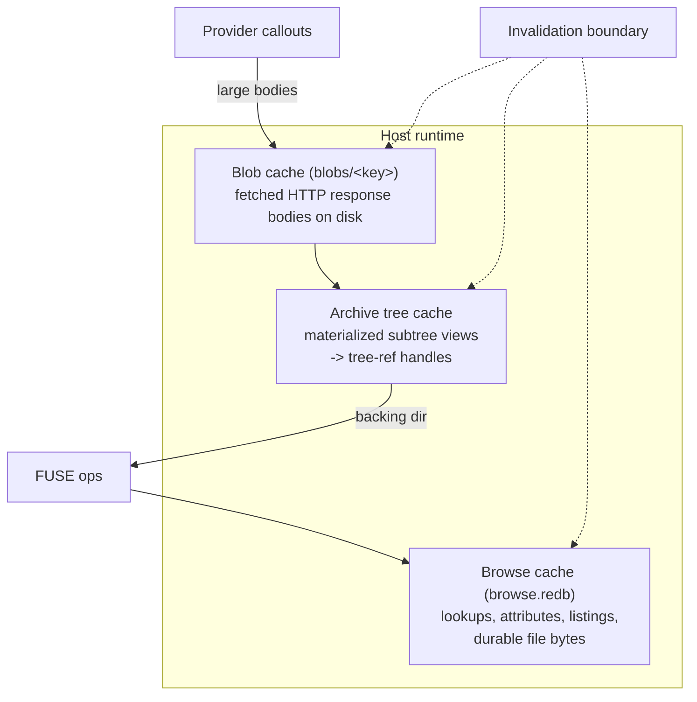
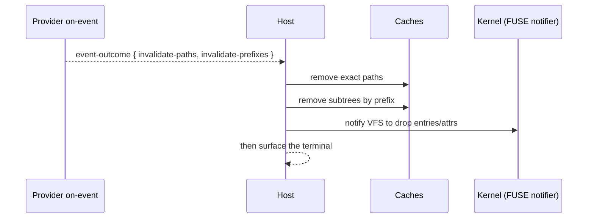

The host owns all caching in omnifs. Provider results — listings, lookups, attributes, and file content — land in capacity-bounded host caches. **There are no TTLs.** Entries leave a cache only by capacity eviction or by explicit invalidation. Providers must not add their own LRUs or time-based expiration; they rely on the host's invalidation signals.

Centralising caching in the host is what lets providers stay pure description engines. A provider answers a question once; the host decides how long that answer lives and when it becomes stale.

## The cache tiers

omnifs has several host-owned caches with different identities and visibility rules. They are not collapsed into one generic cache because each answers a different question.

- **Browse cache** answers FUSE questions about projected paths: lookups, attributes, directory entries, and file bytes. File bytes in the browse cache are durable only for immutable files or versioned mutable files (see [file attributes](/concepts/file-attributes/)). It is backed by a durable store keyed on the [protocol path](/concepts/path-space/) string.
- **Blob cache** stores provider-fetched HTTP response bodies on disk so large payloads do not cross the WIT boundary inline. Keys are safe relative paths under the mount's cache root.
- **Archive tree cache** stores materialized views of cached blobs and returns runtime-local `tree-ref` handles that FUSE can traverse through a real backing directory. This is how an archive becomes a browsable subtree.

The provider instance cache root is `<cache-dir>/providers/<mount>/`, with `browse.redb` and a `blobs/` directory underneath.

## No TTLs, by design

Time-based expiration is intentionally absent. A TTL is a guess about staleness; omnifs replaces the guess with two precise mechanisms:

1. **Capacity eviction.** Each cache is capacity-bounded. When it is full, the least valuable entries are evicted. This bounds memory and disk, nothing more.
2. **Explicit invalidation.** When the host learns that a path has changed, it removes exactly the affected entries.

Because there is no TTL, a cached answer is served indefinitely until one of those two things happens. This makes cold reads expensive once and warm reads free, with no periodic re-fetch storms.

## Warming the cache: preload and sibling files

Cache effects travel *inside* the terminals a provider returns, not as separate callouts (see [the callout runtime](/concepts/callout-runtime/)). A handler that already holds an upstream payload warms the cache for everything it can derive in the same hop:

- **`Projection::preload` / `preload_many`** — a directory listing carries content for named paths the host should cache alongside the listing. A `#[dir]` lookup returning a directory carries the same field on its lookup entry. Use this for nested children of a listed directory.
- **`FileContent::with_sibling_files(..)` / `Lookup::with_sibling_files(..)`** — when a read or lookup payload already contains the target's sibling files, the handler returns them so a later stat or read of a sibling avoids a round trip.

:::tip
The rule of thumb: project everything you already fetched. If a single API response describes an item and its siblings, emit them all. The difference between one network round trip and a dozen is whether the handler returned what it already had in hand.
:::

## The invalidation boundary

Invalidation is explicit and crosses a clear boundary. Two sources drive it:

- **`on-event` handlers.** A provider's event handler returns an `event-outcome` with `invalidate-paths` and `invalidate-prefixes`. The host applies them at the response boundary before surfacing the terminal. A path invalidation removes one entry; a prefix invalidation removes everything under a path, using the segment-safe prefix check so `/foo/bar` does not catch `/foo/barbecue`.
- **The FUSE notifier.** The host can push invalidations to the kernel so cached attributes and entries are dropped at the VFS layer too.

## Durable vs ephemeral content

Not all file bytes are equally cacheable. The browse cache keeps file bytes durably only when they are safe to keep:

- **Immutable files** — content that cannot change is cached durably.
- **Versioned mutable files** — content keyed by version evidence is cached durably under that version; a new version is a new key, so the old bytes are simply never asked for again.

Volatile content that carries no version evidence is not durably cached as exact bytes; it is served through ranged reads instead. The mapping from a provider's declared file stability to which cache layer holds its bytes is described in [file attributes](/concepts/file-attributes/).

## What providers must not do

- **No provider-local LRU.** The host's capacity bounds are the only LRU.
- **No TTLs or time-based expiry.** Rely on `on-event` invalidation.
- **No second cache encoding.** The browse cache keys on the canonical protocol path string, identical to the wire form.

A provider's only caching responsibility is to project generously (preload, siblings) and to invalidate precisely (`on-event`). Everything else — capacity, eviction, durability, version keying, kernel notification — is the host's job.
