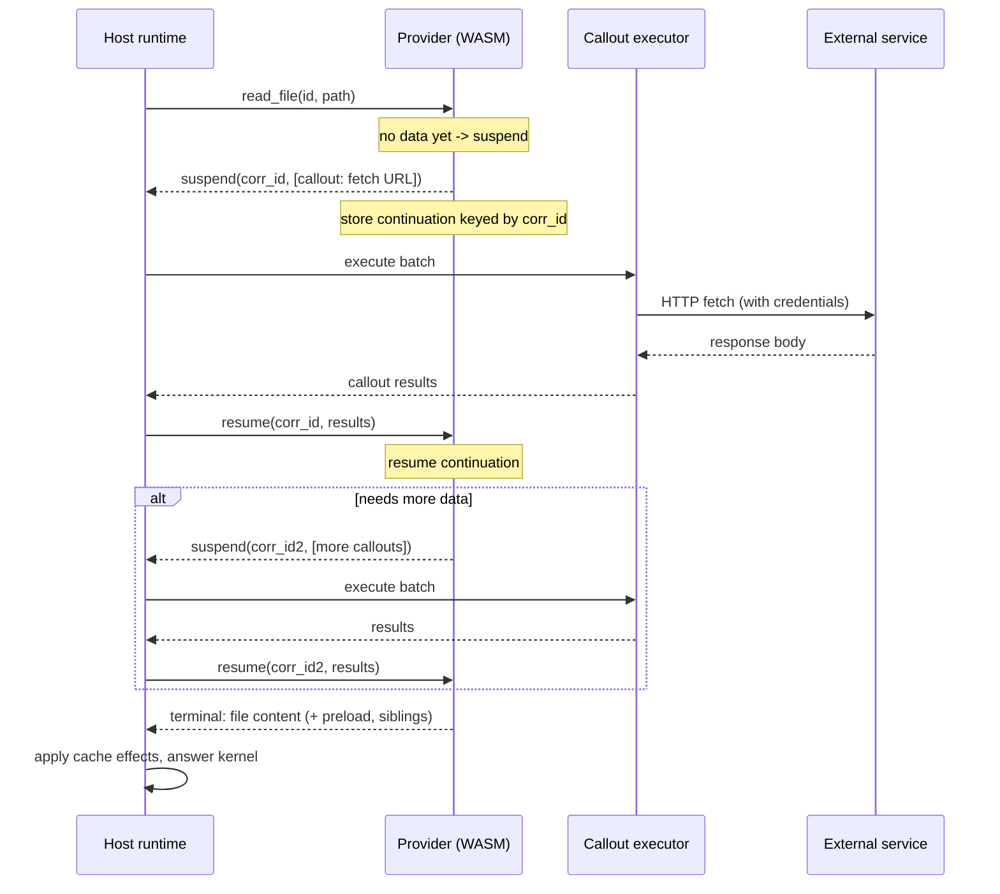

A provider cannot reach the network, git, or the filesystem on its own. When a handler needs external data, it does not block or `await` — it **suspends** and hands the host a list of *callouts* describing exactly what it needs. The host executes that batch, attaching credentials and policy, and calls `resume` with the outcomes. The provider picks up where it left off, possibly suspending again, until it returns a terminal.

This suspend/resume loop is the engine that makes the [sandbox boundary](/concepts/wasm-sandbox/) real: because providers describe work instead of performing it, the host can deny them all ambient capabilities.

## Terminals and callouts

Every provider operation returns one of two things:

- A **terminal** `op-result` wrapped in a `provider-return` — the final answer for the operation (a directory listing, a lookup entry, file content).
- A **suspend** carrying a list of `callout`s — the host must execute them and resume.

Callout kinds include:

- **HTTP fetch** — request a URL; the host performs the request, applies credentials, and returns the response. Large bodies land in the blob cache instead of crossing the WIT boundary inline. See [caching](/concepts/caching/).
- **git open** — open or clone a repository, resolved by the host's clone manager. See [cloning](/concepts/cloning/).
- **archive** — extract or inspect an archive through a sandboxed embedded tool.

:::caution
Callouts are strictly request/response. There are no fire-and-forget callouts. If something is conceptually one-way, it does not become an `await`-shaped callout — the boundary is fixed instead. Every callout the provider issues produces a result the host hands back through `resume`.
:::

## Correlation ids and continuations

When a provider suspends, it stores a continuation keyed by a **correlation id**. The host executes the callout batch and calls `resume(id, results)`. The provider looks up the continuation by id and resumes from exactly where it left off. A single operation may suspend and resume several times — fetch a list, then fetch each item's detail, then return — without the host needing to understand the provider's internal state machine. The id is the only shared token.

## The flow

The host batches callouts within a single suspension, so a provider that needs several independent fetches issues them together and the host can run them concurrently before a single `resume`.

## Cache effects travel inside terminals

Caching is not a separate callout. The side effects a provider wants the host to apply are carried *inside* the terminal it returns, so they are produced and consumed in one hop:

- **`list-children`** listings carry a `preload` field: content for named paths the host should cache alongside the listing.
- **`lookup-child`** returning a directory through a `#[dir]` handler carries the same `preload` field on its lookup entry.
- **File reads** carry sibling files: when a payload already contains a file's siblings, the handler returns them so a later stat or read of a sibling avoids a round trip.
- **`on-event`** handlers return an `event-outcome` with `invalidate-paths` and `invalidate-prefixes`; the host applies them at the response boundary before surfacing the terminal.

This is a deliberate single-phase design. The data needed to warm or invalidate the cache is produced exactly where it is naturally available — in the handler that just fetched it — and consumed immediately, rather than split into a second round trip. See [caching](/concepts/caching/) for how the host applies these effects.

## Reserved streaming surface

The WIT interface reserves `open-file`, `read-chunk`, and `close-file` for streamed and ranged file reads. The current host and runtime path serves exact file bytes and explicit subtree handoff; the streaming arms exist for future ranged reads (for example, [`Volatile` files that require `Ranged` reads](/concepts/file-attributes/)).

## Why request/response, not async I/O

Modeling provider I/O as suspend/resume rather than blocking calls inside the WASM component buys three things:

1. **A real sandbox.** The provider has no socket, no git binary, no filesystem. It can only ask. See [the WASM sandbox](/concepts/wasm-sandbox/).
2. **Host-side policy.** Credentials, retries, rate limits, blob spillover, and concurrency live in the host's callout executor, applied uniformly to every provider.
3. **A flat, inspectable protocol.** Each interaction is a request and a response with a correlation id. There are no hidden hops on the hot path, which makes the protocol easy to trace and reason about.

## Design reference

The source of truth behind this page is the [Protocol shape](https://github.com/0xff-ai/omnifs/blob/main/docs/design/protocol-shape.md) design document. See the full [design-doc index](/contributing/design-docs/) for everything these pages are based on.
