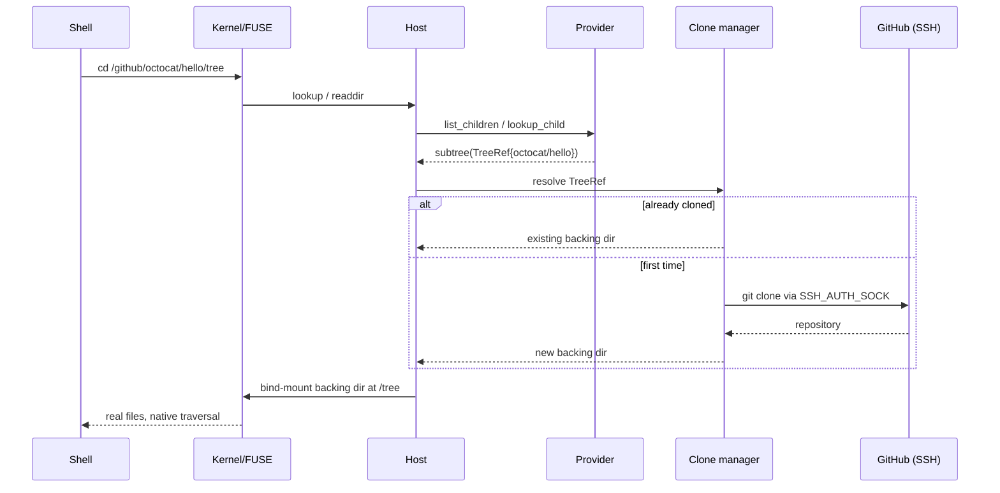

Some provider content is a whole repository tree, not a synthetic projection. When you navigate into a repo's tree under a provider, omnifs serves it from a real git clone on disk, bind-mounted into the path space. The provider does not clone the repo itself — it hands the host a *subtree reference*, and the host's clone manager resolves it to a backing directory. This is **subtree handoff**, and it folds cleanly into the same `lookup_child` and `list_children` operations as everything else.

## Treeref handoff

A provider declares a subtree handoff path family with a `#[treeref("...")]` handler. When the requested path matches, the handler returns a `TreeRef` describing the repo to clone instead of synthesising directory entries.

The host folds this into the [browse surface](/concepts/provider-model/):

- In `lookup_child`, a matching treeref yields a `lookup-result::subtree(tree-ref)` terminal.
- In `list_children`, it yields a `list-result::subtree(tree-ref)` terminal.

The host then resolves the handle to a bind-mounted clone directory. From that point, the kernel traverses the real backing directory directly — `cat`, `grep -r`, `find`, and `diff` all operate on actual files on disk, with native performance and full passthrough semantics.

:::note
The WIT keeps the variant arm name `subtree` on result variants, while the SDK-side attribute is `#[treeref]`. The name `#[subtree]` is reserved for typed-subtree-dispatch impl blocks (the `#[bind]` mechanism), which is a different feature. A treeref hands off to a clone; a `#[bind]` subtree dispatches suffix routing through a typed impl.
:::

## SSH transport

Git clone currently uses SSH:

- **Remote format:** `git@github.com:<owner>/<repo>.git`
- **Auth:** the forwarded `SSH_AUTH_SOCK` from the host.

```text
TreeRef { owner, repo }  ──▶  git@github.com:<owner>/<repo>.git
                              authenticated via SSH_AUTH_SOCK
```

:::caution
Host private keys are never mounted into the container. Authentication flows entirely through the forwarded SSH agent socket. The container can *use* the host's loaded keys via the agent but never has the key material on disk. Switching clone transport from SSH to HTTPS/token would change this operational contract and must be called out explicitly.
:::

For this to work, the host environment must have `SSH_AUTH_SOCK` set and the SSH agent must hold a usable GitHub key (`ssh-add -L` shows it, `ssh -T git@github.com` succeeds).

## The clone manager

The host's clone manager owns the lifecycle of backing clones. Its responsibilities:

- **Dedup.** Multiple paths or repeated traversals that reference the same repo resolve to a single clone, not many. A `TreeRef` for an already-cloned repo returns the existing backing directory.
- **Cache.** Clones persist as backing directories so a second traversal of the same tree is immediate.
- **Bind-mount.** The resolved clone directory is bind-mounted into the path space at the treeref location, so the kernel sees real files.

## The flow



After the bind-mount, subsequent reads under `/tree` never re-enter the provider or the suspend/resume protocol — they hit the bind-mounted directory directly.

## Ownership and passthrough

The repo tree is served with passthrough semantics: the files are the real cloned files, with their real content and structure. Preserve existing repo-tree passthrough and ownership semantics when changing clone behavior. When a refactor touches clone, routing, or traversal, compare against pre-refactor behavior before accepting the new result.

## Debugging clones

A clone failure surfaces in the runtime log (`/tmp/omnifs.log` inside the container) with the `git clone` stderr. When a repo path returns `Input/output error`, check, in order:

1. the runtime log / container logs,
2. SSH auth inside the container (`ssh -F /dev/null -T git@github.com`),
3. whether the mount is still present in `/proc/mounts`.

Subtree handoff is the bridge between omnifs's synthetic projection model and real on-disk trees: the provider decides *which* repo, the host's clone manager decides *how* it is materialized, and the kernel traverses the result as ordinary files.
