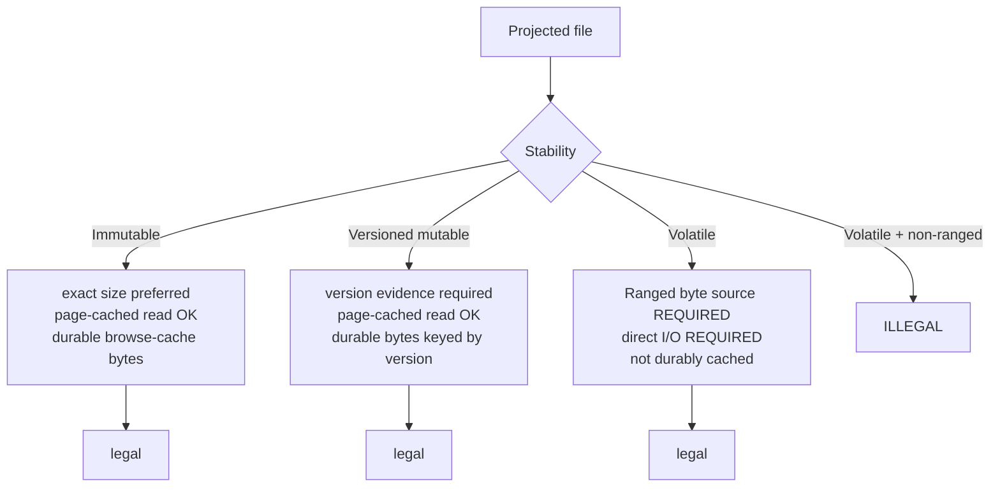

A projected file is more than its bytes. To behave like a real file for the standard Linux toolbox, it needs a size that `ls -l` and `stat` can read, an I/O mode the kernel can honour, and a stability classification that tells the host how long its bytes may be cached. Providers declare these through the SDK's `Projection` API; the host wires them into `st_size`, FUSE flags, cache layers, durable version-keyed content, learned-size promotion, and post-read invalidation.

Read this page before changing the projection API or adding a new `#[file]` handler shape.

## The four declared attributes

Every projected file declares four attributes, plus optional version evidence.

| Attribute | What it declares | Host uses it for |
| --- | --- | --- |
| **Size** | How well the file's length is known | `st_size`, learned-size promotion |
| **Bytes** | The byte source — where content comes from | which read path serves the file |
| **ReadMode** | How the kernel should read it | direct I/O vs page cache |
| **Stability** | Whether and how content can change | which cache layer holds the bytes, post-read invalidation |
| Version evidence (optional) | An identity for the current content | version-keyed durable caching |

### Size

Size declares how confidently the provider knows the file's length:

- An **exact** size is the true byte count. `ls -l`, `wc -c`, `stat`, and tools that pre-allocate or seek see the real number immediately.
- An **estimated or unknown** size is a provisional value the host uses until the real length is learned.

When a file with an inexact size is read in full and the host observes the actual byte count, it performs **learned-size promotion**: the observed length replaces the estimate so subsequent stats report the true size. This lets a provider project a directory of files cheaply (without fetching each body just to know its length) while still converging on correct `st_size` once a file is actually read.

### Bytes — the byte source

Bytes declares where content comes from and is paired with the handler shape that produces it. The byte source determines which host read path serves the file: inline bytes returned directly in a terminal, bytes spilled to the [blob cache](/concepts/caching/), or ranged reads served chunk by chunk. The pairing between byte source and handler shape is a structural contract — a handler must produce the kind of bytes its declared source promises.

### ReadMode

ReadMode tells the kernel how to read the file:

- Page-cached reads let the kernel buffer and reuse content, which is right for stable bytes.
- **Direct I/O** bypasses the page cache, which is right for volatile content whose length or bytes the kernel must not assume are stable.

The host sets the FUSE direct-I/O flag from this attribute so the kernel's caching behavior matches the file's real stability.

### Stability

Stability classifies whether the content can change, and is the input that decides durability:

- **Immutable** content never changes. The host caches its bytes durably in the browse cache; once fetched, it is never re-fetched.
- **Versioned mutable** content can change, but each version has identity (see version evidence). The host caches bytes durably keyed by version; a new version is a new key, so stale bytes are simply never requested again.
- **Volatile** content can change with no stable identity. It is not cached as durable exact bytes.

## The structural rule: Volatile requires Ranged

There is one hard structural rule binding these attributes together:

:::danger
**Volatile content must be served through Ranged reads.** A file that is volatile has no stable length and no version identity, so the host cannot safely hand the kernel a fixed `st_size` and a page-cached body. Volatile therefore requires the ranged byte source and direct-I/O read mode. A projection that declares volatile content with a non-ranged byte source is illegal.
:::

The reasoning: page-cached, fixed-size serving assumes the bytes and length are stable between the `getattr` and the `read`. Volatile content breaks that assumption. Ranged reads with direct I/O let the kernel ask for exactly the range it wants, each time, without caching a length that may already be wrong.

## Legal combinations

The combinations the host accepts:

| Stability | Size | Byte source | Read mode | Cached bytes |
| --- | --- | --- | --- | --- |
| Immutable | exact (or learned) | inline / blob | page cache | durable |
| Versioned mutable | exact or estimated | inline / blob, with version | page cache | durable, version-keyed |
| Volatile | unknown/estimated | ranged | direct I/O | not durable |

## Version evidence and version-keyed content

When content is versioned mutable, the provider attaches version evidence — an identity for the current content (for example an ETag-like token or a content hash). The host caches the bytes durably under a key that includes that version. Two consequences:

1. A read that presents the same version is served from cache with no round trip.
2. When the version changes, the new evidence produces a new cache key. The old bytes are never requested again and fall out by capacity eviction, while the new bytes are fetched and cached under the new key. There is no TTL and no manual invalidation needed for the bytes themselves — the version *is* the cache identity.

## Post-read invalidation

Some files reveal staleness only when read. After serving such a read, the host can apply post-read invalidation: dropping cached entries that the read showed to be out of date. Combined with learned-size promotion, this means a single full read both corrects the file's reported size and clears any stale attributes the host had cached for it.

## Why providers declare instead of implement

A provider never sets `st_size`, never toggles direct I/O, and never decides cache durability. It declares facts — "this file is immutable and exactly N bytes" or "this file is volatile, read it in ranges" — and the host translates those facts into kernel-facing behavior. This keeps the FUSE and caching mechanics in one place (the host) and keeps every provider's file model expressed in domain terms. See [the provider model](/concepts/provider-model/) for the broader description-versus-mechanics split, and [caching](/concepts/caching/) for how stability selects a cache layer.
