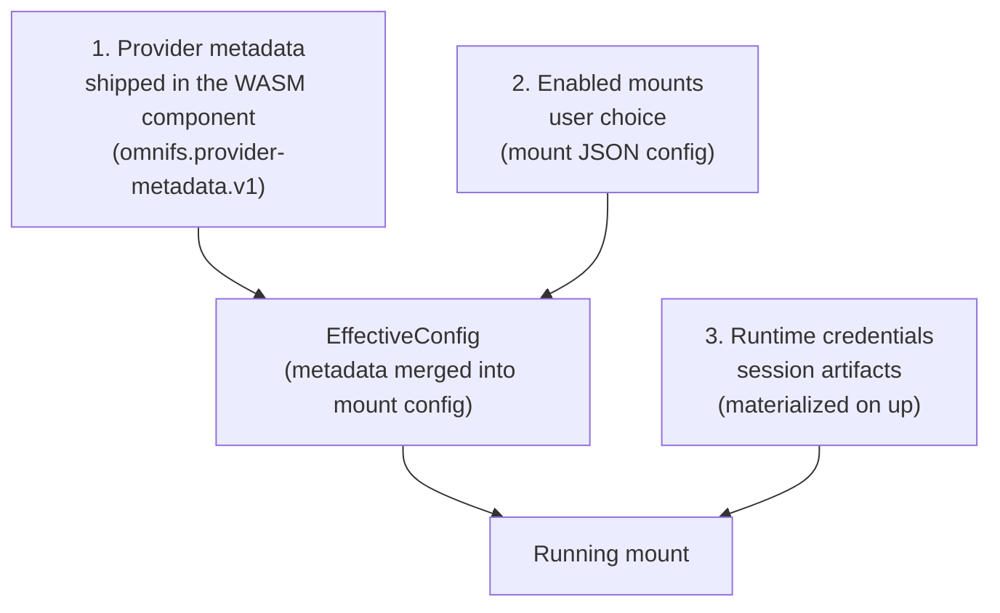
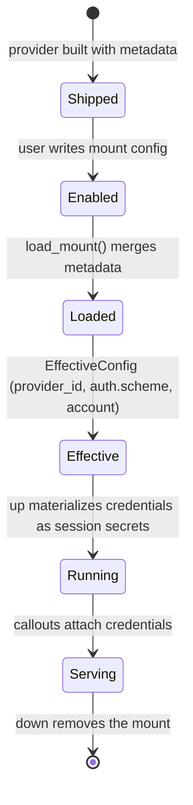

A running mount is the product of three distinct layers, each owned by a different party and resolved at a different time. Keeping them separate is what lets a provider ship sensible defaults, a user choose what to enable, and the host materialize per-session credentials, without any of those three concerns leaking into the others.

## The three layers



1. **Provider metadata — shipped.** Each provider embeds its metadata in the WASM component as `omnifs.provider-metadata.v1`. This includes the provider id, the auth manifest, and other defaults. The user does not write this; it travels with the artifact. See [auth and credentials](/concepts/auth-credentials/).

2. **Enabled mounts — user choice.** The user decides which providers to mount and supplies a mount JSON config: where it mounts, its scheme, account selectors, and the provider-specific `config` object. Instance configs are JSON, not TOML.

3. **Runtime credentials — session artifacts.** When the mount actually runs, the host materializes the credentials the mount needs as session artifacts — secret files keyed by the credential's storage key. These are produced on `up`, not stored in the mount JSON.

## LoadedMount and EffectiveConfig

The host does not operate on raw mount JSON directly. It merges the shipped provider metadata into the user's mount config to produce an **effective config**, and everything downstream — credential targeting, session materialization — operates on that merged result.

```rust
// Loading a mount yields an effective config, not raw JSON.
ProviderCatalog::load_mount() -> LoadedMount { config: EffectiveConfig }
```

The effective config is the merged truth:

- **`provider_id` is always present** on the `EffectiveConfig`. It comes from the metadata layer and is required for host-managed credentials.
- **`auth.scheme`** and an optional **`auth.account`** come from the mount config and select the credential identity.
- Static mounts may still carry `token_env` or `token_file` for external secrets; these do not go through the keychain.

:::note
`CredentialTarget` and session materialization operate on `EffectiveConfig` *after* the metadata merge — not on raw mount JSON plus a late `apply_metadata` pass. The merge happens once, at load, and produces one authoritative config object.
:::

## Strict vs best-effort loading

The same merge has two callers with different tolerance for missing metadata, expressed by a single parameter:

```rust
into_effective_mount(config, require_metadata)
```

- **Strict load** (`require_metadata = true`) is the normal path. If the provider metadata required to complete the effective config is missing, the load fails. A mount that cannot resolve its provider id or auth manifest should not run.
- **Best-effort load** (`require_metadata = false`) is for delete and reset paths. To remove or reset a mount you do not need the full metadata — you only need enough to identify the mount. Requiring full metadata there would make cleanup fail exactly when something is already broken.

This single flag keeps one merge function serving both the run path and the maintenance path without a second parallel loader.

## Credential materialization on `up`

When a mount comes up, the host materializes the credentials the effective config calls for. Each session secret is written to a file whose name is the credential's storage key:

```text
CredentialKey::storage_key()  ->  provider:scheme:account

github:pat:default
linear:oauth:work
```

The credential value is pulled from the host credential store — keychain or the `~/.omnifs/data/credentials.json` fallback — and exposed to the running container as a session secret. The [callout executor](/concepts/callout-runtime/) attaches it when it performs a fetch; provider code never reads the file.

For the contributor `omnifs dev` path specifically, the host also captures `gh auth token` and exposes it read-only at `/run/secrets/github_token`, which is a sandbox convenience distinct from the normal credential-store path.

## End-to-end flow



## Why three layers

Separating shipped metadata, user choice, and session credentials gives each its natural owner and lifetime:

- **Metadata changes with the provider artifact**, not with user config.
- **Enabled mounts change with user intent**, and never need to embed secrets.
- **Credentials are session-scoped artifacts**, materialized fresh on `up` and identified by a single storage-key wire form.

Folding any two of these together would force secrets into config files, or force users to re-declare provider defaults, or make cleanup paths depend on intact metadata. The `EffectiveConfig` merge keeps them composable while presenting one authoritative object to everything downstream.


## Design reference

The source of truth behind this page is the [Mount lifecycle](https://github.com/0xff-ai/omnifs/blob/main/docs/design/mount-lifecycle.md) design document. See the full [design-doc index](/contributing/design-docs/) for everything these pages are based on.
