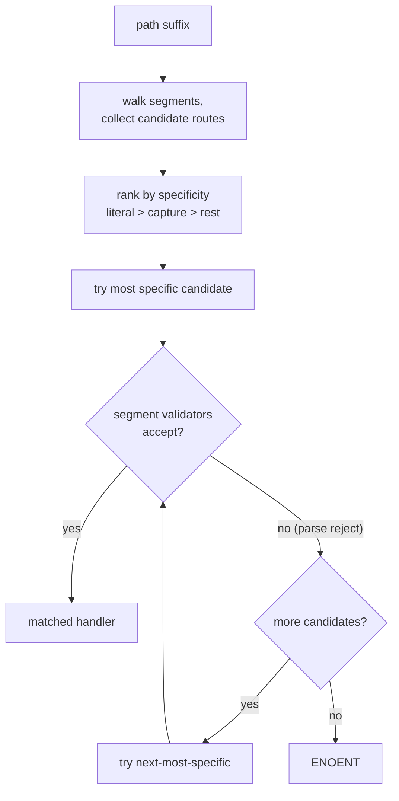
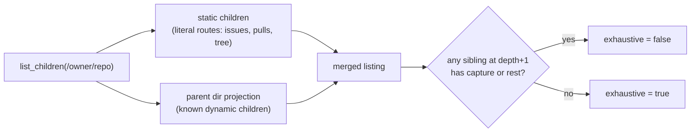

Once the host has stripped a mount prefix from a [protocol path](/concepts/path-space/), the remaining suffix must select one of the provider's registered handlers. This page describes how that choice is made: how candidate routes are ranked, how per-segment validators participate in matching, why an auto-navigable directory exists without a stub handler, and how the authority for "what exists" is split between `lookup_child` and `list_children`.

This is the routing model. Read it before changing dispatch logic.

## Routes and segment kinds

A handler's path family is a route made of segments. Each segment is one of three kinds:

- **Literal** — a fixed string, e.g. `issues` in `/{owner}/{repo}/issues`.
- **Capture** — a single named variable, e.g. `{owner}`, matching exactly one segment.
- **Rest** — a trailing variable that captures the remaining segments.

A capture can carry a **validator**: a parse function that decides whether a given segment value is acceptable for this route. Validators are not cosmetic — they participate in match candidacy.

## Precedence

When several routes could match a path, the most specific wins. Specificity is ordered:

```text
literal  >  capture  >  rest
```

Segment by segment, a literal match beats a capture, and a capture beats a rest. A route that pins more literal segments is more specific than one that captures them. The dispatcher evaluates candidates from most specific to least specific and takes the first that fully matches.



## Validators participate in candidacy

A capture's validator is part of whether the route matches at all. If a route's parse function rejects a segment, dispatch does **not** fail with ENOENT — it falls through to the next-most-specific candidate route.

:::caution
A parse rejection is a fall-through, not a dead end. If `/{owner}/{number}` requires `{number}` to parse as an integer and the segment is `readme`, that route is simply not a candidate; a less specific route (or a sibling literal route) gets the chance to match. ENOENT happens only when no candidate matches.
:::

This is what lets a provider mix structural literals and typed dynamic captures at the same depth without ambiguity. A literal route like `/{owner}/settings` and a typed capture route like `/{owner}/{repo}` coexist: `settings` binds the literal, anything else falls through to the capture.

## Auto-navigable literal prefixes

Any registered route's literal-segment prefix is an automatically navigable directory. Provider authors do **not** write no-op stub `#[dir]` handlers for intermediate navigation nodes.

If a provider registers `/{owner}/{repo}/issues/{number}`, then `/{owner}/{repo}/issues` is navigable as a directory even though no handler is declared for it, because it is a literal prefix on the way to a real route. `cd` and `ls` work through it. This keeps the route set as the single source of truth for the directory tree — there is no parallel scaffolding to maintain or keep in sync.

## Lookup vs readdir authority

The two browse operations have different jobs, and conflating them is a routing bug.

- **`lookup_child` is authoritative.** It answers the question "does this exact child exist?" If `lookup_child` resolves a name, the name exists, regardless of whether a prior listing mentioned it.
- **`list_children` (readdir) is advisory.** It returns the children the provider can enumerate, but it does not have to claim that set is complete.

The resolution order inside each operation:

**`lookup_child`** answers subtree (`#[treeref]`/`#[bind]`) handlers first, then falls back to the exact/static/auto-navigable shape, then to the parent `#[dir]` handler for dynamic children.

**`list_children`** answers subtree handlers first, then merges the static child shape with the parent directory projection.

**`read_file`** uses exact `#[file]` handlers first, then allows bounded eager bytes from a parent directory projection for projected files.

## Listing exhaustiveness

A directory listing carries an `exhaustive` flag.

An auto-navigable directory's listing is **non-exhaustive** (`exhaustive=false`) whenever any sibling route at depth + 1 has a capture or rest segment. The reason: the directory cannot enumerate the open-ended set of values a capture might match, so it advertises what it knows and relies on `lookup_child` to resolve specific dynamic children on demand.



A non-exhaustive listing means: "these entries definitely exist; others may exist and will resolve through `lookup_child`." This is exactly how `ls` can show a partial set while `cat /path/to/a/dynamic/child` still succeeds — the read triggers a `lookup_child` that the listing never enumerated.

## Why the authority split matters for shell tools

Standard tools mix `readdir` and `lookup` freely. `ls` lists; `cat` and `stat` look up by exact name; `find` does both. If readdir were treated as the complete truth, a dynamic child that was never listed would appear not to exist, breaking `cat` on a valid path. By making `lookup_child` authoritative and listings advisory, omnifs keeps the toolbox honest: anything addressable by an exact path resolves, whether or not a listing happened to mention it.

## Traversal testing

When provider path surfaces change, test the whole shell traversal, not only the leaf paths. In a live mount, run `ll`, `cd`, and `find` from the provider root through every intermediate directory. Verify that parent directories do not synthesise duplicate root entries, that route scaffolding names do not bind as dynamic captures, and that control directories do not contain stray item nodes unless the design says they should.
