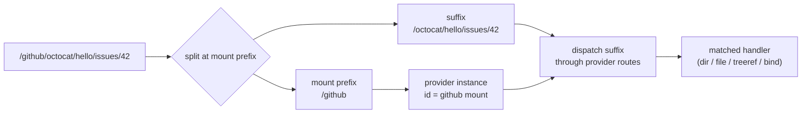

omnifs has a single path space. A protocol path is an absolute, forward-slash-delimited string that satisfies a fixed set of invariants. It is the only path shape that crosses the WIT boundary between host and provider, and the only shape stored in host caches. There is no second encoding, no relative form, and no per-provider namespace dialect.

Holding to one strict path shape is what lets the router, the cache, and every provider agree on what a path *is* without re-normalising or re-parsing at each hop.

## Invariants

Every protocol path obeys these rules:

1. **Always absolute.** A path begins with `/`. The empty string is never a valid path.
2. **Root is `/`.** The root directory has the path `/`. It is the only path that ends in `/`.
3. **No trailing slash.** A non-root directory path is `/foo/bar`, never `/foo/bar/`.
4. **Segments are non-empty.** `/foo//bar` is invalid. Each segment is a non-empty UTF-8 string that does not itself contain `/`.
5. **No `.` or `..` segments.** Normalisation is done up front, never deferred to a consumer.

A path that violates any invariant is a provider contract error at the WIT boundary and a programming error inside the host or SDK.

```text
/                         valid (root, the only trailing slash)
/github/octocat           valid
/github/octocat/hello     valid
""                        invalid (empty)
/github/octocat/          invalid (trailing slash)
/github//octocat          invalid (double slash)
/github/./octocat         invalid (dot segment)
/github/../etc            invalid (dotdot segment)
```

## One newtype

All path arithmetic goes through a single `Path` newtype that wraps a `String`. It is intentionally one type, not a pair like `AbsolutePath` plus `BarePath`. There is only one path space, so encoding an "absent" space in the type system would carry zero information. Provider authors get `Path::ROOT` as the implicit base; routing matches against absolute segments; the macros and dispatch layer never see a bare form.

The type exposes only segment-safe operations:

```rust
impl Path {
    pub const ROOT: &str = "/";

    pub fn parse(s: &str) -> Result<Self, PathParseError>; // checks invariants
    pub fn from_validated(s: impl Into<String>) -> Self;   // trust-boundary fast path

    pub fn join(&self, name: &str) -> Result<Self, PathParseError>;
    pub fn parent(&self) -> Option<Path>;     // /foo/bar -> /foo, /foo -> /, / -> None
    pub fn name(&self) -> &str;               // basename
    pub fn is_root(&self) -> bool;
    pub fn segments(&self) -> impl Iterator<Item = &str>;

    // Segment-boundary-safe: /foo/bar is a prefix of /foo/bar/baz
    // but NOT of /foo/barbecue.
    pub fn has_prefix(&self, prefix: &Path) -> bool;
    pub fn strip_prefix(&self, prefix: &Path) -> Option<Path>;
    pub fn as_str(&self) -> &str;
}
```

`has_prefix` and `strip_prefix` are segment-boundary safe on purpose: `/foo/bar` is a prefix of `/foo/bar/baz` but not of `/foo/barbecue`. This matters for invalidation, where a prefix wipe must not accidentally catch a sibling whose name merely starts with the same characters.

:::note
The two constructors mark trust. `parse` checks invariants and is used at every untrusted boundary. `from_validated` skips the scan and is used only for paths the host already minted — cache keys and route-matched paths — where the invariants already hold.
:::

## Mapping a path to a provider

A mounted provider claims a path prefix. Resolving a path means splitting it into the part that selects the mount and the part the provider handles.



The host owns the mount table: which prefix maps to which provider instance and config. Once the prefix is stripped, the remaining suffix is handed to the provider's [path dispatch](/concepts/path-dispatch/) logic, which selects the registered handler. The provider sees absolute protocol paths throughout — it never receives a bare suffix and never has to reconstruct the leading `/`.

## The WIT boundary

Every `string` typed as `path` in the provider WIT interface satisfies the invariants. The host calls `Path::parse` on every path string crossing the boundary in either direction; a parse error becomes a provider error and fails the operation. The validation cost is one O(length) scan per path, and a typical browse op carries one or two paths, so it is negligible. Host-minted paths skip the scan via `from_validated`.

Path-shaped fields in WIT records — lookup entries, directory listings, projection entries, tree handoffs — all carry absolute paths. Providers must never return a bare relative path; the dispatcher does not prepend `/` for them.

## Cache key encoding

The durable browse cache keys on the path string. `Path` serialises through serde directly to its inner `String`, so on-disk records are byte-identical to a naked string of the same value. Because there is exactly one canonical form for any given path, two requests for the same logical path always produce the same cache key. A multi-encoding path space would have required normalisation at every cache boundary; one strict shape removes that class of bug entirely.

## Why this matters

The single, strict path space is a load-bearing simplification:

- **The cache has one key space.** No normalisation step can disagree with another.
- **The router matches segments, not characters.** Prefix checks respect segment boundaries.
- **Providers cannot smuggle in relative paths** that the host would have to fix up.
- **Validation is centralised** at the WIT boundary, so internal code can assume well-formed paths.

From here, see how the [provider model](/concepts/provider-model/) consumes these paths and how [path dispatch](/concepts/path-dispatch/) selects a handler for a given suffix.
