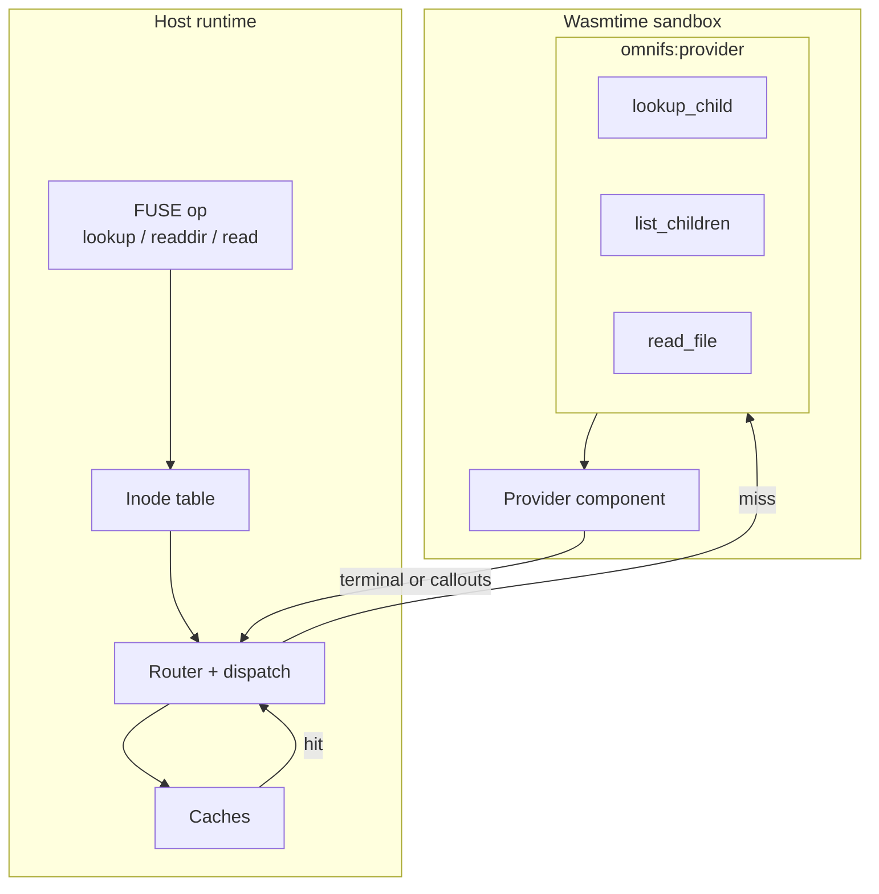

A provider is a `wasm32-wasip2` WASM component that implements the `omnifs:provider` WIT interface. It describes domain facts — what children a path has, what a file contains, what it needs fetched — and nothing about FUSE, NFS, inodes, or caching. Those mechanics live entirely in the host. This split is the core of the omnifs design: **the host owns mechanics, the provider owns facts.**

## Authoring shape

Providers are authored as free-function path handlers, collected from a `#[handlers]` impl block and declared through a provider entrypoint. There are no virtual dispatch tables of stub directory nodes to maintain — the registered routes themselves define the navigable shape.

```rust
#[omnifs_sdk::config]
struct Config { /* parsed from the mount's JSON config */ }

#[omnifs_sdk::handlers]
impl GithubProvider {
    #[dir("/{owner}")]
    fn owner_dir(...) -> Projection { /* list repos under an owner */ }

    #[file("/{owner}/{repo}/issues/{number}")]
    fn issue_file(...) -> FileContent { /* one issue's bytes */ }

    #[treeref("/{owner}/{repo}/tree")]
    fn repo_tree(...) -> TreeRef { /* hand a git clone to the host */ }
}

#[omnifs_sdk::provider(mounts("github"))]
struct GithubProvider;
```

The handler attributes describe what kind of path family each function answers:

- `#[dir("...")]` — a directory path family.
- `#[file("...")]` — an exact file path family.
- `#[treeref("...")]` — a subtree handoff: returns a `TreeRef` that the host resolves to a bind-mounted clone directory. See [cloning](/concepts/cloning/).
- `#[bind("...")]` — mounts a typed subtree (a `#[subtree] impl` block) at this path family; the host parses prefix captures, constructs the subtree, and dispatches the suffix through its inner registry.
- `#[mutate("...")]` — a mutation handler. Mutations are not implemented yet.

Top-level attributes are `#[config]` for the config struct, `#[subtree] impl B { ... }` for a typed subtree handler block whose inner `#[dir]`/`#[file]` items are templates relative to the subtree root, and `#[provider(...)]` for the entrypoint that declares the provider's mounts.

:::note
A provider author does **not** write no-op stub `#[dir]` handlers for intermediate navigation nodes. Any registered route's literal-segment prefix is automatically navigable. The route set defines the directory tree. See [path dispatch](/concepts/path-dispatch/).
:::

## The host browse surface

The host drives every provider through exactly three browse operations:

```wit
lookup-child: func(id: instance-id, parent: path, name: string) -> lookup-result;
list-children: func(id: instance-id, path: path) -> list-result;
read-file: func(id: instance-id, path: path) -> read-result;
```

- **`lookup_child(id, parent_path, name)`** resolves one child entry. This is the authoritative existence check: if `lookup_child` says a name exists, it exists.
- **`list_children(id, path)`** lists a directory. A listing may be non-exhaustive — it advertises the children it knows without claiming to be the complete set, so dynamic children still resolve through `lookup_child`.
- **`read_file(id, path)`** reads exact file content for a path.

This surface is deliberately tiny. Everything richer is folded into these three plus the suspend/resume [callout runtime](/concepts/callout-runtime/):

- **Subtree handoff** folds into `lookup_child` and `list_children`: when a `#[treeref]` handler matches, the result is a `subtree(tree-ref)` terminal and the host resolves the handle to a bind-mounted clone.
- **Cache preloading** travels on the listing and lookup terminals via a `preload` field, and on file reads via sibling files. See [caching](/concepts/caching/).
- **Invalidation** travels back from `on-event` handlers as `invalidate-paths` and `invalidate-prefixes`.



## Why mechanics stay in the host

FUSE and NFSv4 mechanics — inode allocation, attribute timeouts, direct I/O flags, readdir cookies, cache coherence — are intricate, kernel-facing, and identical across providers. Pushing them into each WASM component would duplicate that complexity many times and force every provider author to understand kernel filesystem semantics.

Instead the provider answers in domain terms. It says "this path is a directory with these children" or "this file's bytes are X, it is immutable, its size is exactly N." The host translates those facts into `st_size`, FUSE flags, cache layers, and version-keyed durable content. The mapping from a provider's declared file attributes to kernel behavior is described in [file attributes](/concepts/file-attributes/).

This separation also makes the [sandbox](/concepts/wasm-sandbox/) meaningful: because providers describe rather than act, the host can deny them all ambient capabilities and still get useful work done. A provider that wanted to perform its own I/O would need network and filesystem access; a provider that only describes facts and requests callouts needs neither.

## Configuration

Instance configs are JSON, not TOML. The host parses each mount's JSON config into an instance config; the provider-specific `config` object is preserved as a JSON value and re-serialised to JSON bytes for the `initialize()` call. Providers deserialise the raw payload through serde, wired up automatically by the `#[config]` macro.

## The contract in one line

A provider is a pure description engine: given a path and the results of any callouts it requested, it returns terminals describing directory shape, file content, and attributes. It does not touch the kernel, the cache, the network, or credentials. The host does all of that. Continue to the [callout runtime](/concepts/callout-runtime/) to see how a provider asks the host to fetch on its behalf.


## Design reference

The source of truth behind this page is the [Provider model](https://github.com/0xff-ai/omnifs/blob/main/docs/design/protocol-provider-model.md) design document. See the full [design-doc index](/contributing/design-docs/) for everything these pages are based on.
