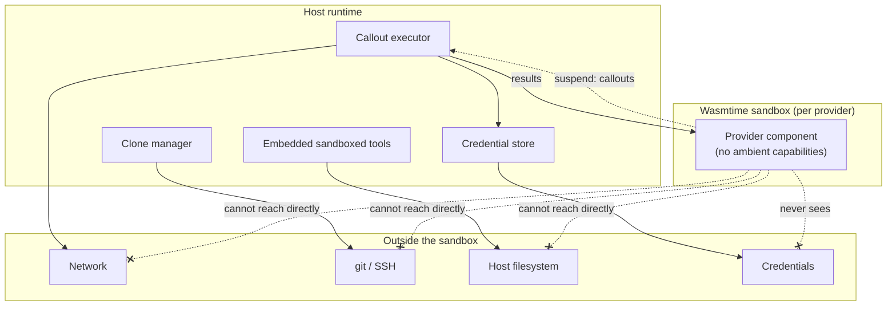
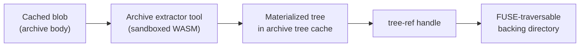

Providers run as WASM components on a Wasmtime/WASI substrate inside the host. The substrate is not just an execution detail — it is a security boundary. A provider component has **no ambient capabilities**: no socket, no git binary, no filesystem, no clock-driven side channels into the outside world. Everything it does to reach a service goes through host-brokered [callouts](/concepts/callout-runtime/). This is what lets omnifs load third-party providers and still keep credentials and the host machine safe.

## The substrate

Each provider is a `wasm32-wasip2` component implementing the `omnifs:provider` WIT interface. The host embeds Wasmtime and the WASI component model:

- Provider artifacts are built directly as components for the `wasm32-wasip2` target.
- WIT bindings are generated inside each provider by `wit_bindgen::generate!`.
- The host instantiates each component, wires the `omnifs:provider` exports, and drives the [browse surface](/concepts/provider-model/) (`lookup_child`, `list_children`, `read_file`) plus the suspend/resume protocol.

The component model gives a typed, capability-oriented boundary: a component can only call the imports the host chooses to provide, and the host provides only the narrow `omnifs:provider` host functions.

## The capability boundary

What crosses into the sandbox is only the data the provider needs to do its job: the path being browsed, the instance config (as JSON bytes at `initialize()`), and the results of callouts the provider explicitly requested. What never crosses in:

- **Network access.** The provider cannot open a socket. It issues an HTTP fetch callout; the host performs the request.
- **git / SSH.** The provider cannot run git. It returns a `TreeRef`; the host's clone manager clones it. See [cloning](/concepts/cloning/).
- **Host filesystem.** The provider cannot read or write host files.
- **Credentials.** Tokens are attached by the host's callout executor, never handed to provider code. See [auth and credentials](/concepts/auth-credentials/).

Because a provider only ever *describes* work and *requests* callouts, denying these capabilities costs it nothing functional while removing entire classes of risk.

## Embedded sandboxed tools

Some host work is itself untrusted in the same way provider input is — parsing an arbitrary archive, for example, is a classic attack surface. omnifs runs that work in its own sandboxed WASM tool rather than in native host code. The archive extractor is the canonical example: it is a `wasm32-wasip2` tool component with its own tool-specific WIT interface (under `wit/extractor`), invoked when an archive callout needs to materialize a subtree.

These embedded tools are separate from providers:

- They have **tool-specific WIT interfaces**, not the `omnifs:provider` interface.
- They are invoked by the host to perform a bounded, well-defined transformation (extract this archive), not to browse a path space.
- They run in the same Wasmtime substrate with the same lack of ambient capabilities, so a malicious archive that exploits the parser is contained inside the WASM sandbox, not running as native host code with host privileges.

The build system treats them as a sibling family: `omnifs-tool-*` crates build for `wasm32-wasip2` alongside `omnifs-provider-*`.

## Why a sandbox at all

Three properties depend on the boundary:

1. **Untrusted providers are safe to load.** A provider is just a WASM component; it cannot reach the network, the disk, or credentials directly, so loading one cannot compromise the host or leak secrets.
2. **One policy point.** Retries, rate limits, credential attachment, blob spillover, and concurrency all live in the host's callout executor, applied uniformly because providers cannot bypass it.
3. **Untrusted *input* is contained too.** Risky parsing (archives) runs in its own sandboxed tool with its own narrow WIT interface, so a parser exploit stays inside WASM.

The sandbox is the structural reason the rest of the architecture works: it is *because* providers cannot act on their own that the [host can own all mechanics](/concepts/architecture/) — caching, credentials, cloning, and I/O — while still safely running provider code that describes domain facts.
