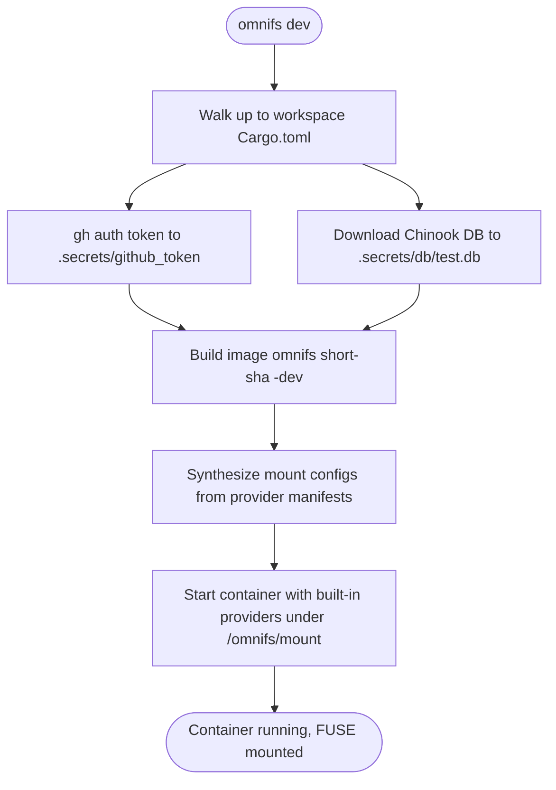

The primary contributor workflow is `omnifs dev`. It is contributor-only and
requires a source checkout. It builds the dev image, synthesizes mount configs
from the built-in provider manifests, materializes credentials and fixtures, and
launches the container directly through the Docker API.

```bash
omnifs dev          # build dev image, materialize secrets/fixtures, launch container
omnifs shell        # attach a zsh shell
omnifs logs -f      # follow container output
omnifs status       # inspect mounts, providers, auth state
omnifs down         # stop and remove the container
```

The implementation lives in `crates/cli/src/commands/dev.rs`. There are also two
`just` wrappers over `omnifs dev`:

```bash
just dev            # omnifs dev
just dev-y          # omnifs dev -y   (no prompts)
```

## What `omnifs dev` does

`omnifs dev` walks up from your current directory looking for the workspace
`Cargo.toml`, so you can run it from anywhere inside the checkout. It then:

1. Captures `gh auth token` and writes it to `.secrets/github_token`.
2. Downloads the Chinook SQLite fixture into `.secrets/db/test.db` (used by the
   `db` provider).
3. Builds an image tagged `omnifs:<short-sha>-dev` from the contributor
   `Dockerfile`.
4. Synthesizes dev mount configs from the built-in provider manifests
   (`omnifs.provider.json`, embedded in each provider WASM as
   `omnifs.provider-metadata.v1`).
5. Starts the container with all built-in providers mounted under
   `/omnifs/<mount>`.

The `.secrets/github_token` file is exposed read-only inside the container at
`/run/secrets/github_token`. Git clone uses the SSH remote
`git@github.com:<owner>/<repo>.git` with auth forwarded through your host
`SSH_AUTH_SOCK`. Host private keys are never mounted in.



## Prerequisites

For container startup to succeed:

- Host `gh auth token` works, so `omnifs dev` can capture and write
  `.secrets/github_token`.
- Host `SSH_AUTH_SOCK` is set.
- The host SSH agent has a usable GitHub key loaded.

Quick host checks:

```bash
test -s .secrets/github_token || gh auth token > .secrets/github_token
ssh-add -L
ssh -T git@github.com
```

## Supporting commands

- `omnifs shell` attaches a `zsh` shell to the running container. Interactive
  shells alias `ls` to `ls --color=auto` and `ll` to `ls -lrt`.
- `omnifs logs -f` follows stdout/stderr from the entrypoint. Runtime FUSE
  traces go to `/tmp/omnifs.log` inside the container.
- `omnifs status` inspects mounts, providers, auth state, and cache - the
  fastest triage for a misbehaving mount.
- `omnifs down` stops and removes the container.

:::caution
`docker exec` does not inherit the entrypoint environment. When checking live
behavior, verify actual runtime paths instead of inferring them from defaults,
and remember the runtime FUSE log is `/tmp/omnifs.log` inside the container, not
whatever `docker logs` shows.
:::

## Validating runtime changes

For mount, provider, clone, traversal, or runtime behavior changes, do not stop
at Rust-only checks. Validate through the supported runtime path:

```bash
omnifs dev -y
docker exec omnifs /bin/zsh -lc 'omnifs status'
docker exec omnifs /bin/zsh -lc 'OMNIFS_DEMO_MODE=smoke /tmp/demo.sh'
docker exec omnifs /bin/zsh -lc 'tail -n 80 /tmp/omnifs.log'
```

For path-surface changes, exercise the whole shell traversal, not just the
intended leaf paths: run `ll`, `cd`, and `find` from the provider root through
every intermediate directory.

:::note
`omnifs dev` is the only supported local mount recipe. Do not add alternate
local mount setups, and keep `omnifs dev` working when changing Docker-related
files. The runtime FUSE mount is Linux-only; the CLI runs on macOS and Linux
and talks to a Linux container in both cases.
:::
