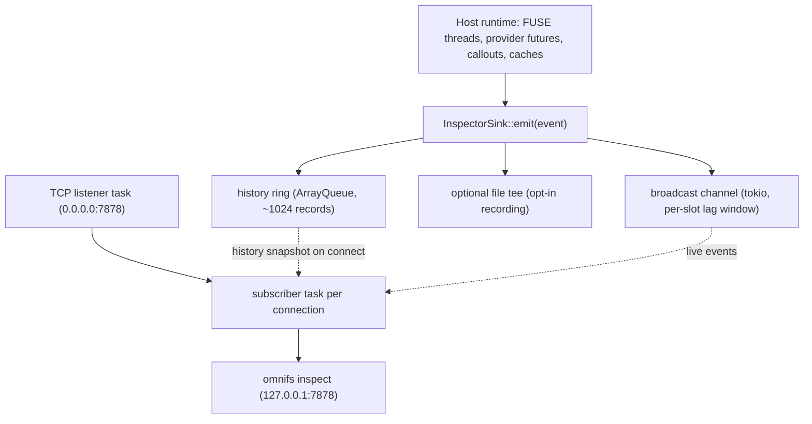

omnifs ships a typed observability stream. The host emits structured
`InspectorEvent` records on a non-blocking hot path; subscribers attach over a
TCP loopback transport and see FUSE, provider, and callout activity as JSONL.

The schema lives in `omnifs-inspector` (`crates/inspector`): the
`InspectorEvent` enum, the `InspectorRecord` envelope, and `parse_record_line`
for the CLI side. The full design is in
`docs/design/inspector-emission-architecture.md`.

## Emission path

Three components live inside the host daemon. The runtime (FUSE threads,
provider futures, callouts, caches) calls a single entry point,
`InspectorSink::emit(event)`, which fans the record out without blocking.



`emit` constructs an `Arc<InspectorRecord>` once, pushes it into the history
ring (wait-free; oldest dropped when full), and broadcasts it (non-blocking;
slow subscribers get a `Lagged` notice and resume from the latest). The hot path
never awaits and never holds a lock for more than a few nanoseconds. The optional
file tee is the only blocking sink and is off by default. Records are redacted by
the `InspectorEvent` constructors before they ever reach the wire.

## Transport: TCP loopback

The transport is plain TCP loopback, not a Unix-domain socket. A bind-mounted
UDS does not work across the Docker Desktop VM boundary on macOS and Windows -
the socket is bound inside the VM's network namespace, so a host `connect()`
returns `ECONNREFUSED`.

Instead:

- The daemon binds `0.0.0.0:7878` inside the container.
- Docker forwards `127.0.0.1:7878:7878/tcp` to the host (loopback only).
- The CLI connects via `TcpStream::connect("127.0.0.1:7878")`.

`omnifs dev` sets `OMNIFS_LIVE_ADDR=0.0.0.0:7878` and configures the port
forward. If the bind fails, the live server simply does not run; `emit` still
works locally (ring plus optional file tee).

## History, replay, and recording

A new subscriber first receives a snapshot of the in-memory history ring, then
switches to the live broadcast - so attaching mid-session shows recent events,
not just future ones. Each record carries a daemon-local `seq` so the CLI can
de-dup the small snapshot/broadcast overlap window.

The ring is in-memory only and does not survive a daemon restart. Durable
capture is opt-in: a file tee writes pure JSONL, and the CLI can record or replay
a file.

| `omnifs inspect` mode | Source |
|---|---|
| `omnifs inspect` (no flags) | TCP socket `127.0.0.1:7878` |
| `omnifs inspect --replay <file>` | Replay from a recorded JSONL file |
| `omnifs inspect --record <file>` | Live socket, tee to `<file>` on the host side |

```bash
omnifs inspect                       # stream live FUSE/provider/callout events
omnifs inspect --record run.jsonl    # stream and record
omnifs inspect --replay run.jsonl    # replay a previous recording
```

## Configuration

Daemon-side environment variables:

| Var | Default | Meaning |
|---|---|---|
| `OMNIFS_LIVE_ADDR` | `0.0.0.0:7878` | TCP listen address. Set to `""` to disable the server. |
| `OMNIFS_LIVE_HISTORY_CAP` | `1024` | History ring capacity. |
| `OMNIFS_LIVE_BROADCAST_CAP` | `256` | Per-subscriber lag tolerance. |
| `OMNIFS_LIVE_PATH` | unset | File tee path. Default is no file. |
| `OMNIFS_LIVE` | `1` | Master switch for all sinks. |

:::caution
The transport has no per-subscriber authentication: any local process that can
`connect()` to the loopback port is a subscriber. This is acceptable for the
single-user contributor flow because records are already redacted at
construction. The non-dev `omnifs up` path revisits this when the security
design lands.
:::

:::note
The inspector schema and wire format are intentionally stable. The design
explicitly rules out replacing the typed-enum stream with
`tracing-subscriber`/OpenTelemetry, which would lose the typed-enum guarantees
and the redaction discipline. Keep `InspectorEvent` and `parse_record_line` the
single source of truth.
:::


## Design reference

The source of truth behind this page is the [Inspector emission architecture](https://github.com/0xff-ai/omnifs/blob/main/docs/design/inspector-emission-architecture.md) design document. See the full [design-doc index](/contributing/design-docs/) for everything these pages are based on.
