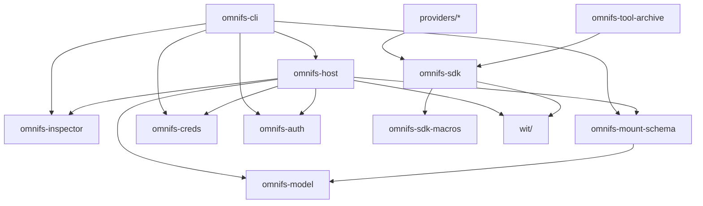

omnifs is a single Cargo workspace. The host runtime and native CLI build for
your native target; providers and tools build as `wasm32-wasip2` WASM
components. This page maps the crates so you know where to look before changing
anything.

The workspace members are declared in the root `Cargo.toml`:

```toml
members = [
    "crates/*",
    "providers/arxiv",
    "providers/db",
    "providers/docker",
    "providers/github",
    "providers/dns",
    "providers/linear",
    "providers/test",
]
default-members = ["crates/cli", "crates/host"]
```

## Host and CLI crates

These build for the native target.

| Crate | Path | Purpose |
|---|---|---|
| `omnifs-cli` | `crates/cli` | The native `omnifs` binary: command-line interface for mounting omnifs filesystems. Implements `dev`, `shell`, `logs`, `status`, `down`, `inspect`, plus the `init`/`up` user flows. Talks to a Linux container through the Docker API. |
| `omnifs-host` | `crates/host` | The host runtime: FUSE mount, Wasmtime component loader, router/dispatch, inode table, host-owned caches, callout execution, clone manager, and the `InspectorSink`. |

## Provider authoring crates

`omnifs-sdk` and `omnifs-sdk-macros` build for the WASM target (used by
providers); the schema/model/creds/auth crates build for the host.

| Crate | Path | Purpose |
|---|---|---|
| `omnifs-sdk` | `crates/omnifs-sdk` | Provider SDK: WIT bindings, the `Projection`/file-attribute API, browse types, HTTP/git callout helpers, and the `Result<T>` alias over `ProviderError`. |
| `omnifs-sdk-macros` | `crates/omnifs-sdk-macros` | Proc macros: `#[provider]`, `#[handlers]`, `#[config]`, `#[subtree]`, and the `#[dir]`/`#[file]`/`#[treeref]`/`#[bind]`/`#[mutate]` handler attributes. |
| `omnifs-mount-schema` | `crates/omnifs-mount-schema` | Wire types for the `omnifs.provider-manifest.v1` / `omnifs.provider-metadata.v1` custom sections, plus `CapabilityEntry`. Config/wire truth; no human-facing CLI labels live here. |
| `omnifs-model` | `crates/omnifs-model` | Shared model value types (IDs like `ProviderId`, `MountName`, `AccountId`, credential IDs) used across host and providers. |
| `omnifs-creds` | `crates/omnifs-creds` | Host-side credential store: keyring or `~/.omnifs/data/credentials.json` file fallback. `CredentialKey::storage_key()` is the only public wire form. |
| `omnifs-auth` | `crates/omnifs-auth` | Generic host-side OAuth protocol engine: `OAuthClient`, device/loopback/manual flows. Not mount config or credential storage. |
| `omnifs-inspector` | `crates/inspector` | JSONL activity event schema and redaction: the `InspectorEvent` enum, the `InspectorRecord` envelope, and `parse_record_line`. |
| `omnifs-tool-archive` | `crates/omnifs-tool-archive` | WASI-sandboxed archive extraction component (tar.gz, tar, zip), loaded by the host as an embedded Wasmtime component behind the archive callout. |

## Provider crates

Each provider under `providers/` is a WASM component implementing the
`omnifs:provider` WIT interface.

| Crate | Path | Mirrors |
|---|---|---|
| `omnifs-provider-arxiv` | `providers/arxiv` | arXiv papers. |
| `omnifs-provider-db` | `providers/db` | SQL databases (Chinook SQLite fixture in dev). |
| `omnifs-provider-docker` | `providers/docker` | Local Docker objects. |
| `omnifs-provider-github` | `providers/github` | GitHub orgs, repos, issues, PRs, repo trees. |
| `omnifs-provider-dns` | `providers/dns` | DNS records. |
| `omnifs-provider-linear` | `providers/linear` | Linear issues. |
| `test-provider` | `providers/test` | Fixture provider used in tests. |

The WIT contracts that providers and host share live under `wit/`
(`wit/provider.wit` for the provider interface, plus the `extractor` world for
the archive tool).

## Crate layering

The CLI sits on top of the host; the host depends on the supporting crates;
providers depend on the SDK, which is generated against the WIT.



:::note
Build and check recipes select packages with the globs `omnifs-provider-*`,
`omnifs-tool-*`, and `test-provider` rather than a hand-maintained crate list.
Naming a new provider `omnifs-provider-<name>` makes it picked up automatically.
:::

See [build and validation](/contributing/build-validation/) for how each layer
is built and checked.
