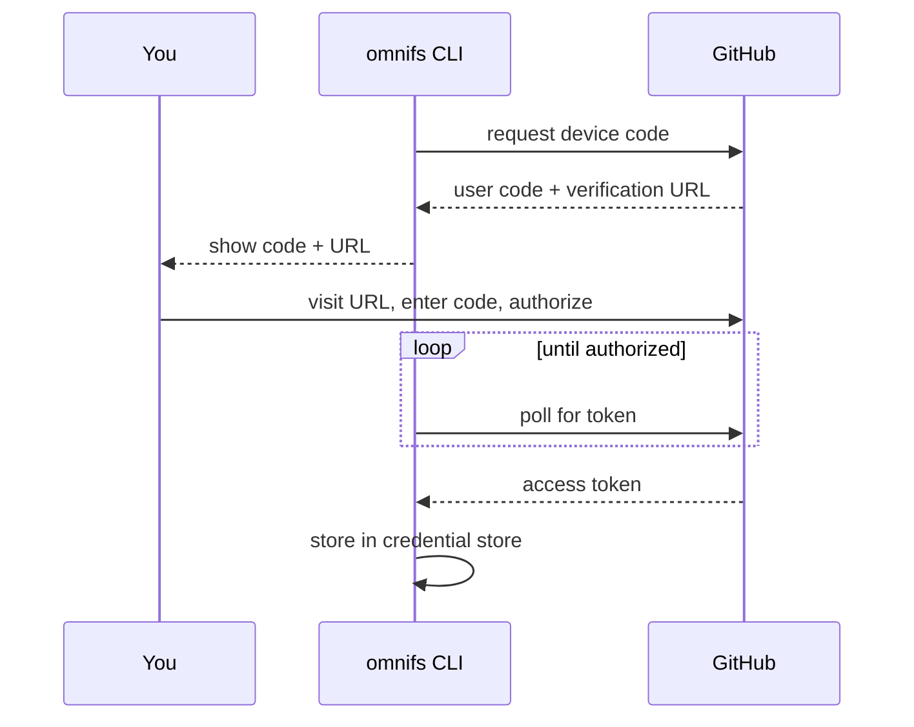

Some providers require credentials. omnifs manages them out of band so the
filesystem stays a plain read interface. Authenticate once with `omnifs auth`,
and the runtime uses the stored credential when it talks to the service.

```bash
omnifs auth login github      # device-code flow
omnifs auth login linear      # browser PKCE flow
omnifs auth status            # see what is configured
```

## Logging in

Run `omnifs auth login <provider>`. The flow depends on the provider:

- **GitHub** uses the OAuth **Device Authorization** flow (RFC 8628). omnifs
  prints a code and a URL; you enter the code in your browser.
- **Linear** uses the **Authorization Code flow with PKCE** (RFC 7636). omnifs
  opens your browser and captures the redirect on a temporary loopback server.

```bash
omnifs auth login github
omnifs auth login linear

# Attach an account label to keep multiple identities apart
omnifs auth login github --account work
```

### Device-code login (GitHub)



The CLI displays the code and URL, then waits:

```text
To authenticate, visit:

    https://github.com/login/device

And enter code: ABCD-1234

Waiting for authorization...
```

## Importing an existing token

If you already have a token — for example a GitHub personal access token — import
it instead of running a login flow.

```bash
omnifs auth import github --token ghp_xxxxxxxxxxxx

# From an environment variable
omnifs auth import github --token "$GITHUB_TOKEN"

# From a file
omnifs auth import github --token-file ~/.secrets/gh_token

# With an account label
omnifs auth import github --token ghp_xxxx --account work
```

## Checking status

`omnifs auth status` shows what is configured. Pass a provider to narrow it.

```bash
omnifs auth status
omnifs auth status github
```

To remove a credential, use `omnifs auth logout <provider>` (with an optional
`--account`).

## Where credentials live

omnifs picks one backend at startup:

- **macOS:** Keychain
- **Linux:** Secret Service (libsecret) when available
- **Fallback:** `~/.omnifs/data/credentials.json`, written with `0600`
  permissions, when no system store is available

Credentials are keyed by `provider:scheme:account` (for example
`github:oauth:default`).

## Read-only by default

omnifs requests **read-only** scopes so it can browse but not modify your data:

- **GitHub:** `repo:status`, `read:org`, `read:user`, `public_repo`
- **Linear:** `read`

:::caution
Do not grant the broad GitHub `repo` scope unless you accept that it gives full
read/write access to your repositories. Write support (mutations) requires
explicit opt-in with broader scopes; until you need it, keep the default
read-only grant to minimize the blast radius of a leaked token.
:::

:::note
PKCE protects the browser flow against code interception, and the loopback
server only accepts localhost connections and shuts down right after the
callback. Tokens that support refresh are renewed transparently during use.
:::
