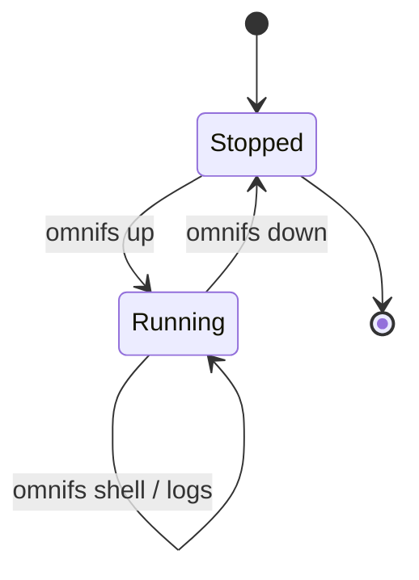

omnifs runs its FUSE mount inside a Linux runtime container. Four commands cover
its whole lifecycle: `up` starts it, `shell` and `logs` work with it while it
runs, and `down` stops it.

```bash
omnifs up        # start the runtime and mount the filesystem
omnifs shell     # open a shell inside it
omnifs down      # stop it
```

## Lifecycle



## `omnifs up`

Starts the runtime container and mounts the projected filesystem. The runtime
image is pulled automatically the first time. By default it detaches after
starting.

```bash
omnifs up
omnifs up --pull             # pull the latest image first
omnifs up --image <image>    # use a specific image
```

Use this when you want to start browsing. After it returns, your provider paths
(`/github`, `/dns`, `/arxiv`, ...) are available inside the runtime.

## `omnifs shell`

Opens an interactive shell inside the running container, where the projected
paths live. You can also run a one-off command instead of an interactive shell.

```bash
omnifs shell
omnifs shell ls /github/torvalds
omnifs shell cat /dns/example.com/A
```

Use this to browse omnifs paths directly — especially on macOS, where the mount
lives inside the container rather than on the host.

## `omnifs logs`

Shows output from the runtime container. Follow it with `-f` (`--follow`), and
limit the tail with `-n`.

```bash
omnifs logs
omnifs logs -f
omnifs logs -n 100
```

Use this to watch what the runtime is doing — for example to see a clone
progress or an error surface.

## `omnifs down`

Stops the runtime container. Pass `--remove` to also delete the container.

```bash
omnifs down
omnifs down --remove
```

:::note
On macOS the FUSE mount is inside the Linux container, not on your host
filesystem, so the paths are not visible in Finder. Use `omnifs shell` or run
commands via `omnifs shell <command>` to browse them. To check that the runtime
is healthy and mounts are loaded, see [Inspect and debug](/guides/inspect-debug/).
:::
