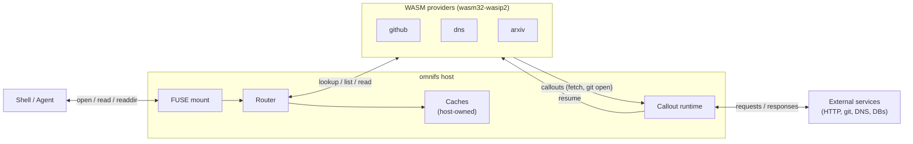
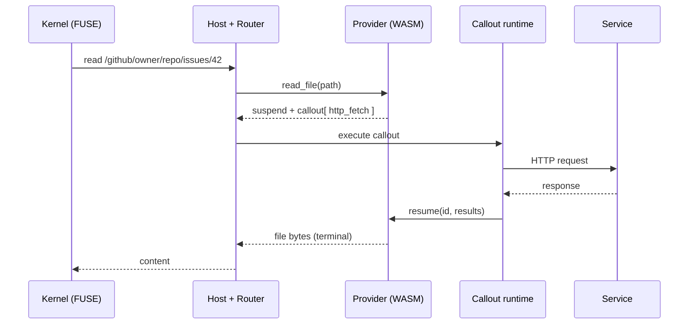

omnifs turns a filesystem syscall into a live service read through three cooperating layers: a **FUSE host**, sandboxed **WASM providers**, and a **callout runtime** that performs the actual I/O. The host owns the mount and all caching; providers own the mapping from path to service; the callout runtime executes the requests providers ask for.

## The architecture at a glance

A read flows down and back: the kernel hands the host a FUSE operation, the router dispatches it to the matching provider, the provider either answers immediately or **suspends** with a list of callouts, the runtime executes those callouts, and the provider resumes to produce the final result.

## Layer 1 — the FUSE host

The host owns the Linux FUSE mount. It exposes three browse operations to providers and serves the kernel from their results:

- **`lookup_child(parent, name)`** — resolve one child entry (a stat).
- **`list_children(path)`** — list a directory (a readdir).
- **`read_file(path)`** — read exact file content.

The host also owns **all caching.** Provider results — listings, lookups, and file content — land in capacity-bounded caches. There are no TTLs; entries leave the cache by capacity eviction or by explicit invalidation that providers signal back. Providers do not run their own caches or expiry. The host additionally manages the inode table, routing, and, for repository subtrees, bind-mounted clone directories.

## Layer 2 — WASM providers

Each provider is a sandboxed `wasm32-wasip2` WASM component implementing the `omnifs:provider` WIT interface. A provider declares the path families it serves (directories, exact files, subtree handoffs, mutations) and maps each path to upstream data. Authors write path handlers; the host derives the navigable directory shape from the registered routes, so intermediate navigation nodes do not need stub handlers.

Sandboxing matters: providers cannot touch the host directly. They can only ask the host to do I/O on their behalf, which keeps untrusted provider code contained.

## Layer 3 — the callout runtime

Providers never perform network or git I/O themselves. When a handler needs external data, it **suspends** and returns a batch of **callouts** — for example an HTTP fetch or a git open. The host's callout runtime executes the batch and calls `resume(id, results)` with the outcomes. Providers keep continuations keyed by a correlation ID so they pick up exactly where they left off.

Callouts are strictly request/response — there are no fire-and-forget callouts. Cache side effects ride inside the terminal result rather than as separate callouts: a listing can carry preloaded content for the host to cache alongside it, and event handlers return invalidation hints the host applies at the response boundary.

## Git-backed reconciliation (write-back, WIP)

Today omnifs is a read model. Writing back to services — git-backed reconciliation, where edits to projected paths are turned into upstream mutations — is **work in progress.** The intended shape keeps the read model read-only, stages changes under a draft namespace, and triggers execution by moving a prepared transaction into a control namespace. Projected entity files are not made directly writable as an implicit mutation mechanism. See [Project status](/introduction/project-status/) for what is implemented versus planned.

## Where to go next

- [What is omnifs](/introduction/what-is-omnifs/) — the projected-filesystem model and path examples.
- [Why omnifs](/introduction/why-omnifs/) — the case for a filesystem over per-service APIs.
- [Project status](/introduction/project-status/) — platform support and roadmap.
