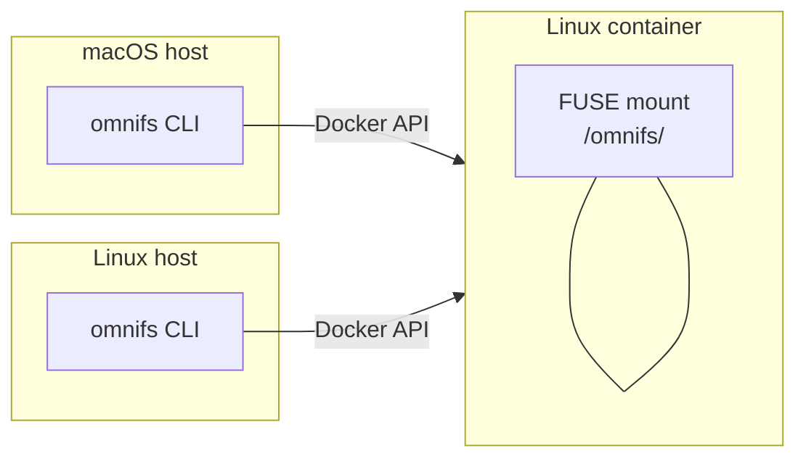

omnifs is **alpha** software. The core projected-filesystem model — reading live services as paths over FUSE — works today across several providers. Interfaces, paths, and CLI flags can still change between versions.

## Platform support

The runtime FUSE mount is **Linux-only.** The host CLI runs on **macOS and Linux**, and in both cases it talks to a Linux container that holds the actual mount. On macOS you do not get a native mount; the CLI drives the same Linux container that a Linux host would run.



Native macOS and Windows mounts are **planned**, not present. Do not assume macFUSE, `diskutil`, or other macOS-specific mount behavior — the supported path is always the Linux container.

## What works today

- The projected read model: `cd`, `ls`, `cat`, `grep`, `find`, and the broader Unix toolbox over projected paths.
- Multiple providers loaded as `wasm32-wasip2` WASM components (for example GitHub, DNS, arXiv, databases, Docker, Linear).
- Host-owned caching with capacity bounds and provider-driven invalidation.
- The callout runtime: HTTP fetch and git open, with provider suspend/resume.
- Repository subtree handoff to bind-mounted clones (git clone currently uses SSH over a forwarded `SSH_AUTH_SOCK`).
- Auth for mounts via static tokens or OAuth, with credentials in the host keychain or a local file fallback.

## What is coming

- **Write-back / mutation.** Git-backed reconciliation — turning edits to projected paths into upstream changes — is work in progress. The read model stays read-only; mutations are designed to flow through a draft namespace and a control namespace rather than making entity files directly writable.
- **Native mounts** on macOS and Windows.

For the detailed feature timeline, see the [roadmap](/reference/roadmap/).

## Supported workflows

There are two supported entry points: a user workflow and a contributor workflow.

### Users

```bash
omnifs init     # configure mounts and credentials
omnifs up       # pull the runtime image and start the mount
omnifs shell    # attach a shell inside the mounted environment
```

For the user path, OAuth credentials live in the host credential store — the system keychain, or a `~/.omnifs/data/credentials.json` fallback.

### Contributors

`omnifs dev` is the primary contributor workflow and requires a source checkout. It builds the dev image, synthesizes mount configs from the built-in provider manifests, materializes credentials and fixtures, and launches the container directly through the Docker API.

```bash
omnifs dev          # build dev image, materialize secrets/fixtures, launch container
omnifs shell        # attach a zsh shell
omnifs logs -f      # follow container output
omnifs status       # inspect mounts, providers, auth state
omnifs down         # stop and remove the container
```

In the contributor sandbox, `omnifs dev` captures `gh auth token` and exposes it read-only inside the container at `/run/secrets/github_token`; git clone uses the forwarded SSH agent rather than mounted private keys.

:::caution
Because omnifs is alpha, treat paths, flags, and provider behavior as subject to change. Validate runtime behavior through the supported container path rather than assuming defaults.
:::

## Where to go next

- [What is omnifs](/introduction/what-is-omnifs/) — the projected-filesystem model.
- [How it works](/introduction/how-it-works/) — the host, providers, and callout runtime.
- [Roadmap](/reference/roadmap/) — the feature timeline.
