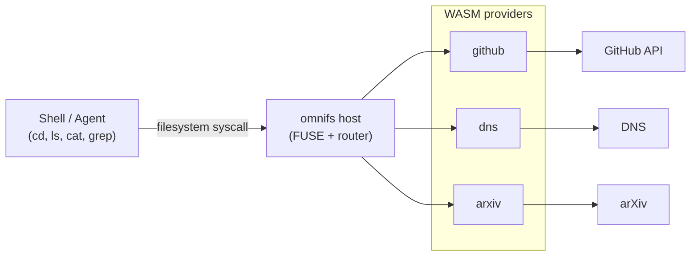

omnifs is a projected filesystem. It mirrors external services — GitHub, DNS, arXiv, databases, Docker, Linear — into local paths so that the entire Unix toolbox works against live data. You do not call an API. You change into a directory, list it, and read a file.

The thesis is Plan 9's: **everything is a file.** omnifs makes that literal for services that normally hide behind HTTP APIs, SDKs, tokens, and pagination cursors.

> the universe, mounted on your filesystem.

## What you get

A single, uniform interface over many services. The same four verbs you already use for files apply everywhere:

- **`cd`** into a service, an account, a repository, a domain.
- **`ls`** to enumerate what exists — repos, issues, DNS records, papers.
- **`cat`** to read a single entity as content — an issue body, an MX record, a paper abstract.
- **`grep` / `find` / `rg`** to search and traverse across everything that is projected.

Because these are real filesystem paths served over FUSE, the standard toolbox just works: `head`, `tail -f`, `less`, `wc`, `stat`, `du -sh`, `cp`, `tar`, `diff`, `sha256sum`, `jq`, and editors like `vim` all operate on projected paths the same way they operate on ordinary files.

## Concrete examples

Each provider mounts under `/omnifs/<mount>` (in the contributor sandbox the GitHub mount appears at `/github`, DNS at `/dns`, and so on). Paths map to entities:

| Path | What it is |
| --- | --- |
| `/github/<owner>` | An owner's repositories, as directories |
| `/github/<owner>/<repo>` | A repository, browsable as a tree |
| `/github/<owner>/<repo>/issues` | Issues, each projected as a file |
| `/dns/@google/<domain>/MX` | The MX records for a domain, as file content |
| `/arxiv/<id>` | A paper, with its metadata and abstract as files |

So instead of writing a script against the GitHub REST API to read an issue, you do:

```bash
cd /github/torvalds/linux
ls issues
cat issues/42
```

And instead of `dig`-ing a domain, you read a path:

```bash
cat /dns/@google/example.com/MX
```

## How the pieces fit

A shell command or an agent issues an ordinary filesystem call. The omnifs **host** receives it through FUSE, routes it to the **provider** responsible for that mount, and the provider turns it into the right upstream request. The result flows back as directory entries or file bytes.



Providers are sandboxed `wasm32-wasip2` WASM components. Each one implements the `omnifs:provider` interface and declares which paths it serves and how each path maps to upstream data. The host owns the FUSE mount, routing, and all caching; the provider owns the mapping from path to service.

## One interface for humans and agents

The same paths that you explore interactively are the paths an LLM agent reads. An agent does not need a bespoke tool, an API client, or an auth flow per service — it lists directories and reads files. This collapses many integrations into one capability: filesystem access.

## Where to go next

- [Why omnifs](/introduction/why-omnifs/) — the problem with APIs, and the everything-is-a-file argument.
- [How it works](/introduction/how-it-works/) — the host, providers, and callout runtime in detail.
- [Project status](/introduction/project-status/) — what works today and what is coming.
