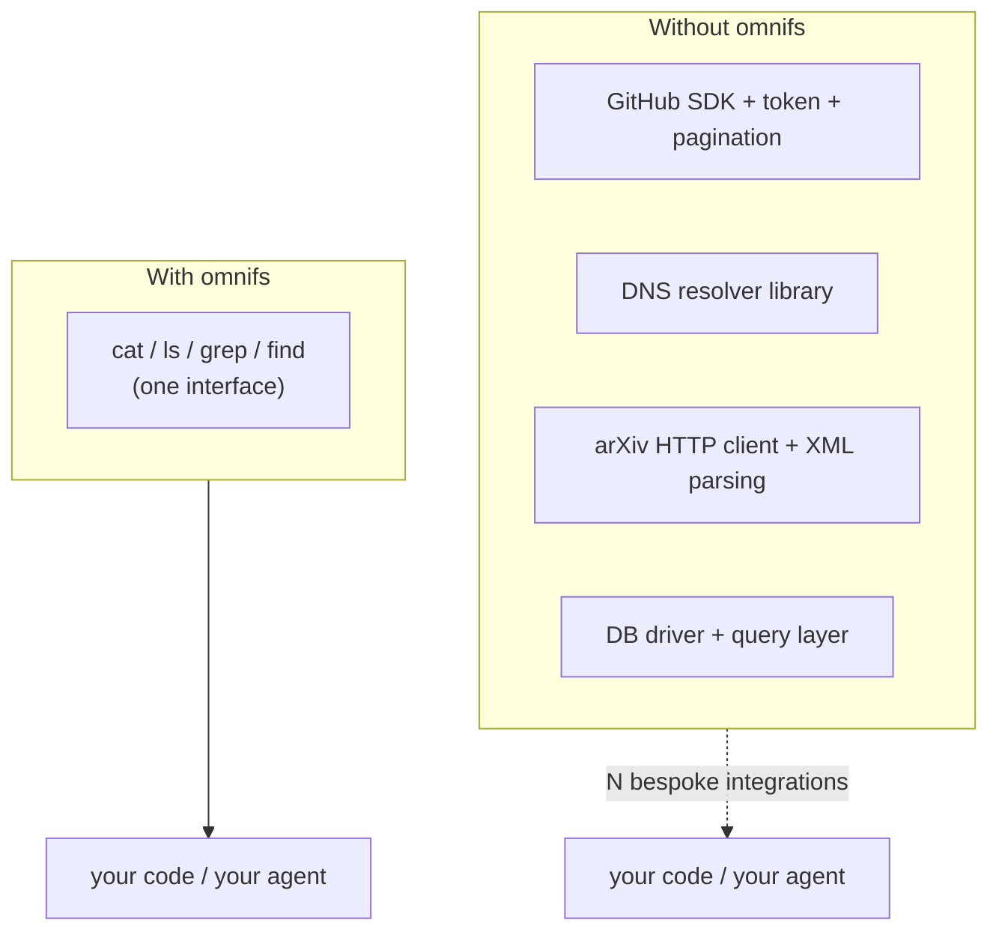

Every online service speaks its own dialect. Different endpoints, different SDKs, different auth, different pagination. To read one issue from GitHub and one DNS record from a domain, you write two completely separate programs. omnifs replaces that with one interface you already know: the filesystem.

## The problem with APIs and SDKs

Reaching a service through its API is rarely a single step:

- **Discovery.** You read API docs to learn the endpoints, request shapes, and response schemas.
- **SDK or client.** You add a dependency, learn its types, and wire it into your code.
- **Auth.** You provision a token or run an OAuth flow, then store and refresh credentials.
- **Pagination.** Lists arrive in pages behind cursors; you loop until you have everything.
- **Shape mismatch.** The JSON rarely matches what you want, so you write glue to extract it.

Multiply that by every service you touch. Each integration is bespoke, and none of your existing shell tooling helps.

## The Plan 9 thesis: everything is a file

Plan 9 made a radical claim that aged well: **everything is a file.** Devices, network connections, and system state were all reachable as paths, so one set of operations — open, read, write, list — covered the whole system. There was no per-resource API surface, just files.

omnifs applies that thesis to the modern service universe. A GitHub issue, a DNS MX record, an arXiv paper, a database row — each becomes a path you can read. The operations are the ones every Unix tool already speaks.



## Reading an API vs reading a path

The contrast is the whole pitch. Compare fetching one GitHub issue:

```bash
# API access: discover endpoint, authenticate, parse JSON
curl -H "Authorization: Bearer $GITHUB_TOKEN" \
  https://api.github.com/repos/torvalds/linux/issues/42 \
  | jq -r '.title, .body'
```

```bash
# Path access: it is already a file
cat /github/torvalds/linux/issues/42
```

The same shift applies across services:

| Concern | API / SDK access | Path access (omnifs) |
| --- | --- | --- |
| Interface | Per-service endpoints and SDKs | One filesystem |
| Auth | Per-service token / OAuth in your code | Configured once at the mount |
| Listing | Paginated requests with cursors | `ls` a directory |
| Reading | HTTP call + JSON parse | `cat` a file |
| Searching | Service-specific query params | `grep` / `find` / `rg` |
| Tooling | Custom scripts per service | The whole Unix toolbox |

## One interface for humans and agents

The same property that makes omnifs pleasant at a shell prompt makes it ideal for LLM agents. An agent that can read files can read every projected service — no per-service tool, client, or auth flow to teach it. Browsing GitHub, resolving DNS, and pulling a paper all reduce to listing directories and reading files. Many integrations become one capability.

Because omnifs paths behave like real files, an agent's existing skills — `cat`, `grep`, `find`, `head` — transfer directly. There is nothing service-specific to learn.

## Where to go next

- [What is omnifs](/introduction/what-is-omnifs/) — the projected-filesystem model with concrete path examples.
- [How it works](/introduction/how-it-works/) — the host, WASM providers, and callout runtime.
- [Project status](/introduction/project-status/) — current platform support and roadmap.
