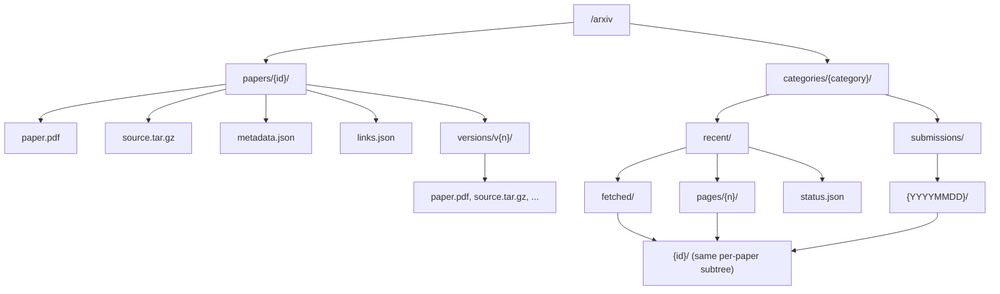

The arXiv provider mounts at `/arxiv` and projects the arXiv corpus as a filesystem. You can reach a paper directly by its id under `papers/`, or discover papers by scanning a category's recent submissions. Every paper exposes the same small subtree — its PDF, source bundle, metadata, links, and per-version files — and that subtree is **bound under every place a paper appears**, so the shape is identical whether you arrived via `papers/`, a recent page, or a submission-day bucket.

It needs no authentication. Metadata comes from the arXiv API; PDFs and source bundles come from arXiv-owned domains.

## Per-paper subtree

| Path | Content |
| --- | --- |
| `/arxiv/papers/{id}/` | Per-paper subtree (any arXiv id, e.g. `1706.03762`) |
| `/arxiv/papers/{id}/paper.pdf` | Latest version PDF |
| `/arxiv/papers/{id}/source.tar.gz` | Latest version source bundle |
| `/arxiv/papers/{id}/metadata.json` | Title, authors, abstract, categories, comment, links |
| `/arxiv/papers/{id}/links.json` | Resolved arXiv URLs for the paper / version |
| `/arxiv/papers/{id}/versions/v{n}/{paper.pdf,…}` | The same files for a specific version |

## Category scans

A category is browsed through a moving **recent** scan and immutable **submission-day** buckets derived from that scan. Listing a recent page fetches one page of the category feed; submission buckets are materialized from already-fetched pages and never trigger a date-range query.

| Path | Content |
| --- | --- |
| `/arxiv/categories/{category}/` | `recent` and `submissions` |
| `/arxiv/categories/{category}/recent/` | `fetched`, `pages`, and a `status.json` |
| `/arxiv/categories/{category}/recent/fetched/` | Deduped papers discovered so far (non-exhaustive until the scan completes) |
| `/arxiv/categories/{category}/recent/pages/{n}/` | One feed page (`start = n × 100`); fetches or reuses page `n` |
| `/arxiv/categories/{category}/submissions/` | Submission-day directories discovered so far |
| `/arxiv/categories/{category}/submissions/{YYYYMMDD}/` | Papers submitted on that UTC day (e.g. `20260512`) |

Each entry inside a recent page, the `fetched` set, or a submission bucket is itself a per-paper subtree, so you can `cd` straight into a result and read its `paper.pdf` or `metadata.json`. A direct `/arxiv/papers/{id}` lookup works for any arXiv id without scanning a category first.



## How the recent scan works

- `recent/pages/{n}` is the explicit "fetch next" mechanism. Listing it fetches feed page `n` (where `start = n × 100`, sorted by submission date, descending), records the returned papers in provider state, and preloads each paper's subtree under its derived paths.
- `recent/fetched` is the deduped union of all papers discovered by the pages fetched so far. It is non-exhaustive until the contiguous scan exhausts the feed.
- `submissions/{YYYYMMDD}` reads only from provider state — it never issues a date-range query. An undiscovered day returns "not found"; a discovered-but-incomplete day returns a non-exhaustive listing; a complete day is exhaustive.
- `status.json` reports the scan snapshot (`feed_updated`), total results, fetched pages, and the next page to fetch.

The submission day is derived from the UTC date of each entry's `<published>` timestamp — an arXiv published-date bucket, not a local wall-clock date.

## Versions

A paper's top-level files (`paper.pdf`, `source.tar.gz`, `metadata.json`, `links.json`) refer to the latest version. The `versions/v{n}/` directories expose the same file set pinned to a specific revision.

## Declared capabilities

| Capability | Value | Why |
| --- | --- | --- |
| `domain` | `export.arxiv.org` | Fetch arXiv API metadata |
| `domain` | `arxiv.org` | Fetch paper PDFs and source bundles |
| `memoryMb` | `64` | Headroom for Atom feeds and paper metadata |

## Examples

```bash
# A specific paper by id
cd /arxiv/papers/1706.03762
cat metadata.json
cp paper.pdf ~/attention.pdf
cat versions/v1/metadata.json

# Scan a category's recent submissions
ls /arxiv/categories/cs.AI/recent
ls /arxiv/categories/cs.AI/recent/pages/1
cat /arxiv/categories/cs.AI/recent/status.json | jq

# Papers submitted on a discovered day
ls /arxiv/categories/cs.AI/submissions
ls /arxiv/categories/cs.AI/submissions/20260512
```
