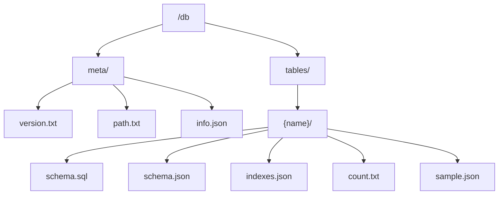

The Database provider mounts at `/db` and projects a database as a read-only, browse-only filesystem. Today it supports **SQLite**: you point it at a database file and it exposes meta information, the list of tables, each table's schema and indexes, a row count, and a bounded sample of rows — all as files.

It is read-only by design and needs no network access or credentials. The database file is handed to the sandbox as a WASI preopen, not over a socket or the network.

## How it connects

The provider does not open the network or a socket. Instead, the host exposes the configured database file to the WASM sandbox as a **read-only WASI preopen** under `/data`. SQLite runs inside the sandbox and pages the file on demand through standard WASI filesystem syscalls.

| Capability | Value | Why |
| --- | --- | --- |
| `memoryMb` | `128` | Room for schema inspection and bounded sample encoding |
| `preopenedPath` | host `/data` → guest `/data`, mode `ro` | Expose the configured database file to the sandbox read-only |

## Configuration

The provider takes a small JSON config (not credentials). The `omnifs init db` flow copies the database file you choose into the preopen directory.

| Field | Type | Default | Notes |
| --- | --- | --- | --- |
| `database_type` | string | `sqlite` | Only `sqlite` is supported today (required) |
| `path` | string | `/data/test.db` | SQLite database file inside the preopen (required) |
| `read_only` | boolean | `true` | Open the database read-only |
| `sample_limit` | integer | `20` | Maximum sample rows projected per table |

```json
{
  "database_type": "sqlite",
  "path": "/data/test.db",
  "read_only": true,
  "sample_limit": 20
}
```

The contributor sandbox (`omnifs dev`) materializes the Chinook sample database at `/data/test.db` automatically.

## Path reference

| Path | Content |
| --- | --- |
| `/db/meta/version.txt` | SQLite library version |
| `/db/meta/path.txt` | The configured database file path |
| `/db/meta/info.json` | File header info: size, page size/count, app id, user version, journal mode |
| `/db/tables/` | Lists every user table (internal `sqlite_*` tables are hidden) |
| `/db/tables/{name}/schema.sql` | The `CREATE TABLE` statement |
| `/db/tables/{name}/schema.json` | Columns, types, nullability, and primary key |
| `/db/tables/{name}/indexes.json` | Index metadata |
| `/db/tables/{name}/count.txt` | `SELECT count(*)` for the table |
| `/db/tables/{name}/sample.json` | Up to `sample_limit` rows (`SELECT * LIMIT sample_limit`) |



## Read-only and browse-only

This provider is intentionally read-only and browse-only:

- it never writes to the database,
- it does not run arbitrary SQL supplied through the filesystem,
- it samples rows up to a fixed limit (`sample_limit`) rather than streaming entire tables.

This keeps it safe to point at production databases for inspection without risk of mutation or expensive full scans. Internal `sqlite_*` tables are not listed. The `sample.json` rows are returned in physical (rowid-ascending) order with no explicit sort.

## Roadmap

PostgreSQL is a planned backend, alongside per-row paths, saved queries, and views. See the [provider roadmap](/providers/roadmap/). Until then, `database_type` accepts only `sqlite`.

## Example

```bash
# What database is mounted and what does it contain
cat /db/meta/version.txt
cat /db/meta/info.json | jq
ls /db/tables                          # Album Artist Customer Employee Genre ...

# Explore a table
cat /db/tables/Album/schema.sql
cat /db/tables/Album/schema.json | jq
cat /db/tables/Album/count.txt
cat /db/tables/Album/sample.json | jq '.[0]'

# Standard tools work
find /db/tables -name schema.sql | head
grep -r INTEGER /db/tables/
```


## Design reference

The source of truth behind this page is the [Database provider design](https://github.com/0xff-ai/omnifs/blob/main/docs/design/providers/db.md) design document. See the full [design-doc index](/contributing/design-docs/) for everything these pages are based on.
