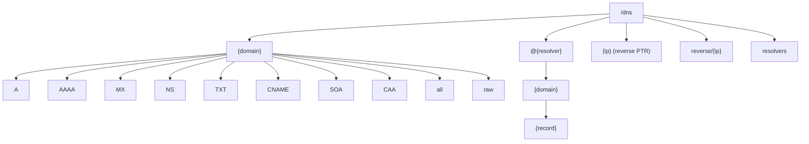

The DNS provider mounts at `/dns` and turns DNS into a filesystem. A domain is a directory; each record type is a file inside it. Reading a record file performs a live DNS query over **DNS-over-HTTPS (DoH)** against a public resolver.

It needs no authentication.

## Path reference

| Path | Content |
| --- | --- |
| `/dns/{domain}/A` | A records (IPv4) |
| `/dns/{domain}/AAAA` | AAAA records (IPv6) |
| `/dns/{domain}/MX` | MX records |
| `/dns/{domain}/NS` | NS records |
| `/dns/{domain}/TXT` | TXT records |
| `/dns/{domain}/CNAME` | CNAME records |
| `/dns/{domain}/SOA` | SOA record |
| `/dns/{domain}/CAA` | CAA records |
| `/dns/{domain}/all` | All common record types together |
| `/dns/{domain}/raw` | dig-style raw output |
| `/dns/@{resolver}/{domain}/{record}` | Query through a specific resolver |
| `/dns/{ip}` | Reverse DNS lookup (PTR) |
| `/dns/reverse/{ip}` | Reverse DNS lookup (alternate path) |
| `/dns/resolvers` | List configured resolvers |



## Record files

Each record-type file under a domain directory contains the answer for that one record type, one entry per line. `all` aggregates the common record types into a single file, and `raw` returns a dig-style rendering of the response.

```console
$ cd /dns/cloudflare.com
$ ls
A  AAAA  CAA  CNAME  MX  NS  SOA  TXT  all  raw

$ cat A
104.16.132.229
104.16.133.229

$ cat NS
ns3.cloudflare.com.
ns4.cloudflare.com.
```

## Choosing a resolver

By default the provider sends queries to its bundled public DoH endpoints. To force a specific resolver, prefix the path with `@{resolver}`. The resolver can be a named shorthand (for example `@google`, `@cloudflare`) or an IP literal (for example `@8.8.8.8`, `@1.1.1.1`):

```bash
cat /dns/@8.8.8.8/google.com/AAAA
cat /dns/@cloudflare/example.com/A
```

List the resolvers the provider knows about:

```bash
cat /dns/resolvers
```

## Reverse lookups

Reading a path whose final component is an IP address performs a reverse (PTR) lookup. Both the bare form and an explicit `reverse/` form work:

```bash
cat /dns/1.1.1.1            # one.one.one.one.
cat /dns/reverse/1.1.1.1    # one.one.one.one.
```

## DNS-over-HTTPS

All queries travel over HTTPS to public resolver endpoints rather than over plain UDP/TCP port 53. The provider declares exactly two upstream domains, the Cloudflare and Google DoH endpoints:

| Capability | Value | Why |
| --- | --- | --- |
| `domain` | `cloudflare-dns.com` | Send DoH queries to the bundled public resolver endpoints |
| `domain` | `dns.google` | Send DoH queries to the bundled public resolver endpoints |
| `memoryMb` | `32` | DNS responses are compact; keep resolver execution small |

:::note
Every read is a live query. The host caches results so repeated reads of the same record do not re-query, but there are no TTL-based expirations in the provider itself; cache entries leave on capacity eviction or explicit invalidation.
:::
