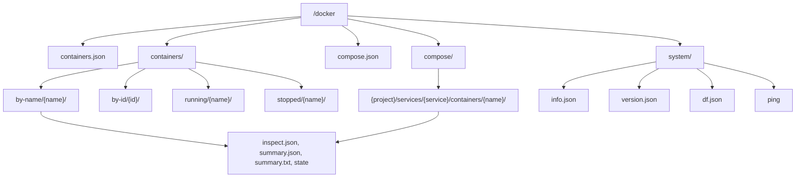

The Docker provider mounts at `/docker` and projects a running Docker daemon as a read-only filesystem. It reads container, compose, and system metadata from the daemon's Engine API and exposes them as browsable directories and files.

It talks to the daemon over its **Unix socket**; it needs no network access or credentials beyond access to that socket.

## How it connects

The provider issues reads against the Docker Engine API over the configured daemon socket. The socket is supplied dynamically by the host as a declared capability, so the provider can only reach the daemon endpoint it was configured with. The provider polls the daemon's `/events` periodically to keep listings fresh.

| Capability | Value | Why |
| --- | --- | --- |
| `unixSocket` | configured Docker socket (dynamic) | Talk to the configured Docker daemon for container, image, and system reads |
| `memoryMb` | `64` | Daemon responses are streamed; keep metadata browsing bounded |

## Configuration

The provider takes a single config field, the daemon endpoint:

| Field | Type | Default | Notes |
| --- | --- | --- | --- |
| `endpoint` | string | `unix:///var/run/docker.sock` | Docker daemon endpoint (required) |

```json
{
  "endpoint": "unix:///var/run/docker.sock"
}
```

For the provider to reach the daemon inside the runtime container, the host must make the configured socket available to the container.

## Path reference

| Path | Content |
| --- | --- |
| `/docker/containers.json` | All containers (the daemon's summary list) |
| `/docker/containers/by-name/{name}/` | A container by name |
| `/docker/containers/by-id/{id}/` | A container by short id |
| `/docker/containers/running/{name}/` | Containers in the running state |
| `/docker/containers/stopped/{name}/` | Containers that are exited, dead, or created |
| `/docker/compose.json` | Compose projects, services, and their containers |
| `/docker/compose/{project}/services/{service}/containers/{name}/` | A container in a compose stack |
| `/docker/system/info.json` | `docker info` |
| `/docker/system/version.json` | `docker version` |
| `/docker/system/df.json` | Disk usage (`docker system df`) |
| `/docker/system/ping` | Daemon liveness (`OK`) |

Compose projects and services are derived from the `com.docker.compose.project` and `com.docker.compose.service` labels Docker Compose stamps on each container.

### Per-container files

Every container subtree (under `by-name`, `by-id`, `running`, `stopped`, or a compose stack) exposes the same files:

| File | Content |
| --- | --- |
| `inspect.json` | Full `docker inspect` output |
| `summary.json` | The daemon's container-summary record |
| `summary.txt` | A compact text summary (id, name, image, state, status) |
| `state` | The container's state, e.g. `running` |



:::note
The Docker provider is read-only metadata browsing. It reads container, compose, and system information from the daemon; it does not start, stop, or modify containers. There is no image-management surface today — the projection covers containers, compose grouping, and system info.
:::

## Example

```bash
cd /docker
cat containers.json | jq '.[].Names'
cat containers/by-name/web/state             # running
cat containers/by-name/web/inspect.json | jq '.State'
ls containers/running/
cat system/version.json | jq '.Version'
cat compose.json | jq '.projects[].name'
```
