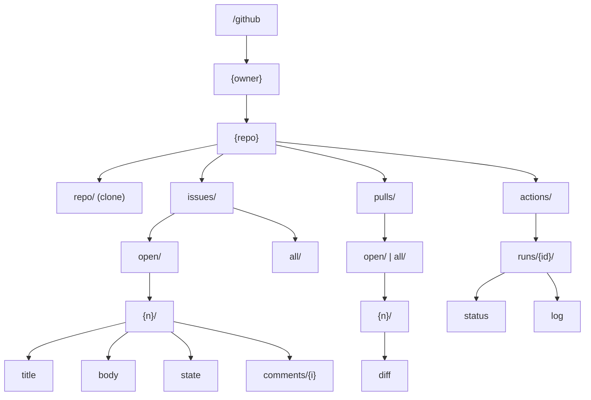

The GitHub provider mounts at `/github` and projects GitHub resources as a filesystem. You browse owners, repositories, issues, pull requests, and Actions runs as directories and files, and you can clone a repository's working tree simply by listing it.

It fetches metadata from the GitHub REST API at `api.github.com` and clones repository contents over SSH.

## Path reference

| Path | Content |
| --- | --- |
| `/github/{owner}` | List repositories for a user or org |
| `/github/{owner}/{repo}/` | Repository root: `repo`, `issues`, `pulls`, `actions` |
| `/github/{owner}/{repo}/repo/` | The repository working tree (cloned on demand via SSH) |
| `/github/{owner}/{repo}/issues/open/` | List open issues (directory of issue numbers) |
| `/github/{owner}/{repo}/issues/all/` | List all issues |
| `/github/{owner}/{repo}/issues/{filter}/{n}/title` | Issue title |
| `/github/{owner}/{repo}/issues/{filter}/{n}/body` | Issue body (markdown) |
| `/github/{owner}/{repo}/issues/{filter}/{n}/state` | Issue state (`open` / `closed`) |
| `/github/{owner}/{repo}/issues/{filter}/{n}/comments/{i}` | An individual comment |
| `/github/{owner}/{repo}/pulls/{filter}/{n}/diff` | Pull request diff |
| `/github/{owner}/{repo}/actions/runs/{id}/status` | CI run status |
| `/github/{owner}/{repo}/actions/runs/{id}/log` | CI run log |

`{filter}` is `open` or `all`. `{n}` is the issue or PR number; `{id}` is a workflow run id; `{i}` is a comment index.



## Browsing behavior

- Listing an owner directory (`/github/{owner}`) returns that user or org's repositories.
- A repository directory exposes the four families `repo`, `issues`, `pulls`, and `actions`.
- Issue and PR numbers appear as directories under the `open` / `all` filter directories; the individual fields (`title`, `body`, `state`, `comments`, `diff`) are files inside each number.
- The provider projects data it has already fetched. When it resolves an issue or PR, sibling fields and related content are cached alongside so a follow-up `cat` of a sibling avoids another round trip.

## Repository clone model

Listing `/github/{owner}/{repo}/repo/` triggers an on-demand **clone** of the repository. The clone is performed by the host, not the provider, through a Git callout. Once cloned, the working tree is bind-mounted at that path and behaves like a normal directory of files.

- Remote format: `git@github.com:{owner}/{repo}.git`
- Transport: **SSH**, using the SSH agent socket forwarded into the runtime container
- Your private key is never copied into the container; the container asks your agent to sign while the socket is mounted

The provider declares the Git capability `git@github.com:*` so the host will only clone GitHub SSH remotes on its behalf.

:::tip
If a `repo/` path returns `Input/output error`, the clone failed. Check that an SSH agent is running with a usable GitHub key:

```bash
echo "$SSH_AUTH_SOCK"
ssh-add -L
ssh -T git@github.com
```
:::

## Authentication

API requests to `api.github.com` carry an injected `Authorization: Bearer <token>` header. Two auth schemes are available; the default is device-code OAuth.

### Device-code OAuth (default)

```bash
omnifs init github
```

This runs GitHub's OAuth **device flow** with a bundled public client id and **no requested scopes**. With an empty scope set the resulting token is effectively read-only — it can read public resources and whatever the authenticated user can already see, but it carries no write scopes. The relevant manifest endpoints are:

- Authorization: `https://github.com/login/oauth/authorize`
- Device authorization: `https://github.com/login/device/code`
- Token: `https://github.com/login/oauth/access_token`

### Personal access token

You can instead supply a GitHub personal access token (`pat` scheme). A minimal read-only token is enough; the manifest's suggested creation URL requests only `read:user`:

```text
https://github.com/settings/tokens/new?scopes=read:user&description=omnifs
```

The token is validated with `GET https://api.github.com/user` (expecting `200`), and the authenticated `login` is recorded as the credential identity.

:::caution
Repository cloning uses SSH and your forwarded SSH agent, independent of the API token. A valid API token does not by itself enable `repo/` clones; you still need an SSH key loaded in your agent.
:::

## Declared capabilities

| Capability | Value | Why |
| --- | --- | --- |
| `domain` | `api.github.com` | Fetch repository metadata, issues, pull requests, Actions, and events |
| `gitRepo` | `git@github.com:*` | Clone repository contents over SSH when browsing `repo/` paths |
| `memoryMb` | `256` | Headroom for larger API payloads and repository tree projections |

## Examples

```bash
# Repositories for an owner
cd /github/torvalds && ls

# A repository's top-level families
ls /github/ollama/ollama          # actions  issues  pulls  repo

# Clone-on-list: browse the working tree
cd /github/ollama/ollama/repo && ls

# Read issue fields
cat /github/ollama/ollama/issues/open/15400/title
cat /github/ollama/ollama/issues/open/15400/body

# A pull request diff
cat /github/ollama/ollama/pulls/all/15087/diff

# CI run status and log
cat /github/ollama/ollama/actions/runs/123456789/status
cat /github/ollama/ollama/actions/runs/123456789/log
```


## Design reference

The source of truth behind this page is the [OAuth](https://github.com/0xff-ai/omnifs/blob/main/docs/oauth.md) design document. See the full [design-doc index](/contributing/design-docs/) for everything these pages are based on.
