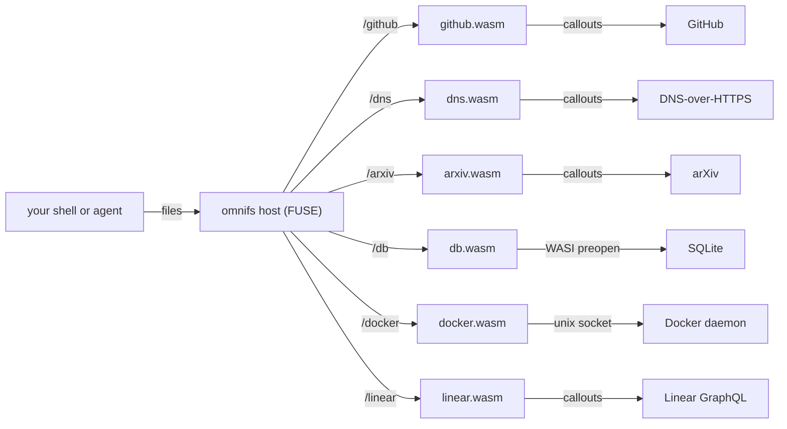

A **provider** is the unit that gives omnifs something to project. Each provider is a `wasm32-wasip2` WebAssembly component that implements the `omnifs:provider` WIT interface and declares one or more mount roots. The host loads the component, mounts it under a path such as `/github`, and answers every `ls`, `cd`, `cat`, and `grep` against that subtree by driving the component.

## How a provider works

Providers do not touch the network, the Docker socket, or Git directly. They describe what they need through **callouts** ("fetch this URL", "clone this repo", "open this socket"), and the host executes those callouts. This keeps every provider sandboxed and lets the host own caching, rate limiting, concurrency, and credential injection.

The browse surface the host drives is small:

- `lookup_child(parent, name)` resolves a single child entry.
- `list_children(path)` lists a directory.
- `read_file(path)` returns exact file bytes.

A provider answers those calls by either returning a terminal result immediately or suspending with a batch of callouts that the host runs before resuming the provider.



## Shipped providers

| Provider | Mount | Mirrors | Auth |
| --- | --- | --- | --- |
| [GitHub](/providers/github/) | `/github` | Repos, issues, PRs, CI runs, and diffs as files; repo trees cloned on demand | Device-code OAuth (default) or personal access token |
| [DNS](/providers/dns/) | `/dns` | DNS records by type, plus reverse lookups, over DNS-over-HTTPS | None |
| [arXiv](/providers/arxiv/) | `/arxiv` | Papers by id or by category recent/submission scans; PDFs, source, metadata, versions | None |
| [Database](/providers/database/) | `/db` | Schema, tables, and bounded sample rows of a SQLite database (read-only) | None (local file) |
| [Docker](/providers/docker/) | `/docker` | Containers, images, and system metadata from a Docker daemon | None (local socket) |
| [Linear](/providers/linear/) | `/linear` | Teams and issues from Linear's GraphQL API | PKCE OAuth `read` scope (default) or personal access token |

A development-only `test` provider also exists in the source tree for exercising the runtime; it is not part of the user-facing catalog.

Each provider also declares **capabilities** in its manifest — the exact domains, sockets, Git remotes, preopened paths, and memory ceiling it is allowed to use. The host enforces these; a provider cannot reach anything it did not declare. See each provider page for its declared capabilities.

## Enabling providers

The bundled providers ship inside the runtime image. The normal user flow is owned by the `omnifs` CLI:

```bash
npm install -g @0xff-ai/omnifs
omnifs init github     # configure a mount + credentials for a provider
omnifs init linear
omnifs status          # inspect mounts, providers, and auth state
omnifs up              # pull and start the matching runtime image
omnifs shell           # open a shell inside the mount
```

`omnifs init <provider>` writes a thin mount config under `~/.omnifs/config/mounts` and, for providers that need credentials, runs the auth flow and stores the result in the host credential store. Providers that need no auth (DNS, arXiv) work as soon as they are mounted. The Database and Docker providers take a small JSON config (a database file path, or a Docker endpoint) rather than credentials.

You do not need to copy provider `.wasm` files into `~/.omnifs/data/providers` or set OAuth client-id environment variables for the bundled providers. To add a third-party provider, drop its `.wasm` component into `~/.omnifs/data/providers/` and it mounts at its declared default mount.

:::note
omnifs is Linux-only at the FUSE layer. On macOS the mount lives inside the Docker Desktop Linux container and is reached through `omnifs shell`, not as a native Finder or host-shell mount.
:::

:::caution
omnifs is alpha and the read model is the supported surface today. Write-back through staged Git transactions is work in progress; projected files are read-only for now.
:::
