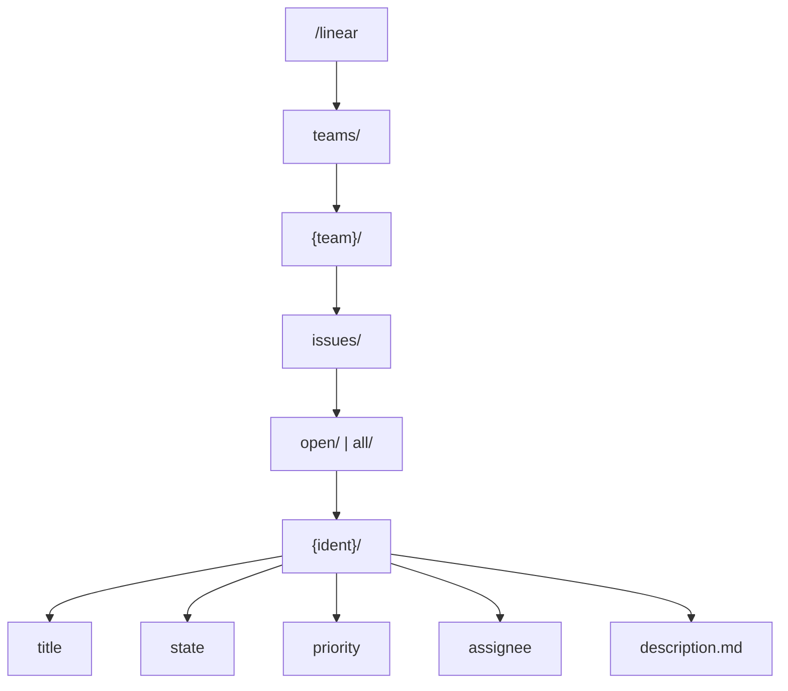

The Linear provider mounts at `/linear` and projects a Linear workspace as a filesystem. You browse teams under `teams/`, list each team's issues by their identifier (for example `ENG-42`), and read individual issue fields as files. Data comes from Linear's **GraphQL API** at `api.linear.app`.

## Path reference

| Path | Content |
| --- | --- |
| `/linear/teams/` | All teams in the workspace, by team key |
| `/linear/teams/{team}/` | A team (navigation node containing `issues`) |
| `/linear/teams/{team}/issues/` | The two filter directories: `open` and `all` |
| `/linear/teams/{team}/issues/{filter}/` | Issue identifiers for the team, filtered |
| `/linear/teams/{team}/issues/{filter}/{ident}/` | Per-issue subtree |
| `/linear/teams/{team}/issues/{filter}/{ident}/title` | Issue title |
| `/linear/teams/{team}/issues/{filter}/{ident}/state` | Workflow state name |
| `/linear/teams/{team}/issues/{filter}/{ident}/priority` | Priority label |
| `/linear/teams/{team}/issues/{filter}/{ident}/assignee` | Assignee display name |
| `/linear/teams/{team}/issues/{filter}/{ident}/description.md` | Issue body (markdown) |

`{filter}` is `open` or `all`. `{team}` is a team key such as `ENG`; `{ident}` is a full issue identifier such as `ENG-42`.



## Browsing behavior

- `teams/` flattens all pages of the workspace's teams into one listing, so a plain `ls` works without per-team follow-ups.
- A team directory is a navigation node; its issues live under `issues/`, split into `open` and `all`. The `open` filter covers triage, backlog, unstarted, and started states.
- Listing a filter directory lists issue identifiers and **preloads** the small per-issue files (`title`, `state`, `priority`, `assignee`, and short `description.md` bodies) so a `cat` after the `ls` avoids a round trip. Large descriptions are served on demand from a per-issue handler.

## Authentication

Requests to `api.linear.app` carry an injected `Authorization` header. For personal access tokens the raw token value is sent directly (no `Bearer` prefix); for OAuth the access token is sent as `Bearer <token>`. Two schemes are available; the default is OAuth.

### PKCE OAuth (default)

```bash
omnifs init linear
```

This runs Linear's browser **authorization-code + PKCE** loopback flow with a bundled public client id and the `read` scope only, so the resulting token is read-only. The manifest endpoints are:

- Authorization: `https://linear.app/oauth/authorize`
- Token: `https://api.linear.app/oauth/token`
- Redirect: `http://127.0.0.1:{port}/callback` (loopback)

### Personal access token

You can instead supply a Linear personal access token or API key (`pat` scheme). Create one at:

```text
https://linear.app/settings/api
```

The token is validated with a GraphQL `viewer` query (`POST https://api.linear.app/graphql`, expecting `200`). The provider records the viewer's email as the credential identity and the organization's `urlKey` as the workspace.

:::note
In the contributor container workflow, static-token auth is the supported default; OAuth is the default for the normal `omnifs init linear` user flow.
:::

## Declared capabilities

| Capability | Value | Why |
| --- | --- | --- |
| `domain` | `api.linear.app` | Fetch GraphQL resources for teams, issues, projects, and workflow metadata |
| `memoryMb` | `128` | Room for GraphQL response decoding and issue tree projections |

## Roadmap

Projects, cycles, comments, labels, and full workflow state — with draftable mutations — are planned. See the [provider roadmap](/providers/roadmap/). The read model stays read-only until mutation support lands.

## Example

```bash
cd /linear/teams
ls                                   # team keys, e.g. ENG  DES  OPS
cd ENG/issues/open
ls                                   # ENG-12  ENG-42  ...
cat ENG-42/title
cat ENG-42/state
cat ENG-42/priority
cat ENG-42/description.md
```


## Design reference

The source of truth behind this page is the [Linear provider design](https://github.com/0xff-ai/omnifs/blob/main/docs/design/providers/linear.md) design document. See the full [design-doc index](/contributing/design-docs/) for everything these pages are based on.
