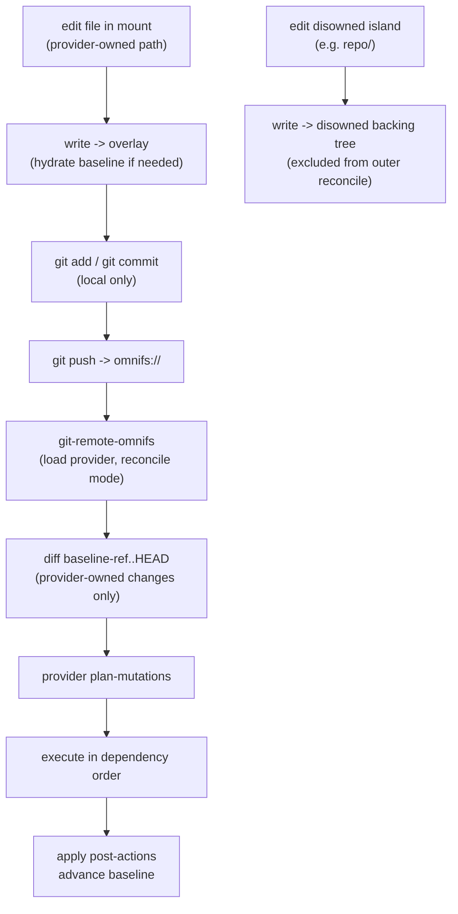

This page summarizes two forward-looking design directions. Both are **proposed**, not
implemented. They are included here as reference so the intended architecture is
self-contained.

:::caution
Neither design below is shipped. The current runtime uses the callout/resume protocol and
a read-only mount. Treat this page as design intent.
:::

## Async HTTP: direct WASIp2 with async components

### The idea

Today providers never make HTTP calls directly. They return effect requests
(`ProviderResponse::{Effect, Batch, Done}`), the host performs the I/O out of band, and the
host re-enters the component with `resume(id, result)`. The SDK keeps pending continuations
keyed by request id. This is the **callout/resume** protocol, and it is what lets omnifs
drop the store between slow operations and keep several requests in flight on a single
provider instance.

The future redesign keeps that concurrency benefit but removes the custom machinery.
Providers would:

- compile as `wasm32-wasip2` components,
- import `wasi:http` directly,
- write straight-line async Rust — call HTTP, `await` the response, shape filesystem
  results, return a terminal `ActionResult`.

The custom continuation map and `resume` boundary disappear. Concepts like
`correlation-id`, `single-effect`, `effect-result`, `provider-response`, and the exported
`resume` are removed; browse and lifecycle exports return terminal results directly. The
host keeps central control over auth and transport at the `wasi:http` boundary
(`WasiHttpView` / `WasiHttpHooks`): domain allowlists, header restrictions, auth injection,
timeouts, and error mapping. A small provider-facing wrapper would smooth over the verbose
raw `wasi:http` resource API (outgoing requests, options, future responses, bodies,
streams, pollables) into something like `http::send(request).await?`. That wrapper is an
ergonomics layer only — concurrency comes from async components, not from reinventing
suspension in the SDK.

### Why it is gated

The hard requirement is concurrency. omnifs needs a **single provider instance to service
multiple concurrent filesystem requests** while provider code is suspended in async
imports. Ordinary host-side async is not enough: Wasmtime can suspend a guest while an
imported host function awaits, but that still leaves one active top-level call owning the
component instance and store, which would flatten same-instance concurrency to one active
request at a time.

So the redesign becomes viable only when all of these are true at once:

1. direct provider-side `wasi:http`,
2. no custom continuation/resume boundary,
3. multiple concurrent requests on one provider instance.

A Cargo feature being on by default is not the same as the runtime feature being
operationally ready. The target is `wasm32-wasip2` (not wasip3), and the move begins when
async components can preserve omnifs's concurrency model. Until then, the callout/resume
boundary is the mechanism that holds the design together.

This is explicitly **not** a host-only `wasi:http` refactor (keeping continuations) and
**not** a `reqwest`-to-`hyper` swap — those would not remove continuations, simplify
provider code, or improve concurrency.

## Mutations via Git

### The idea

Each mutable omnifs scope is presented to the user as an ordinary **Git repository at the
mounted path itself**. You edit files in the mount, then `git add`, `git commit`, and
`git push`. A write syscall alone never triggers a remote mutation — mutations happen only
at push time, computed from committed changes.

```bash
cd /github/rust-lang/rust
printf 'closed\n' > issues/42/state
git add issues/42/state
git commit -m "close issue 42"
git push
```

The remote uses an `omnifs://` URL, and a helper, `git-remote-omnifs`, performs
reconciliation by loading the same provider config and calling the provider's reconcile
exports (`plan-mutations`, `execute`, `fetch-resource`, `list-scope`). The read model stays
read-only; projected files are **not** directly writable as an implicit mutation mechanism.
This model supersedes the older transaction-directory and control-namespace approach — one
mutation protocol, one mental model.

### How it composes

The mounted scope is a real Git repo from the user's view, implemented as a composed FUSE
view over four layers of hidden local state under `~/.omnifs/state/...`. Read precedence is:

1. **disowned backing tree** — local filesystem reality wins,
2. **outer-repo overlay** — local edits to provider-owned paths win,
3. **hydrated baseline** — already-fetched upstream snapshot plus version tokens,
4. **live provider browse** — fills gaps for provider-owned paths not yet in local state.

**Hydration** fetches a resource's baseline content and version tokens on first
mutation-relevant access (including a first read), so `git add` is safe even for paths not
previously in local state. **Disowned islands** — such as a GitHub `repo/` passthrough
tree — stay locally writable but are excluded from outer reconcile and listed in
`.git/info/exclude`; they may even contain their own nested Git repos with their own
remotes. Outer push refuses tracked disowned paths with a direct error rather than silently
dropping them. **Partial success** is modeled honestly: if mutation 3 of 3 fails, the
upstream effects of 1 and 2 are real, the baseline advances for them, and the next push
retries only the unapplied work — because the upstream API cannot offer all-or-nothing
atomicity.

### Flow



Both designs are tracked so the project can pick them up without redoing the
investigation. See the [roadmap](/reference/roadmap/) for where they sit relative to other
planned work.
