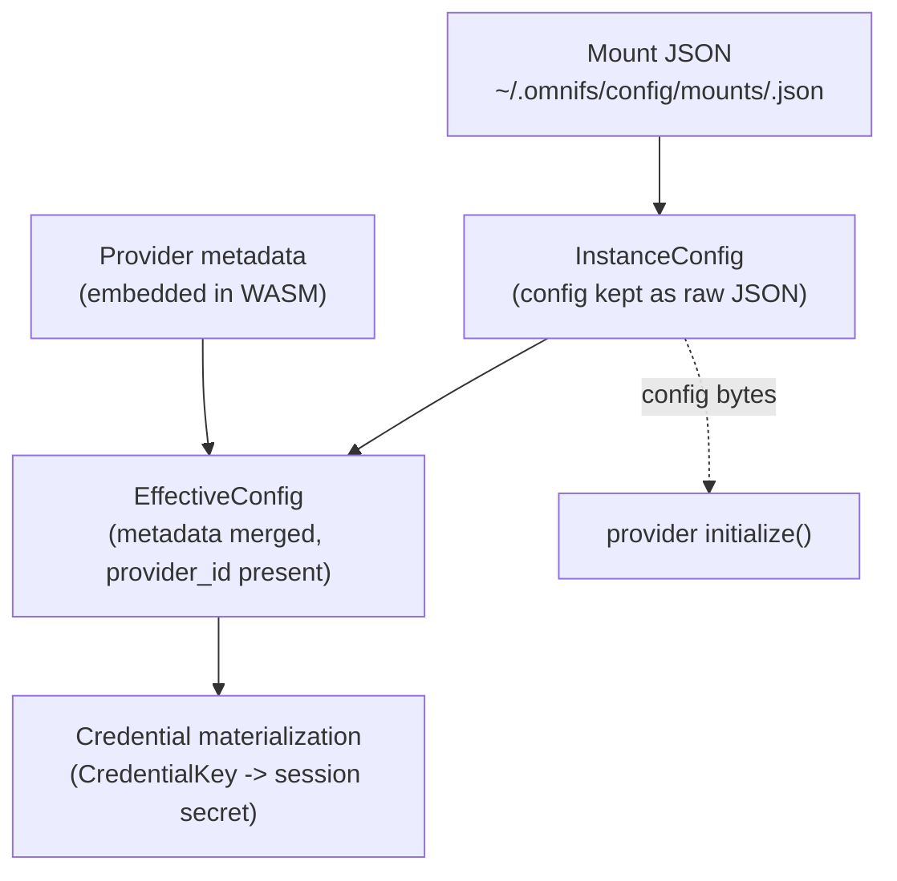

A mount config is a small JSON document that tells the omnifs host how to mount one
provider instance: where to mount it, which provider drives it, the provider-specific
settings, and how to authenticate. The CLI writes these files for you; this page
documents their shape so you can read, hand-edit, or generate them.

## Where mount configs live

User-managed mount configs are stored on the host, one file per mount:

```text
~/.omnifs/config/mounts/<name>.json
```

`omnifs init <provider>` generates a config here, and `omnifs up` loads every file in
this directory when it starts the runtime container. The contributor workflow
(`omnifs dev`) does not use this directory — it synthesizes dev mount configs directly
from the built-in provider manifests.

## Top-level shape

A mount config is parsed into an `InstanceConfig`. The fields that matter for authoring
are the mount identity, the provider binding, the provider-specific `config` object, and
the `auth` block.

```json
{
  "mount": "github",
  "provider_id": "github",
  "config": {
    "...": "provider-specific settings"
  },
  "auth": {
    "...": "auth block, see below"
  }
}
```

| Field         | Required | Meaning                                                                                  |
| ------------- | -------- | ---------------------------------------------------------------------------------------- |
| `mount`       | yes      | The mount root name. The provider's namespace appears under `/omnifs/<mount>` (or `/<mount>`). It also determines the mount root path. |
| `provider_id` | optional in raw JSON | Identifies which provider component drives this mount. Optional on the raw `InstanceConfig`, but always present on the `EffectiveConfig` after metadata merge. |
| `config`      | optional | Provider-specific settings, preserved verbatim as raw JSON.                               |
| `auth`        | optional | How the host obtains credentials for this mount. Omit for providers that need no auth.    |

:::note
Mount configs are JSON, not TOML. The host parses the file into an `InstanceConfig` and
keeps the provider-specific `config` object as a raw JSON value.
:::

## The provider `config` object

The `config` object is **not** interpreted by the host. It is preserved as raw JSON and
re-serialized to JSON bytes for the provider's `initialize()` call. The provider
deserializes those bytes itself (the SDK's `#[omnifs_sdk::config]` macro wires this up
through `serde_json::from_slice`).

The practical consequences:

- The host does not validate provider config fields; the provider does.
- Field names and structure are entirely up to the provider.
- Do not put host concerns (such as keychain indirection) inside `config`.

## The `auth` block

The `auth` block declares how the host obtains a credential for the mount. It is a single
flat object — there is **no** `type` discriminator field. The two shapes are distinguished
by which fields are present:

| Field        | Meaning                                                                                  |
| ------------ | ---------------------------------------------------------------------------------------- |
| `scheme`     | The auth scheme key, for example `pat` or `oauth`. Matches a scheme key in the provider's auth manifest. |
| `account`    | Optional account label for host-managed credentials (for example `default` or a username). Combined with provider and scheme to form the credential key. |
| `token_env`  | Name of an environment variable that holds the token (static-token path).                 |
| `token_file` | Path to a file that holds the token (static-token path).                                  |

All fields are optional; omit the whole block for providers that need no auth.

### Host-managed credential (OAuth)

This is the normal `omnifs init` plus `omnifs up` path. The actual secret lives in the
host credential store, not in the mount JSON. The config carries only `scheme` and an
optional `account`; the host materializes the token into the session at mount time.

```json
{
  "mount": "linear",
  "provider_id": "linear",
  "auth": {
    "scheme": "oauth",
    "account": "default"
  }
}
```

Host-managed credentials require `provider_id` plus `auth.scheme`, with `account`
optional. These three combine into the credential key (see below). The underlying wire
scheme kind for this shape is `oauth`.

### Static token

A static-token mount brings its own externally supplied secret — read from an environment
variable or a file — rather than a host-managed credential. This is the advanced or
contributor path. Use `scheme` to name the credential scheme (for example `pat`), and
supply the secret through `token_env` **or** `token_file`.

```json
{
  "mount": "github",
  "provider_id": "github",
  "auth": {
    "scheme": "pat",
    "token_env": "GITHUB_TOKEN"
  }
}
```

These fields read an external secret directly; do not add keychain indirection to a static
mount. The underlying wire scheme kind for this shape is `static-token`.

## From config to effective config

The host does not act on raw mount JSON directly. It merges the provider's embedded
metadata into the parsed config to produce an `EffectiveConfig`, and credential
materialization operates on that effective config — not on raw JSON plus a late metadata
pass.

- `ProviderCatalog::load_mount()` returns a `LoadedMount { config: EffectiveConfig }`.
- `into_effective_mount(config, require_metadata)` produces the effective config, strict
  for normal loads and best-effort for delete/reset paths.
- `provider_id` is always present on `EffectiveConfig`.



## Credential keys

Host-managed credentials are addressed by a `CredentialKey`. Its only public wire form,
`storage_key()`, is:

```text
provider:scheme:account
```

For example, a GitHub PAT for the default account is `github:pat:default`. Session secret
filenames use this same key. The credential store backend is chosen once at startup:
either the OS keychain or a file at `~/.omnifs/data/credentials.json`.

:::tip
For the normal user path, run `omnifs init <provider>` to generate the mount config and
walk through OAuth, then `omnifs up`. You rarely need to hand-write these files.
:::

See also the [glossary](/reference/glossary/) for the surrounding terms and the
[FAQ](/reference/faq/) for where credentials and configs are stored.
