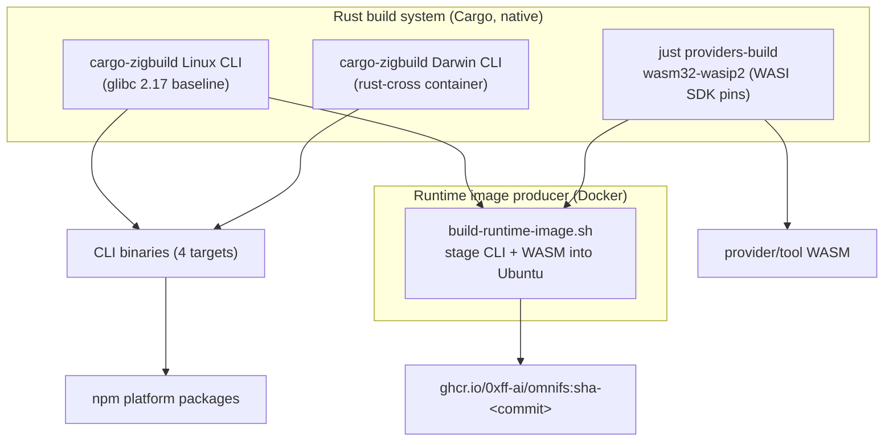

The CI pipeline keeps two responsibilities separate: a **Rust build system** that
produces native artifacts, and a **runtime image producer** that assembles those
artifacts. The reference is `CI-NATIVE.md` at the repo root.

## The invariant

:::note
Separate the Rust build system from the runtime image producer. Cargo builds all
Rust artifacts natively. Docker is used **only** to assemble the final runtime
image from prebuilt artifacts. The runtime image build never compiles Rust.
:::

This is why CI is fast and the runtime image stays small: the image context
already contains finished binaries and WASM components.

## Rust artifacts

| Artifact | How it's built |
|---|---|
| **Linux CLI** | `cargo-zigbuild` against a GNU glibc **2.17** baseline, so the binary runs on old and new glibc alike. |
| **Darwin CLI** | Cross-linked from Linux through the pinned `rust-cross/cargo-zigbuild` container. |
| **Provider / tool WASM** | `just providers-build` for `wasm32-wasip2`, with WASI SDK pins from `tools/versions.toml`. |

The glibc 2.17 baseline is what lets the published Linux CLI run across the broad
range of distros users have, without a per-distro build.

## CI stages

Stages, in order:

1. Build Linux + Darwin CLI binaries natively (`cargo-zigbuild`).
2. Build provider/tool WASM components (`just providers-build`).
3. Assemble the runtime image from those artifacts (`build-runtime-image.sh`).
4. Tag the image `sha-<commit>` and push to GHCR.

## Artifact consumers

The native CLI binaries feed the [npm platform packages](/releasing/npm/). The
Linux CLI plus WASM components feed the [runtime image](/releasing/runtime-image/).
On release, the `sha-<commit>` image is promoted to semver tags.

## Release promotion

On release, `sha-*` image tags are promoted to semver (both `X.Y.Z` and `vX.Y.Z`).
The CLI default image ref uses the unprefixed `X.Y.Z`. Promotion is a re-tag of an
existing CI-built image — `release.yml` never rebuilds Rust or the image. See
[Runtime image](/releasing/runtime-image/) and
[Release process](/releasing/process/).

## See also

- [Runtime image](/releasing/runtime-image/)
- [npm distribution](/releasing/npm/)
- [Release process](/releasing/process/)
