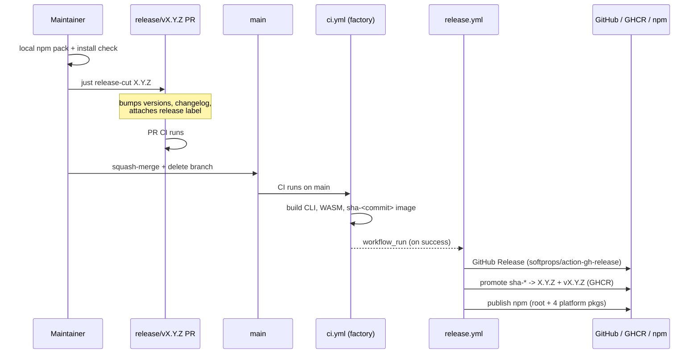

This is the maintainer flow for cutting a user-facing omnifs release. The primary
maintainer guide is `RELEASING.md` at the repo root; this page mirrors it for the
docs site and is self-contained.

A release ships four coupled artifacts from a single version number:

1. **Host CLI binaries** — native Linux and macOS executables.
2. **WASM providers** — `wasm32-wasip2` components bundled into the runtime image.
3. **npm packages** — `@0xff-ai/omnifs` plus four platform optional dependencies.
4. **GHCR runtime image** — `ghcr.io/0xff-ai/omnifs`.

All four use the **same unprefixed semver**. The git tag is the only place a `v`
prefix appears. See [Version coupling](/releasing/version-coupling/) for the full
mapping.

## The two-stage pipeline

CI on `main` is the **single factory** for build artifacts. The publish step is a
separate workflow that fires only after CI is green.

- **`ci.yml`** (on `main`): builds Rust CLI binaries, provider/tool WASM, and the
  `sha-<commit>` runtime image. See [Native CI](/releasing/native-ci/).
- **`release.yml`**: triggered via `workflow_run` after a green CI run on `main`.
  It publishes the GitHub Release (`softprops/action-gh-release`), promotes the
  `sha-*` GHCR tags to semver, and publishes npm.

`release.yml` does not rebuild artifacts. It consumes what the CI factory already
produced, which is why nothing publishes until CI is green.

## Prerequisites

- `cargo set-version` — install with `cargo install cargo-edit`.
- `gh` authenticated with push + release scopes.
- A clean working tree on `main`.
- `NPM_TOKEN` repository secret (Automation type; bypasses 2FA), passed to the
  npm jobs as `NODE_AUTH_TOKEN`.
- `id-token: write` on the publish jobs (already set) for `--provenance`.
- The `release` label must exist on the repo; `release.ts` attaches it to the cut
  PR and fails if it is missing.

## Local verification before cutting

This is mandatory. The publish pipeline cannot catch install-time failures — if
the packed npm tarball fails to install, it fails the same way for every user.
Verify with and without install scripts (the postinstall path).

```bash
# 1. Pack the root npm package as it would publish.
scratch="$(mktemp -d)"; cd "$scratch"
npm pack /path/to/omnifs/npm/omnifs

# 2. Install into a scratch prefix, both ways.
prefix="$scratch/prefix"; mkdir -p "$prefix"

npm install --ignore-scripts --prefix "$prefix" "$scratch"/0xff-ai-omnifs-*.tgz
node "$prefix/node_modules/@0xff-ai/omnifs/bin/omnifs.js" --version   # must succeed

npm install --prefix "$prefix" "$scratch"/0xff-ai-omnifs-*.tgz       # postinstall path
node "$prefix/node_modules/@0xff-ai/omnifs/bin/omnifs.js" --version   # must succeed
```

:::danger
If either invocation fails (MODULE_NOT_FOUND, missing platform binary,
postinstall crash), fix it before cutting. The published package will reproduce
the failure for everyone.
:::

## Cutting a release

```bash
# On main, clean tree:
git checkout main && git pull

# Bumps versions, updates the changelog, opens a release/vX.Y.Z PR,
# and attaches the `release` label.
just release-cut 0.2.0

# Watch the PR CI. Merge via squash + delete branch.
# release.yml fires via workflow_run after green CI on main.
```

## End-to-end flow



## Prereleases

Any version containing `-` (for example `0.2.0-dev.0`) is auto-detected as a
prerelease. No flags needed:

- **GitHub Release**: `prerelease=true`, `make_latest=false`.
- **npm**: published with dist-tag `dev` (not `latest`).
- **GHCR**: still gets both `X.Y.Z` and `vX.Y.Z` tags.

```bash
just release-cut 0.2.0-dev.0
```

## After publish

```bash
gh release view vX.Y.Z --json isPrerelease,assets
npm view @0xff-ai/omnifs --json | jq '.["dist-tags"]'   # dev tag points at the new prerelease
docker buildx imagetools inspect ghcr.io/0xff-ai/omnifs:X.Y.Z
```

## Failure modes seen in practice

:::caution[Race against main's CI]
If you `release-cut` immediately after a PR merges, the new `release/vX.Y.Z` PR
starts CI before main's post-merge CI has saved caches under `refs/heads/main`.
PR CI then runs cold on lanes like `cli (linux-x64, darwin)`. Mitigation: wait
for the prior main CI to finish before cutting, or accept one cold cycle.
:::

:::caution[Branch name collision]
If a non-versioned branch named `release` exists (local or remote), git refuses
to create `release/vX.Y.Z` (`cannot lock ref ... 'refs/heads/release' exists`).
Delete the conflicting branch first — usually the leftover branch from the last
release cleanup. Delete remote (`git push origin --delete release`) and
`git remote prune origin` locally.
:::

## See also

- [Version coupling](/releasing/version-coupling/)
- [npm distribution](/releasing/npm/)
- [Runtime image](/releasing/runtime-image/)
- [Native CI](/releasing/native-ci/)
