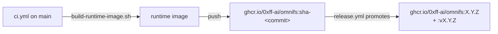

The runtime image is `ghcr.io/0xff-ai/omnifs`. It bundles the Linux CLI plus the
provider WASM components into a small Ubuntu runtime. The CLI pulls it on
`omnifs up`; it is **not** part of the npm install.

## How it is built

`scripts/ci/build-runtime-image.sh` stages a **prebuilt** Linux CLI binary plus
provider WASM components into a small Ubuntu runtime context and builds the image.

:::note
The runtime image build never compiles Rust. Cargo produces the artifacts; the
image build only assembles them. This is the core invariant of the
[native CI pipeline](/releasing/native-ci/).
:::

The base runtime uses Ubuntu 25.10 with `zsh`. Interactive shells alias `ls` to
`ls --color=auto` and `ll` to `ls -lrt`; shell behavior belongs in the image, not
per-session config.

## Tagging and promotion



- **CI** builds and pushes `sha-<commit>` tags. These are the immutable,
  per-commit artifacts.
- **`release.yml`** promotes `sha-*` to semver, publishing **both** `X.Y.Z` and
  `vX.Y.Z`. Promotion re-tags the already-built image; it does not rebuild.

The CLI default image ref lives in `crates/cli/src/session.rs` as the `IMAGE`
constant, built from `CARGO_PKG_VERSION`, so it always uses the **unprefixed**
tag (`ghcr.io/0xff-ai/omnifs:X.Y.Z`). See
[Version coupling](/releasing/version-coupling/).

## Contributor image vs release image

There are two image paths. Do not conflate them.

| Path | File | Used by |
|---|---|---|
| Contributor / dev | `Dockerfile` | `omnifs dev` — builds `omnifs:<short-sha>-dev` locally from source |
| Release runtime | `scripts/ci/build-runtime-image.sh` | CI / GHCR — assembles from prebuilt artifacts |

:::caution
`Dockerfile` remains the `omnifs dev` contributor image path. Keep `omnifs dev`
working when changing Docker-related files; the release runtime path is separate
and must not be merged into the contributor `Dockerfile`.
:::

## Verify a published image

```bash
docker buildx imagetools inspect ghcr.io/0xff-ai/omnifs:X.Y.Z
docker buildx imagetools inspect ghcr.io/0xff-ai/omnifs:vX.Y.Z
```

## See also

- [Native CI](/releasing/native-ci/)
- [Version coupling](/releasing/version-coupling/)
- [Release process](/releasing/process/)
