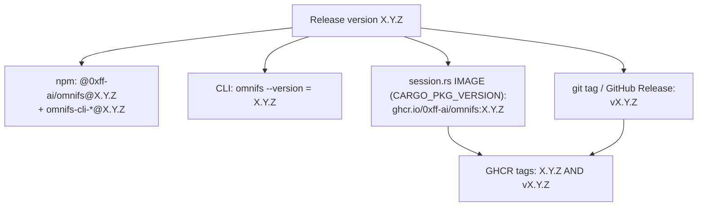

A release is one version number applied across every surface. Keeping them in
lockstep is what makes `omnifs --version`, the npm package, and the runtime image
the CLI pulls all agree.

## The rule

For a release `X.Y.Z`:

| Surface | Value | Where |
|---|---|---|
| npm root + platform packages | `X.Y.Z` | `@0xff-ai/omnifs` and `@0xff-ai/omnifs-cli-*` |
| CLI `CARGO_PKG_VERSION` / `omnifs --version` | `X.Y.Z` | Cargo workspace |
| Default runtime image tag | `X.Y.Z` | `crates/cli/src/session.rs` (`IMAGE`, from `CARGO_PKG_VERSION`) |
| Git tag / GitHub Release name | `vX.Y.Z` | the **only** `v`-prefixed surface |
| GHCR image tags | **both** `X.Y.Z` and `vX.Y.Z` | promoted from `sha-*` |

The CLI default image ref uses the **unprefixed** tag. GHCR publishes both forms,
so `vX.Y.Z` is available too, but the embedded ref in
`crates/cli/src/session.rs` is built from `CARGO_PKG_VERSION`:

```rust
pub(crate) const IMAGE: &str = concat!("ghcr.io/0xff-ai/omnifs:", env!("CARGO_PKG_VERSION"));
```

This is why the CLI version and the image tag can never drift: the image tag is
the CLI's own compiled-in version string.

## How the surfaces relate



## Do not bump independently

:::danger
Never edit the npm version, the Cargo version, or the embedded image ref by hand
or in isolation. They must move together.
:::

`just release-cut X.Y.Z` is the only supported way to bump:

- It runs `cargo set-version` across the workspace (CLI `CARGO_PKG_VERSION`).
- It runs `just npm-sync`, which updates package versions via `npm pkg set`,
  preserving manifest order and formatting.
- It updates the embedded runtime image tag and the changelog, then opens the
  `release/vX.Y.Z` PR.

If the surfaces drift, `omnifs up` can pull a runtime image whose tag does not
match the installed CLI, which is exactly the failure coupling prevents.

## Prerelease versions

Prerelease semver (any version containing `-`, e.g. `0.2.0-dev.0`) follows the
same coupling: npm, CLI, and image tag all carry the prerelease string, and GHCR
still publishes both `X.Y.Z` and `vX.Y.Z`. The differences are publish-side only
(npm dist-tag `dev`, GitHub Release `prerelease=true`); see
[Release process](/releasing/process/).

## See also

- [Release process](/releasing/process/)
- [npm distribution](/releasing/npm/)
- [Runtime image](/releasing/runtime-image/)
